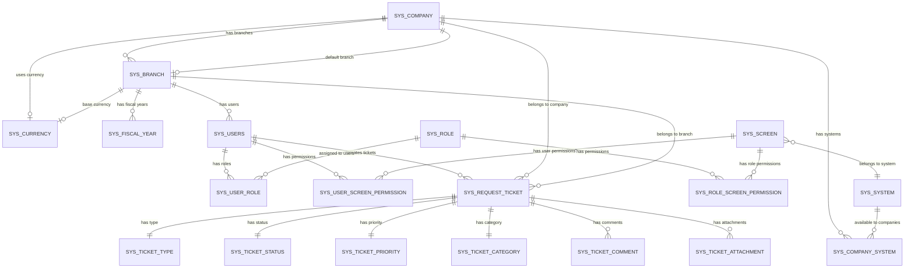

# Design Document: EF Core Migration

## Overview

This document provides a comprehensive technical design for migrating the ThinkOnErp ERP system from ADO.NET to Entity Framework Core (EF Core). The system is an ASP.NET Core 8.0 application following Clean Architecture principles with an Oracle database backend.

### Current State

The application currently uses:
- **Data Access**: ADO.NET with OracleConnection/OracleCommand
- **Database**: Oracle Database with 23+ tables
- **Stored Procedures**: All CRUD operations use stored procedures (SP_SYS_*)
- **Architecture**: Clean Architecture (Domain, Application, Infrastructure, API layers)
- **Connection Management**: OracleDbContext factory class
- **Repositories**: 23 repository implementations using ADO.NET

### Target State

The migration will transition to:
- **Data Access**: Entity Framework Core 8.0 with Oracle.EntityFrameworkCore provider
- **Database**: Same Oracle Database (no schema changes)
- **Stored Procedures**: Preserved and called through EF Core (FromSqlRaw/ExecuteSqlRaw)
- **Architecture**: Clean Architecture maintained
- **Connection Management**: EF Core DbContext with dependency injection
- **Repositories**: 23 repositories migrated to use EF Core
- **LINQ Support**: New capability for simple queries alongside stored procedures

### Migration Goals

1. **Zero Schema Changes**: Work with existing Oracle database schema without modifications
2. **Backward Compatibility**: Maintain all existing API contracts and behavior
3. **Stored Procedure Preservation**: Continue using existing stored procedures
4. **Performance Parity**: Match or exceed ADO.NET performance
5. **Clean Architecture**: Preserve separation of concerns across layers
6. **Gradual Migration**: Support incremental repository migration with rollback capability
7. **Audit Logging**: Maintain existing audit trail functionality
8. **Multi-Tenancy**: Preserve company/branch data isolation

### Key Benefits

- **Type Safety**: Compile-time checking for queries and entity mappings
- **Productivity**: LINQ queries for simple operations reduce boilerplate code
- **Maintainability**: Centralized entity configurations and relationship definitions
- **Testability**: Easier unit testing with in-memory database provider
- **Change Tracking**: Automatic detection of entity modifications
- **Migration Path**: Foundation for future enhancements (migrations, code-first)


## Architecture

### Layer Responsibilities

```
┌─────────────────────────────────────────────────────────────┐
│                        API Layer                             │
│  - Controllers                                               │
│  - Middleware                                                │
│  - API Models (DTOs)                                         │
└─────────────────────────────────────────────────────────────┘
                            │
                            ▼
┌─────────────────────────────────────────────────────────────┐
│                   Application Layer                          │
│  - Services                                                  │
│  - Use Cases                                                 │
│  - Application DTOs                                          │
└─────────────────────────────────────────────────────────────┘
                            │
                            ▼
┌─────────────────────────────────────────────────────────────┐
│                     Domain Layer                             │
│  - Entities (SysCompany, SysUser, etc.)                     │
│  - Repository Interfaces (ICompanyRepository, etc.)          │
│  - Domain Exceptions                                         │
│  - Value Objects                                             │
└─────────────────────────────────────────────────────────────┘
                            │
                            ▼
┌─────────────────────────────────────────────────────────────┐
│                 Infrastructure Layer                         │
│  ┌───────────────────────────────────────────────────────┐  │
│  │           EF Core DbContext                           │  │
│  │  - ThinkOnErpDbContext                                │  │
│  │  - DbSet<TEntity> properties                          │  │
│  │  - Entity configurations                              │  │
│  │  - Interceptors (Audit, Performance)                  │  │
│  └───────────────────────────────────────────────────────┘  │
│  ┌───────────────────────────────────────────────────────┐  │
│  │      Entity Configurations                            │  │
│  │  - CompanyConfiguration                               │  │
│  │  - UserConfiguration                                  │  │
│  │  - BranchConfiguration                                │  │
│  │  - (20 more configurations)                           │  │
│  └───────────────────────────────────────────────────────┘  │
│  ┌───────────────────────────────────────────────────────┐  │
│  │         Repository Implementations                    │  │
│  │  - CompanyRepository                                  │  │
│  │  - UserRepository                                     │  │
│  │  - BranchRepository                                   │  │
│  │  - (20 more repositories)                             │  │
│  └───────────────────────────────────────────────────────┘  │
└─────────────────────────────────────────────────────────────┘
                            │
                            ▼
┌─────────────────────────────────────────────────────────────┐
│                    Oracle Database                           │
│  - Tables (SYS_COMPANY, SYS_USERS, etc.)                    │
│  - Stored Procedures (SP_SYS_*)                             │
│  - Sequences (SEQ_SYS_*)                                    │
│  - Constraints and Indexes                                   │
└─────────────────────────────────────────────────────────────┘
```

### EF Core DbContext Architecture

The `ThinkOnErpDbContext` serves as the central hub for all database operations:

**Responsibilities:**
- Entity set management (DbSet<T> properties)
- Entity configuration application
- Connection management and pooling
- Transaction coordination
- Change tracking
- Query translation to SQL
- Interceptor integration (audit logging, performance monitoring)

**Design Principles:**
- Single Responsibility: Each entity configuration in separate class
- Dependency Injection: DbContext registered as scoped service
- Configuration over Convention: Explicit mappings for all entities
- Interceptor Pattern: Cross-cutting concerns (audit, logging) via interceptors

### Coexistence Strategy During Migration

During gradual migration, both ADO.NET and EF Core will coexist:

```
┌─────────────────────────────────────────────────────────────┐
│                  Application Layer                           │
└─────────────────────────────────────────────────────────────┘
                            │
                ┌───────────┴───────────┐
                ▼                       ▼
┌───────────────────────────┐  ┌───────────────────────────┐
│   Migrated Repositories   │  │  Legacy Repositories      │
│   (EF Core)               │  │  (ADO.NET)                │
│                           │  │                           │
│  - CompanyRepository      │  │  - TicketRepository       │
│  - UserRepository         │  │  - AuditRepository        │
│  - BranchRepository       │  │  - AlertRepository        │
└───────────────────────────┘  └───────────────────────────┘
                │                       │
                ▼                       ▼
┌───────────────────────────┐  ┌───────────────────────────┐
│   ThinkOnErpDbContext     │  │   OracleDbContext         │
│   (EF Core)               │  │   (ADO.NET Factory)       │
└───────────────────────────┘  └───────────────────────────┘
                │                       │
                └───────────┬───────────┘
                            ▼
                ┌───────────────────────┐
                │   Oracle Database     │
                └───────────────────────┘
```

**Configuration Switch:**
```csharp
// In DependencyInjection.cs
if (configuration.GetValue<bool>("UseEfCore:CompanyRepository"))
{
    services.AddScoped<ICompanyRepository, EfCore.CompanyRepository>();
}
else
{
    services.AddScoped<ICompanyRepository, AdoNet.CompanyRepository>();
}
```


## Components and Interfaces

### 1. ThinkOnErpDbContext

**Purpose**: Central EF Core DbContext managing all entity sets and database operations.

**Location**: `ThinkOnErp.Infrastructure/Data/ThinkOnErpDbContext.cs`

**Key Responsibilities:**
- Expose DbSet<T> properties for all 23 entities
- Apply entity configurations via OnModelCreating
- Configure Oracle provider with connection string
- Integrate audit and performance interceptors
- Support global query filters (soft delete, multi-tenancy)

**Interface:**
```csharp
public class ThinkOnErpDbContext : DbContext
{
    // Entity Sets
    public DbSet<SysCompany> Companies { get; set; }
    public DbSet<SysBranch> Branches { get; set; }
    public DbSet<SysUser> Users { get; set; }
    public DbSet<SysRole> Roles { get; set; }
    public DbSet<SysRoleScreenPermission> RoleScreenPermissions { get; set; }
    public DbSet<SysUserScreenPermission> UserScreenPermissions { get; set; }
    public DbSet<SysUserRole> UserRoles { get; set; }
    public DbSet<SysCurrency> Currencies { get; set; }
    public DbSet<SysFiscalYear> FiscalYears { get; set; }
    public DbSet<SysSuperAdmin> SuperAdmins { get; set; }
    public DbSet<SysAuditLog> AuditLogs { get; set; }
    public DbSet<SysScreen> Screens { get; set; }
    public DbSet<SysSystem> Systems { get; set; }
    public DbSet<SysCompanySystem> CompanySystems { get; set; }
    public DbSet<SysRequestTicket> Tickets { get; set; }
    public DbSet<SysTicketType> TicketTypes { get; set; }
    public DbSet<SysTicketStatus> TicketStatuses { get; set; }
    public DbSet<SysTicketPriority> TicketPriorities { get; set; }
    public DbSet<SysTicketComment> TicketComments { get; set; }
    public DbSet<SysTicketAttachment> TicketAttachments { get; set; }
    public DbSet<SysTicketConfig> TicketConfigs { get; set; }
    public DbSet<SysTicketCategory> TicketCategories { get; set; }
    public DbSet<SysSavedSearch> SavedSearches { get; set; }
    public DbSet<SysSearchAnalytics> SearchAnalytics { get; set; }
    
    // Constructor
    public ThinkOnErpDbContext(DbContextOptions<ThinkOnErpDbContext> options)
        : base(options) { }
    
    // Configuration
    protected override void OnModelCreating(ModelBuilder modelBuilder);
    
    // Stored Procedure Execution
    public Task<List<T>> ExecuteStoredProcedureAsync<T>(
        string procedureName, 
        params OracleParameter[] parameters) where T : class;
}
```

**Configuration:**
```csharp
// In Program.cs or DependencyInjection.cs
services.AddDbContext<ThinkOnErpDbContext>(options =>
{
    options.UseOracle(
        configuration.GetConnectionString("OracleDb"),
        oracleOptions =>
        {
            oracleOptions.UseOracleSQLCompatibility("11");
            oracleOptions.CommandTimeout(30);
        })
        .EnableSensitiveDataLogging(isDevelopment)
        .EnableDetailedErrors(isDevelopment)
        .AddInterceptors(
            serviceProvider.GetRequiredService<AuditCommandInterceptor>(),
            serviceProvider.GetRequiredService<PerformanceInterceptor>());
});
```

### 2. Entity Configuration Classes

**Purpose**: Define entity-to-table mappings, relationships, and constraints.

**Location**: `ThinkOnErp.Infrastructure/Data/Configurations/`

**Pattern**: One configuration class per entity implementing `IEntityTypeConfiguration<TEntity>`

**Example: CompanyConfiguration**
```csharp
public class CompanyConfiguration : IEntityTypeConfiguration<SysCompany>
{
    public void Configure(EntityTypeBuilder<SysCompany> builder)
    {
        // Table mapping
        builder.ToTable("SYS_COMPANY");
        
        // Primary key
        builder.HasKey(e => e.RowId);
        builder.Property(e => e.RowId)
            .HasColumnName("ROW_ID")
            .HasDefaultValueSql("SEQ_SYS_COMPANY.NEXTVAL")
            .ValueGeneratedOnAdd();
        
        // Required properties
        builder.Property(e => e.RowDesc)
            .HasColumnName("ROW_DESC")
            .HasMaxLength(200)
            .IsRequired();
        
        builder.Property(e => e.RowDescE)
            .HasColumnName("ROW_DESC_E")
            .HasMaxLength(200)
            .IsRequired();
        
        // Optional properties
        builder.Property(e => e.LegalName)
            .HasColumnName("LEGAL_NAME")
            .HasMaxLength(300);
        
        builder.Property(e => e.CompanyCode)
            .HasColumnName("COMPANY_CODE")
            .HasMaxLength(50);
        
        // BLOB property
        builder.Property(e => e.CompanyLogo)
            .HasColumnName("COMPANY_LOGO")
            .HasColumnType("BLOB");
        
        // Audit properties
        builder.Property(e => e.IsActive)
            .HasColumnName("IS_ACTIVE")
            .HasConversion(
                v => v ? "Y" : "N",
                v => v == "Y" || v == "1")
            .HasMaxLength(1)
            .IsRequired();
        
        builder.Property(e => e.CreationUser)
            .HasColumnName("CREATION_USER")
            .HasMaxLength(100)
            .IsRequired();
        
        builder.Property(e => e.CreationDate)
            .HasColumnName("CREATION_DATE");
        
        // Foreign keys
        builder.HasOne(e => e.Currency)
            .WithMany()
            .HasForeignKey(e => e.CurrId)
            .HasConstraintName("FK_COMPANY_CURRENCY");
        
        builder.HasOne(e => e.DefaultBranch)
            .WithMany()
            .HasForeignKey(e => e.DefaultBranchId)
            .HasConstraintName("FK_COMPANY_DEFAULT_BRANCH");
        
        // Global query filter for soft delete
        builder.HasQueryFilter(e => e.IsActive);
        
        // Indexes
        builder.HasIndex(e => e.CompanyCode)
            .IsUnique()
            .HasDatabaseName("UK_COMPANY_CODE");
    }
}
```

**Configuration Classes to Create:**
1. CompanyConfiguration
2. BranchConfiguration
3. UserConfiguration
4. RoleConfiguration
5. RoleScreenPermissionConfiguration
6. UserScreenPermissionConfiguration
7. UserRoleConfiguration
8. CurrencyConfiguration
9. FiscalYearConfiguration
10. SuperAdminConfiguration
11. AuditLogConfiguration
12. ScreenConfiguration
13. SystemConfiguration
14. CompanySystemConfiguration
15. TicketConfiguration
16. TicketTypeConfiguration
17. TicketStatusConfiguration
18. TicketPriorityConfiguration
19. TicketCommentConfiguration
20. TicketAttachmentConfiguration
21. TicketConfigConfiguration
22. TicketCategoryConfiguration
23. SavedSearchConfiguration
24. SearchAnalyticsConfiguration

### 3. Repository Implementation Pattern

**Purpose**: Implement repository interfaces using EF Core while maintaining stored procedure support.

**Location**: `ThinkOnErp.Infrastructure/Repositories/`

**Pattern**: Hybrid approach using both LINQ and stored procedures

**Example: CompanyRepository with EF Core**
```csharp
public class CompanyRepository : ICompanyRepository
{
    private readonly ThinkOnErpDbContext _context;
    private readonly ILogger<CompanyRepository> _logger;

    public CompanyRepository(
        ThinkOnErpDbContext context,
        ILogger<CompanyRepository> logger)
    {
        _context = context ?? throw new ArgumentNullException(nameof(context));
        _logger = logger ?? throw new ArgumentNullException(nameof(logger));
    }

    // LINQ query for simple read operations
    public async Task<List<SysCompany>> GetAllAsync()
    {
        return await _context.Companies
            .AsNoTracking()
            .Include(c => c.Currency)
            .Include(c => c.DefaultBranch)
            .Where(c => c.IsActive) // Redundant with query filter, but explicit
            .OrderBy(c => c.RowDesc)
            .ToListAsync();
    }

    // LINQ query for simple lookup by ID
    public async Task<SysCompany?> GetByIdAsync(long rowId)
    {
        return await _context.Companies
            .AsNoTracking()
            .Include(c => c.Currency)
            .Include(c => c.DefaultBranch)
            .FirstOrDefaultAsync(c => c.RowId == rowId);
    }

    // Stored procedure for complex insert operation
    public async Task<long> CreateAsync(SysCompany company)
    {
        var parameters = new[]
        {
            new OracleParameter("P_ROW_DESC", OracleDbType.Varchar2, company.RowDesc, ParameterDirection.Input),
            new OracleParameter("P_ROW_DESC_E", OracleDbType.Varchar2, company.RowDescE, ParameterDirection.Input),
            new OracleParameter("P_LEGAL_NAME", OracleDbType.Varchar2, company.LegalName ?? (object)DBNull.Value, ParameterDirection.Input),
            new OracleParameter("P_LEGAL_NAME_E", OracleDbType.Varchar2, company.LegalNameE ?? (object)DBNull.Value, ParameterDirection.Input),
            new OracleParameter("P_COMPANY_CODE", OracleDbType.Varchar2, company.CompanyCode ?? (object)DBNull.Value, ParameterDirection.Input),
            new OracleParameter("P_TAX_NUMBER", OracleDbType.Varchar2, company.TaxNumber ?? (object)DBNull.Value, ParameterDirection.Input),
            new OracleParameter("P_COUNTRY_ID", OracleDbType.Decimal, company.CountryId ?? (object)DBNull.Value, ParameterDirection.Input),
            new OracleParameter("P_CURR_ID", OracleDbType.Decimal, company.CurrId ?? (object)DBNull.Value, ParameterDirection.Input),
            new OracleParameter("P_CREATION_USER", OracleDbType.Varchar2, company.CreationUser, ParameterDirection.Input),
            new OracleParameter("P_NEW_ID", OracleDbType.Decimal, ParameterDirection.Output)
        };

        try
        {
            await _context.Database.ExecuteSqlRawAsync(
                "BEGIN SP_SYS_COMPANY_INSERT(:P_ROW_DESC, :P_ROW_DESC_E, :P_LEGAL_NAME, :P_LEGAL_NAME_E, " +
                ":P_COMPANY_CODE, :P_TAX_NUMBER, :P_COUNTRY_ID, :P_CURR_ID, :P_CREATION_USER, :P_NEW_ID); END;",
                parameters);

            return Convert.ToInt64(((OracleDecimal)parameters[9].Value).Value);
        }
        catch (OracleException ex) when (ex.Number == 20308)
        {
            throw new InvalidOperationException($"Company code '{company.CompanyCode}' already exists.", ex);
        }
        catch (DbUpdateException ex)
        {
            _logger.LogError(ex, "Database error creating company");
            throw new InvalidOperationException("Failed to create company", ex);
        }
    }

    // Stored procedure for update
    public async Task<long> UpdateAsync(SysCompany company)
    {
        var parameters = new[]
        {
            new OracleParameter("P_ROW_ID", OracleDbType.Decimal, company.RowId, ParameterDirection.Input),
            new OracleParameter("P_ROW_DESC", OracleDbType.Varchar2, company.RowDesc, ParameterDirection.Input),
            new OracleParameter("P_ROW_DESC_E", OracleDbType.Varchar2, company.RowDescE, ParameterDirection.Input),
            new OracleParameter("P_LEGAL_NAME", OracleDbType.Varchar2, company.LegalName ?? (object)DBNull.Value, ParameterDirection.Input),
            new OracleParameter("P_LEGAL_NAME_E", OracleDbType.Varchar2, company.LegalNameE ?? (object)DBNull.Value, ParameterDirection.Input),
            new OracleParameter("P_COMPANY_CODE", OracleDbType.Varchar2, company.CompanyCode ?? (object)DBNull.Value, ParameterDirection.Input),
            new OracleParameter("P_TAX_NUMBER", OracleDbType.Varchar2, company.TaxNumber ?? (object)DBNull.Value, ParameterDirection.Input),
            new OracleParameter("P_COUNTRY_ID", OracleDbType.Decimal, company.CountryId ?? (object)DBNull.Value, ParameterDirection.Input),
            new OracleParameter("P_CURR_ID", OracleDbType.Decimal, company.CurrId ?? (object)DBNull.Value, ParameterDirection.Input),
            new OracleParameter("P_DEFAULT_BRANCH_ID", OracleDbType.Decimal, company.DefaultBranchId ?? (object)DBNull.Value, ParameterDirection.Input),
            new OracleParameter("P_UPDATE_USER", OracleDbType.Varchar2, company.UpdateUser ?? string.Empty, ParameterDirection.Input)
        };

        var rowsAffected = await _context.Database.ExecuteSqlRawAsync(
            "BEGIN SP_SYS_COMPANY_UPDATE(:P_ROW_ID, :P_ROW_DESC, :P_ROW_DESC_E, :P_LEGAL_NAME, :P_LEGAL_NAME_E, " +
            ":P_COMPANY_CODE, :P_TAX_NUMBER, :P_COUNTRY_ID, :P_CURR_ID, :P_DEFAULT_BRANCH_ID, :P_UPDATE_USER); END;",
            parameters);

        return rowsAffected;
    }

    // Stored procedure for soft delete
    public async Task<long> DeleteAsync(long rowId)
    {
        var parameter = new OracleParameter("P_ROW_ID", OracleDbType.Decimal, rowId, ParameterDirection.Input);
        
        var rowsAffected = await _context.Database.ExecuteSqlRawAsync(
            "BEGIN SP_SYS_COMPANY_DELETE(:P_ROW_ID); END;",
            parameter);

        return rowsAffected;
    }
}
```

### 4. Stored Procedure Execution Helper

**Purpose**: Simplify stored procedure execution with REF CURSOR support.

**Location**: `ThinkOnErp.Infrastructure/Data/StoredProcedureHelper.cs`

```csharp
public static class StoredProcedureHelper
{
    public static async Task<List<T>> ExecuteStoredProcedureAsync<T>(
        this DbContext context,
        string procedureName,
        Func<DbDataReader, T> mapper,
        params OracleParameter[] parameters) where T : class
    {
        var results = new List<T>();
        var connection = context.Database.GetDbConnection();
        
        await using var command = connection.CreateCommand();
        command.CommandText = procedureName;
        command.CommandType = CommandType.StoredProcedure;
        
        foreach (var parameter in parameters)
        {
            command.Parameters.Add(parameter);
        }
        
        if (connection.State != ConnectionState.Open)
        {
            await connection.OpenAsync();
        }
        
        await using var reader = await command.ExecuteReaderAsync();
        while (await reader.ReadAsync())
        {
            results.Add(mapper(reader));
        }
        
        return results;
    }
}
```

### 5. Audit Interceptor Integration

**Purpose**: Maintain audit logging functionality with EF Core.

**Location**: `ThinkOnErp.Infrastructure/Interceptors/EfCoreAuditInterceptor.cs`

```csharp
public class EfCoreAuditInterceptor : SaveChangesInterceptor
{
    private readonly IAuditRepository _auditRepository;
    private readonly IHttpContextAccessor _httpContextAccessor;

    public EfCoreAuditInterceptor(
        IAuditRepository auditRepository,
        IHttpContextAccessor httpContextAccessor)
    {
        _auditRepository = auditRepository;
        _httpContextAccessor = httpContextAccessor;
    }

    public override async ValueTask<InterceptionResult<int>> SavingChangesAsync(
        DbContextEventData eventData,
        InterceptionResult<int> result,
        CancellationToken cancellationToken = default)
    {
        if (eventData.Context is null)
            return result;

        var entries = eventData.Context.ChangeTracker.Entries()
            .Where(e => e.State == EntityState.Added ||
                       e.State == EntityState.Modified ||
                       e.State == EntityState.Deleted)
            .ToList();

        foreach (var entry in entries)
        {
            await LogAuditEntry(entry);
        }

        return result;
    }

    private async Task LogAuditEntry(EntityEntry entry)
    {
        var tableName = entry.Metadata.GetTableName();
        var operation = entry.State.ToString();
        var userName = _httpContextAccessor.HttpContext?.User?.Identity?.Name ?? "System";
        
        var auditLog = new SysAuditLog
        {
            TableName = tableName,
            Operation = operation,
            UserName = userName,
            Timestamp = DateTime.UtcNow,
            OldValues = entry.State == EntityState.Modified ? SerializeEntity(entry.OriginalValues) : null,
            NewValues = entry.State != EntityState.Deleted ? SerializeEntity(entry.CurrentValues) : null
        };

        await _auditRepository.LogAsync(auditLog);
    }
}
```


## Data Models

### Entity Relationship Diagram



### Core Entity Mappings

#### 1. SysCompany
**Table**: SYS_COMPANY  
**Sequence**: SEQ_SYS_COMPANY  
**Primary Key**: ROW_ID (NUMBER)

| Property | Column | Type | Nullable | Notes |
|----------|--------|------|----------|-------|
| RowId | ROW_ID | long | No | PK, auto-generated |
| RowDesc | ROW_DESC | string(200) | No | Arabic name |
| RowDescE | ROW_DESC_E | string(200) | No | English name |
| LegalName | LEGAL_NAME | string(300) | Yes | Arabic legal name |
| LegalNameE | LEGAL_NAME_E | string(300) | Yes | English legal name |
| CompanyCode | COMPANY_CODE | string(50) | Yes | Unique code |
| TaxNumber | TAX_NUMBER | string(50) | Yes | Tax registration |
| CountryId | COUNTRY_ID | long? | Yes | FK to Country |
| CurrId | CURR_ID | long? | Yes | FK to SYS_CURRENCY |
| DefaultBranchId | DEFAULT_BRANCH_ID | long? | Yes | FK to SYS_BRANCH |
| CompanyLogo | COMPANY_LOGO | byte[]? | Yes | BLOB |
| IsActive | IS_ACTIVE | bool | No | 'Y'/'N' conversion |
| CreationUser | CREATION_USER | string(100) | No | Audit field |
| CreationDate | CREATION_DATE | DateTime? | Yes | Audit field |
| UpdateUser | UPDATE_USER | string(100) | Yes | Audit field |
| UpdateDate | UPDATE_DATE | DateTime? | Yes | Audit field |

**Relationships:**
- One-to-Many: Company → Branches
- Many-to-One: Company → Currency
- Many-to-One: Company → DefaultBranch

#### 2. SysBranch
**Table**: SYS_BRANCH  
**Sequence**: SEQ_SYS_BRANCH  
**Primary Key**: ROW_ID (NUMBER)

| Property | Column | Type | Nullable | Notes |
|----------|--------|------|----------|-------|
| RowId | ROW_ID | long | No | PK, auto-generated |
| CompanyId | COMPANY_ID | long | No | FK to SYS_COMPANY |
| RowDesc | ROW_DESC | string(200) | No | Arabic name |
| RowDescE | ROW_DESC_E | string(200) | No | English name |
| BranchPhone | BRANCH_PHONE | string(50) | Yes | Contact phone |
| BranchMobile | BRANCH_MOBILE | string(50) | Yes | Contact mobile |
| BranchFax | BRANCH_FAX | string(50) | Yes | Fax number |
| BranchEmail | BRANCH_EMAIL | string(100) | Yes | Email address |
| BranchLogo | BRANCH_LOGO | byte[]? | Yes | BLOB |
| DefaultLang | DEFAULT_LANG | string(10) | Yes | 'ar' or 'en' |
| BaseCurrencyId | BASE_CURRENCY_ID | long? | Yes | FK to SYS_CURRENCY |
| RoundingRules | ROUNDING_RULES | int? | Yes | Decimal rounding |
| IsActive | IS_ACTIVE | bool | No | 'Y'/'N' conversion |

**Relationships:**
- Many-to-One: Branch → Company
- One-to-Many: Branch → FiscalYears
- One-to-Many: Branch → Users

#### 3. SysUser
**Table**: SYS_USERS  
**Sequence**: SEQ_SYS_USERS  
**Primary Key**: ROW_ID (NUMBER)

| Property | Column | Type | Nullable | Notes |
|----------|--------|------|----------|-------|
| RowId | ROW_ID | long | No | PK, auto-generated |
| CompanyId | COMPANY_ID | long | No | FK to SYS_COMPANY |
| BranchId | BRANCH_ID | long | No | FK to SYS_BRANCH |
| UserName | USER_NAME | string(100) | No | Unique username |
| PasswordHash | PASSWORD_HASH | string(500) | No | Hashed password |
| FullName | FULL_NAME | string(200) | No | Display name |
| FullNameE | FULL_NAME_E | string(200) | Yes | English name |
| Email | EMAIL | string(200) | No | Email address |
| PhoneNumber | PHONE_NUMBER | string(50) | Yes | Contact phone |
| RefreshToken | REFRESH_TOKEN | string(500) | Yes | JWT refresh token |
| RefreshTokenExpiry | REFRESH_TOKEN_EXPIRY | DateTime? | Yes | Token expiration |
| IsActive | IS_ACTIVE | bool | No | 'Y'/'N' conversion |
| IsLocked | IS_LOCKED | bool | No | Account lock status |
| FailedLoginAttempts | FAILED_LOGIN_ATTEMPTS | int | No | Security counter |
| LastLoginDate | LAST_LOGIN_DATE | DateTime? | Yes | Last successful login |

**Relationships:**
- Many-to-One: User → Company
- Many-to-One: User → Branch
- Many-to-Many: User ↔ Role (via SysUserRole)
- One-to-Many: User → UserScreenPermissions

#### 4. SysRole
**Table**: SYS_ROLE  
**Sequence**: SEQ_SYS_ROLE  
**Primary Key**: ROW_ID (NUMBER)

| Property | Column | Type | Nullable | Notes |
|----------|--------|------|----------|-------|
| RowId | ROW_ID | long | No | PK, auto-generated |
| RoleName | ROLE_NAME | string(100) | No | Role identifier |
| RoleDesc | ROLE_DESC | string(200) | No | Arabic description |
| RoleDescE | ROLE_DESC_E | string(200) | Yes | English description |
| IsActive | IS_ACTIVE | bool | No | 'Y'/'N' conversion |

**Relationships:**
- Many-to-Many: Role ↔ User (via SysUserRole)
- One-to-Many: Role → RoleScreenPermissions

#### 5. SysRequestTicket
**Table**: SYS_REQUEST_TICKET  
**Sequence**: SEQ_SYS_REQUEST_TICKET  
**Primary Key**: ROW_ID (NUMBER)

| Property | Column | Type | Nullable | Notes |
|----------|--------|------|----------|-------|
| RowId | ROW_ID | long | No | PK, auto-generated |
| CompanyId | COMPANY_ID | long | No | FK to SYS_COMPANY |
| BranchId | BRANCH_ID | long | No | FK to SYS_BRANCH |
| UserId | USER_ID | long | No | FK to SYS_USERS |
| TicketTypeId | TICKET_TYPE_ID | long | No | FK to SYS_TICKET_TYPE |
| TicketStatusId | TICKET_STATUS_ID | long | No | FK to SYS_TICKET_STATUS |
| TicketPriorityId | TICKET_PRIORITY_ID | long | No | FK to SYS_TICKET_PRIORITY |
| TicketCategoryId | TICKET_CATEGORY_ID | long? | Yes | FK to SYS_TICKET_CATEGORY |
| TicketNumber | TICKET_NUMBER | string(50) | No | Unique identifier |
| Subject | SUBJECT | string(500) | No | Ticket subject |
| Description | DESCRIPTION | string(4000) | No | Detailed description |
| ResolutionNotes | RESOLUTION_NOTES | string(4000) | Yes | Resolution details |
| CreationDate | CREATION_DATE | DateTime | No | Submission date |
| ResolvedDate | RESOLVED_DATE | DateTime? | Yes | Resolution date |

**Relationships:**
- Many-to-One: Ticket → Company
- Many-to-One: Ticket → Branch
- Many-to-One: Ticket → User
- Many-to-One: Ticket → TicketType
- Many-to-One: Ticket → TicketStatus
- Many-to-One: Ticket → TicketPriority
- Many-to-One: Ticket → TicketCategory
- One-to-Many: Ticket → TicketComments
- One-to-Many: Ticket → TicketAttachments

### Value Conversions

EF Core requires explicit conversions for Oracle-specific types:

**Boolean to VARCHAR2(1):**
```csharp
builder.Property(e => e.IsActive)
    .HasConversion(
        v => v ? "Y" : "N",
        v => v == "Y" || v == "1");
```

**Oracle NUMBER to C# long:**
```csharp
builder.Property(e => e.RowId)
    .HasColumnType("NUMBER(19,0)");
```

**Oracle DATE to C# DateTime:**
```csharp
builder.Property(e => e.CreationDate)
    .HasColumnType("DATE");
```

**Oracle BLOB to C# byte[]:**
```csharp
builder.Property(e => e.CompanyLogo)
    .HasColumnType("BLOB");
```

### Sequence Configuration

All primary keys use Oracle sequences:

```csharp
builder.Property(e => e.RowId)
    .HasDefaultValueSql("SEQ_SYS_COMPANY.NEXTVAL")
    .ValueGeneratedOnAdd();
```

**Sequence Naming Convention**: `SEQ_SYS_{TABLE_NAME}`


## Error Handling

### Exception Mapping Strategy

EF Core exceptions must be mapped to domain-specific exceptions to maintain consistency with existing error handling:

```csharp
public class RepositoryExceptionHandler
{
    public static Exception MapException(Exception ex, string operation, string entityName)
    {
        return ex switch
        {
            DbUpdateException dbEx when dbEx.InnerException is OracleException oraEx =>
                MapOracleException(oraEx, operation, entityName),
            
            DbUpdateConcurrencyException concurrencyEx =>
                new ConcurrencyException(
                    $"The {entityName} was modified by another user. Please refresh and try again.",
                    concurrencyEx),
            
            InvalidOperationException invalidEx when invalidEx.Message.Contains("connection") =>
                new DatabaseConnectionException(
                    "Unable to connect to the database. Please check your connection.",
                    invalidEx),
            
            TimeoutException timeoutEx =>
                new DatabaseTimeoutException(
                    $"The {operation} operation timed out. Please try again.",
                    timeoutEx),
            
            _ => new InvalidOperationException(
                $"An error occurred during {operation} operation on {entityName}.",
                ex)
        };
    }

    private static Exception MapOracleException(OracleException oraEx, string operation, string entityName)
    {
        return oraEx.Number switch
        {
            // Unique constraint violation
            1 => new DuplicateEntityException(
                $"A {entityName} with this identifier already exists.",
                oraEx),
            
            // Foreign key constraint violation
            2291 => new ReferentialIntegrityException(
                $"Cannot {operation} {entityName} because it references non-existent data.",
                oraEx),
            
            // Parent key not found
            2292 => new ReferentialIntegrityException(
                $"Cannot {operation} {entityName} because other records depend on it.",
                oraEx),
            
            // Application errors (ORA-20000 series)
            >= 20000 and <= 20999 => ExtractApplicationError(oraEx),
            
            // Connection errors
            12154 or 12514 or 12541 => new DatabaseConnectionException(
                "Unable to connect to Oracle database. Please check connection settings.",
                oraEx),
            
            // Timeout errors
            1013 => new DatabaseTimeoutException(
                "Database operation was cancelled due to timeout.",
                oraEx),
            
            _ => new DatabaseException(
                $"Oracle error {oraEx.Number}: {oraEx.Message}",
                oraEx)
        };
    }

    private static Exception ExtractApplicationError(OracleException oraEx)
    {
        // Extract custom error message from stored procedure
        var message = oraEx.Message;
        var colonIndex = message.IndexOf(':');
        if (colonIndex > 0 && colonIndex < message.Length - 1)
        {
            message = message.Substring(colonIndex + 1).Trim();
        }
        
        return new BusinessRuleException(message, oraEx);
    }
}
```

### Domain Exception Hierarchy

```csharp
// Base exception
public class DomainException : Exception
{
    public DomainException(string message) : base(message) { }
    public DomainException(string message, Exception innerException) 
        : base(message, innerException) { }
}

// Database exceptions
public class DatabaseException : DomainException
{
    public DatabaseException(string message, Exception innerException) 
        : base(message, innerException) { }
}

public class DatabaseConnectionException : DatabaseException
{
    public DatabaseConnectionException(string message, Exception innerException) 
        : base(message, innerException) { }
}

public class DatabaseTimeoutException : DatabaseException
{
    public DatabaseTimeoutException(string message, Exception innerException) 
        : base(message, innerException) { }
}

// Business rule exceptions
public class BusinessRuleException : DomainException
{
    public BusinessRuleException(string message) : base(message) { }
    public BusinessRuleException(string message, Exception innerException) 
        : base(message, innerException) { }
}

public class DuplicateEntityException : BusinessRuleException
{
    public DuplicateEntityException(string message, Exception innerException) 
        : base(message, innerException) { }
}

public class ReferentialIntegrityException : BusinessRuleException
{
    public ReferentialIntegrityException(string message, Exception innerException) 
        : base(message, innerException) { }
}

public class ConcurrencyException : BusinessRuleException
{
    public ConcurrencyException(string message, Exception innerException) 
        : base(message, innerException) { }
}
```

### Repository Error Handling Pattern

```csharp
public async Task<long> CreateAsync(SysCompany company)
{
    try
    {
        // Execute stored procedure or LINQ operation
        var parameters = BuildParameters(company);
        await _context.Database.ExecuteSqlRawAsync(sql, parameters);
        return GetOutputParameter(parameters);
    }
    catch (Exception ex)
    {
        _logger.LogError(ex, "Error creating company: {CompanyCode}", company.CompanyCode);
        throw RepositoryExceptionHandler.MapException(ex, "create", "Company");
    }
}
```

### Transaction Rollback Handling

```csharp
public async Task<(long CompanyId, long BranchId, long FiscalYearId)> CreateWithBranchAsync(...)
{
    using var transaction = await _context.Database.BeginTransactionAsync();
    
    try
    {
        // Execute multiple operations
        var companyId = await CreateCompanyAsync(...);
        var branchId = await CreateBranchAsync(...);
        var fiscalYearId = await CreateFiscalYearAsync(...);
        
        await transaction.CommitAsync();
        return (companyId, branchId, fiscalYearId);
    }
    catch (Exception ex)
    {
        await transaction.RollbackAsync();
        _logger.LogError(ex, "Transaction failed during CreateWithBranch");
        throw RepositoryExceptionHandler.MapException(ex, "create", "Company with Branch");
    }
}
```

### Retry Logic for Transient Failures

```csharp
public static IServiceCollection AddEfCoreWithRetry(
    this IServiceCollection services,
    IConfiguration configuration)
{
    services.AddDbContext<ThinkOnErpDbContext>(options =>
    {
        options.UseOracle(
            configuration.GetConnectionString("OracleDb"),
            oracleOptions =>
            {
                oracleOptions.EnableRetryOnFailure(
                    maxRetryCount: 3,
                    maxRetryDelay: TimeSpan.FromSeconds(5),
                    errorNumbersToAdd: new[] { 1, 12154, 12514 });
            });
    });
    
    return services;
}
```


## Testing Strategy

### Testing Pyramid

```
                    ┌─────────────────┐
                    │   E2E Tests     │  ← 10% (API integration)
                    │   (50 tests)    │
                    └─────────────────┘
                  ┌───────────────────────┐
                  │  Integration Tests    │  ← 30% (Database operations)
                  │    (150 tests)        │
                  └───────────────────────┘
              ┌─────────────────────────────────┐
              │      Unit Tests                 │  ← 60% (Repository logic)
              │       (300 tests)               │
              └─────────────────────────────────┘
```

### 1. Unit Tests

**Purpose**: Test repository methods in isolation using in-memory database or mocks.

**Framework**: xUnit + Moq + EF Core InMemory Provider

**Coverage Target**: 80% code coverage for repository implementations

**Example Test Structure:**
```csharp
public class CompanyRepositoryTests
{
    private readonly ThinkOnErpDbContext _context;
    private readonly CompanyRepository _repository;

    public CompanyRepositoryTests()
    {
        var options = new DbContextOptionsBuilder<ThinkOnErpDbContext>()
            .UseInMemoryDatabase(databaseName: Guid.NewGuid().ToString())
            .Options;
        
        _context = new ThinkOnErpDbContext(options);
        _repository = new CompanyRepository(_context, Mock.Of<ILogger<CompanyRepository>>());
        
        SeedTestData();
    }

    [Fact]
    public async Task GetAllAsync_ReturnsActiveCompanies()
    {
        // Act
        var companies = await _repository.GetAllAsync();

        // Assert
        Assert.NotEmpty(companies);
        Assert.All(companies, c => Assert.True(c.IsActive));
    }

    [Fact]
    public async Task GetByIdAsync_WithValidId_ReturnsCompany()
    {
        // Arrange
        var expectedId = 1L;

        // Act
        var company = await _repository.GetByIdAsync(expectedId);

        // Assert
        Assert.NotNull(company);
        Assert.Equal(expectedId, company.RowId);
    }

    [Fact]
    public async Task GetByIdAsync_WithInvalidId_ReturnsNull()
    {
        // Act
        var company = await _repository.GetByIdAsync(999L);

        // Assert
        Assert.Null(company);
    }

    [Fact]
    public async Task CreateAsync_WithValidCompany_ReturnsNewId()
    {
        // Arrange
        var company = new SysCompany
        {
            RowDesc = "Test Company",
            RowDescE = "Test Company EN",
            CompanyCode = "TEST001",
            CreationUser = "admin"
        };

        // Act
        var newId = await _repository.CreateAsync(company);

        // Assert
        Assert.True(newId > 0);
        var created = await _repository.GetByIdAsync(newId);
        Assert.NotNull(created);
        Assert.Equal("TEST001", created.CompanyCode);
    }

    [Fact]
    public async Task CreateAsync_WithDuplicateCode_ThrowsException()
    {
        // Arrange
        var company = new SysCompany
        {
            RowDesc = "Duplicate",
            RowDescE = "Duplicate",
            CompanyCode = "EXISTING",
            CreationUser = "admin"
        };

        // Act & Assert
        await Assert.ThrowsAsync<DuplicateEntityException>(
            () => _repository.CreateAsync(company));
    }

    private void SeedTestData()
    {
        _context.Companies.AddRange(
            new SysCompany
            {
                RowId = 1,
                RowDesc = "شركة الاختبار",
                RowDescE = "Test Company",
                CompanyCode = "EXISTING",
                IsActive = true,
                CreationUser = "system"
            },
            new SysCompany
            {
                RowId = 2,
                RowDesc = "شركة غير نشطة",
                RowDescE = "Inactive Company",
                CompanyCode = "INACTIVE",
                IsActive = false,
                CreationUser = "system"
            }
        );
        _context.SaveChanges();
    }
}
```

### 2. Integration Tests

**Purpose**: Test repository operations against a real Oracle database.

**Framework**: xUnit + Testcontainers (Oracle) or dedicated test database

**Test Categories:**
- Stored procedure execution with parameters
- REF CURSOR result mapping
- Output parameter retrieval
- Transaction commit/rollback
- Concurrency conflict handling
- BLOB data storage/retrieval

**Example Integration Test:**
```csharp
public class CompanyRepositoryIntegrationTests : IClassFixture<OracleDatabaseFixture>
{
    private readonly OracleDatabaseFixture _fixture;
    private readonly CompanyRepository _repository;

    public CompanyRepositoryIntegrationTests(OracleDatabaseFixture fixture)
    {
        _fixture = fixture;
        _repository = new CompanyRepository(
            _fixture.CreateContext(),
            Mock.Of<ILogger<CompanyRepository>>());
    }

    [Fact]
    public async Task CreateAsync_CallsStoredProcedure_ReturnsGeneratedId()
    {
        // Arrange
        var company = new SysCompany
        {
            RowDesc = "شركة التكامل",
            RowDescE = "Integration Test Company",
            CompanyCode = $"INT{Guid.NewGuid().ToString().Substring(0, 8)}",
            LegalName = "شركة التكامل القانونية",
            LegalNameE = "Integration Test Company Legal",
            TaxNumber = "123456789",
            CreationUser = "integration_test"
        };

        // Act
        var newId = await _repository.CreateAsync(company);

        // Assert
        Assert.True(newId > 0);
        
        // Verify in database
        var retrieved = await _repository.GetByIdAsync(newId);
        Assert.NotNull(retrieved);
        Assert.Equal(company.CompanyCode, retrieved.CompanyCode);
        Assert.Equal(company.RowDesc, retrieved.RowDesc);
    }

    [Fact]
    public async Task UpdateLogoAsync_WithBlobData_StoresAndRetrievesCorrectly()
    {
        // Arrange
        var companyId = await CreateTestCompany();
        var logoData = GenerateTestImageBytes(1024); // 1KB test image

        // Act
        await _repository.UpdateLogoAsync(companyId, logoData, "test_user");
        var retrievedLogo = await _repository.GetLogoAsync(companyId);

        // Assert
        Assert.NotNull(retrievedLogo);
        Assert.Equal(logoData.Length, retrievedLogo.Length);
        Assert.Equal(logoData, retrievedLogo);
    }

    [Fact]
    public async Task CreateWithBranchAsync_CreatesAllEntities_InTransaction()
    {
        // Arrange
        var companyCode = $"TRANS{Guid.NewGuid().ToString().Substring(0, 8)}";

        // Act
        var (companyId, branchId, fiscalYearId) = await _repository.CreateWithBranchAsync(
            companyNameAr: "شركة المعاملات",
            companyNameEn: "Transaction Test Company",
            legalNameAr: "شركة المعاملات القانونية",
            legalNameEn: "Transaction Test Legal",
            companyCode: companyCode,
            taxNumber: "987654321",
            countryId: 1,
            currId: 1,
            companyLogo: null,
            branchNameAr: "الفرع الرئيسي",
            branchNameEn: "Main Branch",
            branchPhone: "123456789",
            branchMobile: "987654321",
            branchFax: null,
            branchEmail: "test@example.com",
            branchLogo: null,
            defaultLang: "ar",
            baseCurrencyId: 1,
            roundingRules: 2,
            creationUser: "integration_test");

        // Assert
        Assert.True(companyId > 0);
        Assert.True(branchId > 0);
        Assert.True(fiscalYearId > 0);

        // Verify all entities exist
        var company = await _repository.GetByIdAsync(companyId);
        Assert.NotNull(company);
        Assert.Equal(branchId, company.DefaultBranchId);
    }

    private async Task<long> CreateTestCompany()
    {
        var company = new SysCompany
        {
            RowDesc = "Test",
            RowDescE = "Test",
            CompanyCode = $"TEST{Guid.NewGuid().ToString().Substring(0, 8)}",
            CreationUser = "test"
        };
        return await _repository.CreateAsync(company);
    }

    private byte[] GenerateTestImageBytes(int size)
    {
        var random = new Random();
        var bytes = new byte[size];
        random.NextBytes(bytes);
        return bytes;
    }
}

public class OracleDatabaseFixture : IDisposable
{
    private readonly string _connectionString;

    public OracleDatabaseFixture()
    {
        _connectionString = GetTestConnectionString();
        InitializeDatabase();
    }

    public ThinkOnErpDbContext CreateContext()
    {
        var options = new DbContextOptionsBuilder<ThinkOnErpDbContext>()
            .UseOracle(_connectionString)
            .Options;
        
        return new ThinkOnErpDbContext(options);
    }

    private string GetTestConnectionString()
    {
        return Environment.GetEnvironmentVariable("TEST_ORACLE_CONNECTION_STRING")
            ?? "Data Source=localhost:1521/XEPDB1;User Id=test_user;Password=test_password;";
    }

    private void InitializeDatabase()
    {
        // Run database setup scripts if needed
    }

    public void Dispose()
    {
        // Cleanup test data
    }
}
```

### 3. Comparison Tests (ADO.NET vs EF Core)

**Purpose**: Verify EF Core produces identical results to ADO.NET implementation.

**Approach**: Run both implementations side-by-side and compare outputs.

```csharp
public class AdoNetVsEfCoreComparisonTests
{
    private readonly ICompanyRepository _adoNetRepository;
    private readonly ICompanyRepository _efCoreRepository;

    public AdoNetVsEfCoreComparisonTests()
    {
        var configuration = BuildConfiguration();
        
        var oracleDbContext = new OracleDbContext(configuration);
        _adoNetRepository = new AdoNet.CompanyRepository(oracleDbContext);
        
        var efCoreContext = CreateEfCoreContext(configuration);
        _efCoreRepository = new EfCore.CompanyRepository(
            efCoreContext,
            Mock.Of<ILogger<EfCore.CompanyRepository>>());
    }

    [Fact]
    public async Task GetAllAsync_BothImplementations_ReturnIdenticalResults()
    {
        // Act
        var adoNetResults = await _adoNetRepository.GetAllAsync();
        var efCoreResults = await _efCoreRepository.GetAllAsync();

        // Assert
        Assert.Equal(adoNetResults.Count, efCoreResults.Count);
        
        for (int i = 0; i < adoNetResults.Count; i++)
        {
            AssertCompaniesEqual(adoNetResults[i], efCoreResults[i]);
        }
    }

    [Theory]
    [InlineData(1L)]
    [InlineData(2L)]
    [InlineData(3L)]
    public async Task GetByIdAsync_BothImplementations_ReturnIdenticalResult(long id)
    {
        // Act
        var adoNetResult = await _adoNetRepository.GetByIdAsync(id);
        var efCoreResult = await _efCoreRepository.GetByIdAsync(id);

        // Assert
        if (adoNetResult == null)
        {
            Assert.Null(efCoreResult);
        }
        else
        {
            Assert.NotNull(efCoreResult);
            AssertCompaniesEqual(adoNetResult, efCoreResult);
        }
    }

    private void AssertCompaniesEqual(SysCompany expected, SysCompany actual)
    {
        Assert.Equal(expected.RowId, actual.RowId);
        Assert.Equal(expected.RowDesc, actual.RowDesc);
        Assert.Equal(expected.RowDescE, actual.RowDescE);
        Assert.Equal(expected.CompanyCode, actual.CompanyCode);
        Assert.Equal(expected.IsActive, actual.IsActive);
        // ... compare all properties
    }
}
```

### 4. Performance Tests

**Purpose**: Ensure EF Core performance is comparable to ADO.NET.

**Metrics**: Query execution time, memory usage, connection pool efficiency

```csharp
public class PerformanceTests
{
    [Fact]
    public async Task GetAllAsync_EfCore_PerformsWithinThreshold()
    {
        // Arrange
        var repository = CreateEfCoreRepository();
        var stopwatch = Stopwatch.StartNew();

        // Act
        var results = await repository.GetAllAsync();
        stopwatch.Stop();

        // Assert
        Assert.True(stopwatch.ElapsedMilliseconds < 1000, 
            $"Query took {stopwatch.ElapsedMilliseconds}ms, expected < 1000ms");
        Assert.NotEmpty(results);
    }

    [Fact]
    public async Task BulkInsert_EfCore_HandlesLargeDatasets()
    {
        // Arrange
        var repository = CreateEfCoreRepository();
        var companies = GenerateTestCompanies(1000);
        var stopwatch = Stopwatch.StartNew();

        // Act
        foreach (var company in companies)
        {
            await repository.CreateAsync(company);
        }
        stopwatch.Stop();

        // Assert
        var avgTimePerInsert = stopwatch.ElapsedMilliseconds / 1000.0;
        Assert.True(avgTimePerInsert < 50, 
            $"Average insert time {avgTimePerInsert}ms, expected < 50ms");
    }
}
```

### 5. End-to-End API Tests

**Purpose**: Verify complete request/response cycles through API endpoints.

**Framework**: WebApplicationFactory + HttpClient

```csharp
public class CompanyApiTests : IClassFixture<WebApplicationFactory<Program>>
{
    private readonly HttpClient _client;

    public CompanyApiTests(WebApplicationFactory<Program> factory)
    {
        _client = factory.CreateClient();
    }

    [Fact]
    public async Task GetCompanies_ReturnsSuccessAndCorrectContentType()
    {
        // Act
        var response = await _client.GetAsync("/api/companies");

        // Assert
        response.EnsureSuccessStatusCode();
        Assert.Equal("application/json", response.Content.Headers.ContentType?.MediaType);
        
        var content = await response.Content.ReadAsStringAsync();
        var companies = JsonSerializer.Deserialize<List<CompanyDto>>(content);
        Assert.NotNull(companies);
    }

    [Fact]
    public async Task CreateCompany_WithValidData_ReturnsCreatedCompany()
    {
        // Arrange
        var newCompany = new CreateCompanyRequest
        {
            RowDesc = "شركة جديدة",
            RowDescE = "New Company",
            CompanyCode = $"NEW{Guid.NewGuid().ToString().Substring(0, 8)}"
        };

        // Act
        var response = await _client.PostAsJsonAsync("/api/companies", newCompany);

        // Assert
        Assert.Equal(HttpStatusCode.Created, response.StatusCode);
        var created = await response.Content.ReadFromJsonAsync<CompanyDto>();
        Assert.NotNull(created);
        Assert.Equal(newCompany.CompanyCode, created.CompanyCode);
    }
}
```

### Test Data Management

**Strategy**: Use database transactions for test isolation

```csharp
public class DatabaseTestBase : IDisposable
{
    protected readonly ThinkOnErpDbContext Context;
    private readonly IDbContextTransaction _transaction;

    public DatabaseTestBase()
    {
        Context = CreateContext();
        _transaction = Context.Database.BeginTransaction();
    }

    public void Dispose()
    {
        _transaction.Rollback();
        _transaction.Dispose();
        Context.Dispose();
    }

    private ThinkOnErpDbContext CreateContext()
    {
        var options = new DbContextOptionsBuilder<ThinkOnErpDbContext>()
            .UseOracle(GetTestConnectionString())
            .Options;
        
        return new ThinkOnErpDbContext(options);
    }
}
```

### Continuous Integration

**Test Execution in CI/CD:**
```yaml
# .github/workflows/test.yml
name: Run Tests

on: [push, pull_request]

jobs:
  test:
    runs-on: ubuntu-latest
    
    services:
      oracle:
        image: gvenzl/oracle-xe:21-slim
        env:
          ORACLE_PASSWORD: test_password
        ports:
          - 1521:1521
    
    steps:
      - uses: actions/checkout@v3
      
      - name: Setup .NET
        uses: actions/setup-dotnet@v3
        with:
          dotnet-version: '8.0.x'
      
      - name: Restore dependencies
        run: dotnet restore
      
      - name: Run unit tests
        run: dotnet test --filter Category=Unit --logger trx
      
      - name: Run integration tests
        run: dotnet test --filter Category=Integration --logger trx
        env:
          TEST_ORACLE_CONNECTION_STRING: ${{ secrets.TEST_ORACLE_CONNECTION }}
      
      - name: Generate coverage report
        run: dotnet test --collect:"XPlat Code Coverage"
      
      - name: Upload coverage to Codecov
        uses: codecov/codecov-action@v3
```


## Migration Strategy

### Gradual Migration Approach

The migration will be executed in phases to minimize risk and allow for rollback at any stage.

#### Phase 1: Foundation (Week 1-2)

**Objectives:**
- Set up EF Core infrastructure
- Create DbContext and entity configurations
- Implement interceptors and helpers
- Establish testing framework

**Deliverables:**
1. `ThinkOnErpDbContext` class with all DbSet properties
2. 24 entity configuration classes
3. `StoredProcedureHelper` utility class
4. `EfCoreAuditInterceptor` implementation
5. `RepositoryExceptionHandler` for error mapping
6. Unit test infrastructure with in-memory database
7. Integration test infrastructure with test Oracle database

**Success Criteria:**
- All entity configurations compile without errors
- DbContext can connect to Oracle database
- Basic LINQ queries execute successfully
- Audit interceptor captures database operations

#### Phase 2: Pilot Repositories (Week 3-4)

**Objectives:**
- Migrate 3 low-risk repositories as proof of concept
- Validate stored procedure execution patterns
- Test coexistence with ADO.NET repositories
- Establish performance baselines

**Repositories to Migrate:**
1. **CurrencyRepository** (simple CRUD, no complex relationships)
2. **TicketStatusRepository** (lookup table, minimal dependencies)
3. **TicketPriorityRepository** (lookup table, minimal dependencies)

**Migration Steps per Repository:**
1. Create EF Core implementation in new namespace
2. Write comprehensive unit tests
3. Write integration tests comparing with ADO.NET
4. Run performance benchmarks
5. Deploy to staging with feature flag
6. Monitor for 48 hours
7. Enable in production with 10% traffic
8. Gradually increase to 100% over 1 week

**Rollback Plan:**
- Feature flag to switch back to ADO.NET implementation
- No database changes required
- Rollback time: < 5 minutes

#### Phase 3: Core Repositories (Week 5-8)

**Objectives:**
- Migrate core business entities
- Validate complex stored procedures
- Test transaction management
- Verify multi-tenancy and soft delete

**Repositories to Migrate:**
1. **CompanyRepository** (complex, has BLOB, multi-step transactions)
2. **BranchRepository** (relationships with Company and FiscalYear)
3. **FiscalYearRepository** (relationships with Branch)
4. **UserRepository** (authentication, refresh tokens, complex queries)
5. **RoleRepository** (many-to-many relationships)
6. **ScreenRepository** (permission system dependencies)

**Migration Steps:**
- Same as Phase 2, but with extended monitoring period (1 week)
- Additional focus on transaction testing
- Stress testing with concurrent users

#### Phase 4: Permission System (Week 9-10)

**Objectives:**
- Migrate permission-related repositories
- Validate many-to-many relationships
- Test complex join queries

**Repositories to Migrate:**
1. **RoleScreenPermissionRepository**
2. **UserScreenPermissionRepository**
3. **UserRoleRepository**

#### Phase 5: Ticket System (Week 11-13)

**Objectives:**
- Migrate ticket management repositories
- Test one-to-many relationships
- Validate BLOB handling for attachments

**Repositories to Migrate:**
1. **TicketRepository**
2. **TicketTypeRepository**
3. **TicketCommentRepository**
4. **TicketAttachmentRepository**
5. **TicketConfigRepository**
6. **TicketCategoryRepository**

#### Phase 6: Supporting Systems (Week 14-15)

**Objectives:**
- Migrate remaining repositories
- Complete the migration
- Decommission ADO.NET infrastructure

**Repositories to Migrate:**
1. **SystemRepository**
2. **CompanySystemRepository**
3. **SuperAdminRepository**
4. **AuditRepository**
5. **SavedSearchRepository**
6. **SearchAnalyticsRepository**

#### Phase 7: Cleanup and Optimization (Week 16)

**Objectives:**
- Remove ADO.NET code
- Optimize EF Core configurations
- Update documentation
- Final performance tuning

**Activities:**
1. Delete `OracleDbContext` class
2. Remove ADO.NET repository implementations
3. Remove feature flags
4. Optimize entity configurations
5. Add compiled queries for hot paths
6. Update API documentation
7. Conduct final performance audit

### Migration Decision Tree

```
┌─────────────────────────────────────┐
│  Select Repository to Migrate       │
└─────────────────────────────────────┘
                 │
                 ▼
┌─────────────────────────────────────┐
│  Does it have complex stored        │
│  procedures with business logic?    │
└─────────────────────────────────────┘
         │                    │
        Yes                  No
         │                    │
         ▼                    ▼
┌──────────────────┐  ┌──────────────────┐
│ Keep stored      │  │ Consider LINQ    │
│ procedures       │  │ for simple ops   │
└──────────────────┘  └──────────────────┘
         │                    │
         └────────┬───────────┘
                  ▼
┌─────────────────────────────────────┐
│  Implement EF Core version          │
└─────────────────────────────────────┘
                  │
                  ▼
┌─────────────────────────────────────┐
│  Write unit tests                   │
└─────────────────────────────────────┘
                  │
                  ▼
┌─────────────────────────────────────┐
│  Write integration tests            │
└─────────────────────────────────────┘
                  │
                  ▼
┌─────────────────────────────────────┐
│  Run comparison tests               │
│  (ADO.NET vs EF Core)               │
└─────────────────────────────────────┘
                  │
                  ▼
┌─────────────────────────────────────┐
│  Results identical?                 │
└─────────────────────────────────────┘
         │                    │
        Yes                  No
         │                    │
         ▼                    ▼
┌──────────────────┐  ┌──────────────────┐
│ Run performance  │  │ Debug and fix    │
│ benchmarks       │  │ differences      │
└──────────────────┘  └──────────────────┘
         │                    │
         ▼                    │
┌──────────────────┐          │
│ Performance OK?  │          │
└──────────────────┘          │
         │                    │
        Yes                   │
         │                    │
         ▼                    │
┌──────────────────┐          │
│ Deploy to        │          │
│ staging          │          │
└──────────────────┘          │
         │                    │
         ▼                    │
┌──────────────────┐          │
│ Monitor 48 hours │          │
└──────────────────┘          │
         │                    │
         ▼                    │
┌──────────────────┐          │
│ Issues found?    │          │
└──────────────────┘          │
         │                    │
        No                   Yes
         │                    │
         ▼                    ▼
┌──────────────────┐  ┌──────────────────┐
│ Deploy to prod   │  │ Rollback and     │
│ with feature flag│  │ investigate      │
└──────────────────┘  └──────────────────┘
         │                    │
         ▼                    │
┌──────────────────┐          │
│ Gradual rollout  │          │
│ 10% → 50% → 100% │          │
└──────────────────┘          │
         │                    │
         ▼                    │
┌──────────────────┐          │
│ Migration        │          │
│ complete         │          │
└──────────────────┘          │
                              │
         └────────────────────┘
```

### Feature Flag Configuration

```csharp
// appsettings.json
{
  "FeatureFlags": {
    "UseEfCore": {
      "CompanyRepository": true,
      "BranchRepository": true,
      "UserRepository": false,  // Still using ADO.NET
      "RoleRepository": false,
      // ... other repositories
    }
  }
}

// DependencyInjection.cs
public static IServiceCollection AddRepositories(
    this IServiceCollection services,
    IConfiguration configuration)
{
    var featureFlags = configuration.GetSection("FeatureFlags:UseEfCore");
    
    // Company Repository
    if (featureFlags.GetValue<bool>("CompanyRepository"))
    {
        services.AddScoped<ICompanyRepository, EfCore.CompanyRepository>();
    }
    else
    {
        services.AddScoped<ICompanyRepository, AdoNet.CompanyRepository>();
    }
    
    // Branch Repository
    if (featureFlags.GetValue<bool>("BranchRepository"))
    {
        services.AddScoped<IBranchRepository, EfCore.BranchRepository>();
    }
    else
    {
        services.AddScoped<IBranchRepository, AdoNet.BranchRepository>();
    }
    
    // ... repeat for all repositories
    
    return services;
}
```

### Rollback Procedures

**Immediate Rollback (< 5 minutes):**
1. Update feature flag in configuration
2. Restart application or trigger configuration reload
3. Verify ADO.NET repository is active
4. Monitor error rates

**Partial Rollback:**
1. Identify problematic repository
2. Set its feature flag to false
3. Keep other migrated repositories on EF Core
4. Investigate and fix issues
5. Re-enable when ready

**Complete Rollback:**
1. Set all feature flags to false
2. Restart all application instances
3. Verify all repositories using ADO.NET
4. Conduct post-mortem analysis

### Risk Mitigation

**High-Risk Repositories** (require extra caution):
1. **UserRepository** - Authentication critical path
2. **AuditRepository** - Compliance requirement
3. **CompanyRepository** - Multi-step transactions
4. **TicketRepository** - High transaction volume

**Mitigation Strategies:**
- Extended testing period (2 weeks in staging)
- Gradual rollout starting at 5% traffic
- Real-time monitoring with automatic rollback triggers
- Parallel execution (run both implementations, compare results)
- Load testing before production deployment


## Performance Optimization

### Connection Pooling

**Configuration:**
```csharp
services.AddDbContext<ThinkOnErpDbContext>(options =>
{
    options.UseOracle(connectionString, oracleOptions =>
    {
        // Connection pooling settings
        oracleOptions.CommandTimeout(30);
        oracleOptions.MaxBatchSize(100);
        
        // Oracle-specific optimizations
        oracleOptions.UseOracleSQLCompatibility("11");
    });
}, ServiceLifetime.Scoped);

// Connection string with pooling parameters
// "Data Source=...;User Id=...;Password=...;Pooling=true;Min Pool Size=5;Max Pool Size=100;Connection Lifetime=300;"
```

**Pool Monitoring:**
```csharp
public class ConnectionPoolMonitor
{
    public static void LogPoolStatistics(ILogger logger)
    {
        var stats = OracleConnection.GetPoolStatistics();
        logger.LogInformation(
            "Connection Pool Stats - Active: {Active}, Idle: {Idle}, Total: {Total}",
            stats["NumberOfActiveConnections"],
            stats["NumberOfFreeConnections"],
            stats["NumberOfPooledConnections"]);
    }
}
```

### Query Optimization

#### 1. AsNoTracking for Read-Only Queries

```csharp
// Good: Read-only query
public async Task<List<SysCompany>> GetAllAsync()
{
    return await _context.Companies
        .AsNoTracking()  // Disable change tracking
        .Include(c => c.Currency)
        .ToListAsync();
}

// Bad: Unnecessary tracking
public async Task<List<SysCompany>> GetAllAsync()
{
    return await _context.Companies  // Change tracking enabled
        .Include(c => c.Currency)
        .ToListAsync();
}
```

#### 2. Projection for Partial Data

```csharp
// Good: Select only needed columns
public async Task<List<CompanyListDto>> GetCompanyListAsync()
{
    return await _context.Companies
        .AsNoTracking()
        .Select(c => new CompanyListDto
        {
            Id = c.RowId,
            Name = c.RowDescE,
            Code = c.CompanyCode
        })
        .ToListAsync();
}

// Bad: Loading entire entity
public async Task<List<CompanyListDto>> GetCompanyListAsync()
{
    var companies = await _context.Companies.ToListAsync();
    return companies.Select(c => new CompanyListDto
    {
        Id = c.RowId,
        Name = c.RowDescE,
        Code = c.CompanyCode
    }).ToList();
}
```

#### 3. Compiled Queries for Hot Paths

```csharp
public class CompanyQueries
{
    private static readonly Func<ThinkOnErpDbContext, long, Task<SysCompany?>> 
        _getByIdQuery = EF.CompileAsyncQuery(
            (ThinkOnErpDbContext context, long id) =>
                context.Companies
                    .AsNoTracking()
                    .Include(c => c.Currency)
                    .FirstOrDefault(c => c.RowId == id));

    public static Task<SysCompany?> GetByIdAsync(
        ThinkOnErpDbContext context, 
        long id)
    {
        return _getByIdQuery(context, id);
    }
}

// Usage in repository
public async Task<SysCompany?> GetByIdAsync(long rowId)
{
    return await CompanyQueries.GetByIdAsync(_context, rowId);
}
```

#### 4. Split Queries for Complex Includes

```csharp
// Good: Split query to avoid cartesian explosion
public async Task<SysRequestTicket?> GetTicketWithDetailsAsync(long ticketId)
{
    return await _context.Tickets
        .AsNoTracking()
        .AsSplitQuery()  // Execute separate queries for each Include
        .Include(t => t.Comments)
        .Include(t => t.Attachments)
        .Include(t => t.TicketType)
        .Include(t => t.TicketStatus)
        .FirstOrDefaultAsync(t => t.RowId == ticketId);
}

// Bad: Single query with cartesian explosion
public async Task<SysRequestTicket?> GetTicketWithDetailsAsync(long ticketId)
{
    return await _context.Tickets
        .AsNoTracking()
        .Include(t => t.Comments)
        .Include(t => t.Attachments)
        .Include(t => t.TicketType)
        .Include(t => t.TicketStatus)
        .FirstOrDefaultAsync(t => t.RowId == ticketId);
}
```

#### 5. Batch Operations

```csharp
// Good: Batch insert
public async Task CreateMultipleAsync(List<SysCompany> companies)
{
    _context.Companies.AddRange(companies);
    await _context.SaveChangesAsync();
}

// Bad: Individual inserts
public async Task CreateMultipleAsync(List<SysCompany> companies)
{
    foreach (var company in companies)
    {
        _context.Companies.Add(company);
        await _context.SaveChangesAsync();  // Separate database round-trip
    }
}
```

### Caching Strategy

#### 1. Memory Cache for Lookup Tables

```csharp
public class CachedCurrencyRepository : ICurrencyRepository
{
    private readonly ICurrencyRepository _innerRepository;
    private readonly IMemoryCache _cache;
    private const string CacheKey = "AllCurrencies";
    private static readonly TimeSpan CacheDuration = TimeSpan.FromHours(1);

    public CachedCurrencyRepository(
        ICurrencyRepository innerRepository,
        IMemoryCache cache)
    {
        _innerRepository = innerRepository;
        _cache = cache;
    }

    public async Task<List<SysCurrency>> GetAllAsync()
    {
        return await _cache.GetOrCreateAsync(CacheKey, async entry =>
        {
            entry.AbsoluteExpirationRelativeToNow = CacheDuration;
            return await _innerRepository.GetAllAsync();
        });
    }

    public async Task<long> CreateAsync(SysCurrency currency)
    {
        var result = await _innerRepository.CreateAsync(currency);
        _cache.Remove(CacheKey);  // Invalidate cache
        return result;
    }
}
```

#### 2. Distributed Cache for Multi-Instance Deployments

```csharp
public class DistributedCacheRepository
{
    private readonly IDistributedCache _cache;
    private readonly ICompanyRepository _repository;

    public async Task<SysCompany?> GetByIdAsync(long id)
    {
        var cacheKey = $"Company:{id}";
        var cached = await _cache.GetStringAsync(cacheKey);
        
        if (cached != null)
        {
            return JsonSerializer.Deserialize<SysCompany>(cached);
        }

        var company = await _repository.GetByIdAsync(id);
        if (company != null)
        {
            var options = new DistributedCacheEntryOptions
            {
                AbsoluteExpirationRelativeToNow = TimeSpan.FromMinutes(30)
            };
            await _cache.SetStringAsync(
                cacheKey,
                JsonSerializer.Serialize(company),
                options);
        }

        return company;
    }
}
```

### Index Optimization

**Ensure Oracle indexes exist for frequently queried columns:**

```sql
-- Company lookups
CREATE INDEX IDX_COMPANY_CODE ON SYS_COMPANY(COMPANY_CODE);
CREATE INDEX IDX_COMPANY_ACTIVE ON SYS_COMPANY(IS_ACTIVE);

-- User lookups
CREATE INDEX IDX_USER_USERNAME ON SYS_USERS(USER_NAME);
CREATE INDEX IDX_USER_EMAIL ON SYS_USERS(EMAIL);
CREATE INDEX IDX_USER_COMPANY_BRANCH ON SYS_USERS(COMPANY_ID, BRANCH_ID);

-- Ticket queries
CREATE INDEX IDX_TICKET_STATUS ON SYS_REQUEST_TICKET(TICKET_STATUS_ID);
CREATE INDEX IDX_TICKET_USER ON SYS_REQUEST_TICKET(USER_ID);
CREATE INDEX IDX_TICKET_COMPANY ON SYS_REQUEST_TICKET(COMPANY_ID, BRANCH_ID);
CREATE INDEX IDX_TICKET_CREATED ON SYS_REQUEST_TICKET(CREATION_DATE);
```

### Query Performance Monitoring

```csharp
public class PerformanceInterceptor : DbCommandInterceptor
{
    private readonly ILogger<PerformanceInterceptor> _logger;
    private readonly int _slowQueryThresholdMs;

    public PerformanceInterceptor(
        ILogger<PerformanceInterceptor> logger,
        IConfiguration configuration)
    {
        _logger = logger;
        _slowQueryThresholdMs = configuration.GetValue<int>("SlowQueryThresholdMs", 1000);
    }

    public override async ValueTask<DbDataReader> ReaderExecutedAsync(
        DbCommand command,
        CommandExecutedEventData eventData,
        DbDataReader result,
        CancellationToken cancellationToken = default)
    {
        var duration = eventData.Duration.TotalMilliseconds;
        
        if (duration > _slowQueryThresholdMs)
        {
            _logger.LogWarning(
                "Slow query detected: {Duration}ms - {CommandText}",
                duration,
                command.CommandText);
        }

        return await base.ReaderExecutedAsync(command, eventData, result, cancellationToken);
    }
}
```

### Memory Optimization

#### 1. Dispose DbContext Properly

```csharp
// Good: Scoped lifetime with automatic disposal
services.AddDbContext<ThinkOnErpDbContext>(
    options => options.UseOracle(connectionString),
    ServiceLifetime.Scoped);

// Repository automatically gets disposed at end of request
```

#### 2. Avoid Loading Large Collections

```csharp
// Good: Paginated query
public async Task<PagedResult<SysCompany>> GetPagedAsync(int page, int pageSize)
{
    var query = _context.Companies.AsNoTracking();
    
    var total = await query.CountAsync();
    var items = await query
        .OrderBy(c => c.RowDesc)
        .Skip((page - 1) * pageSize)
        .Take(pageSize)
        .ToListAsync();
    
    return new PagedResult<SysCompany>
    {
        Items = items,
        TotalCount = total,
        Page = page,
        PageSize = pageSize
    };
}
```

#### 3. Stream Large BLOBs

```csharp
public async Task<Stream> GetLogoStreamAsync(long companyId)
{
    var connection = _context.Database.GetDbConnection();
    await connection.OpenAsync();
    
    var command = connection.CreateCommand();
    command.CommandText = "SELECT COMPANY_LOGO FROM SYS_COMPANY WHERE ROW_ID = :id";
    command.Parameters.Add(new OracleParameter("id", companyId));
    
    var reader = await command.ExecuteReaderAsync(CommandBehavior.SequentialAccess);
    if (await reader.ReadAsync())
    {
        return reader.GetStream(0);
    }
    
    return Stream.Null;
}
```

### Performance Benchmarks

**Target Metrics:**

| Operation | ADO.NET Baseline | EF Core Target | Acceptable Range |
|-----------|------------------|----------------|------------------|
| GetAll (100 records) | 50ms | 60ms | 50-75ms |
| GetById | 5ms | 7ms | 5-10ms |
| Insert | 15ms | 18ms | 15-25ms |
| Update | 12ms | 15ms | 12-20ms |
| Delete | 10ms | 12ms | 10-18ms |
| Complex query with joins | 100ms | 120ms | 100-150ms |
| Bulk insert (1000 records) | 2000ms | 2500ms | 2000-3000ms |

**Monitoring Dashboard:**
- Average query execution time
- 95th percentile query time
- Slow query count (> 1 second)
- Connection pool utilization
- Memory usage per request
- Cache hit ratio


## Deployment Strategy

### Zero-Downtime Deployment

#### Blue-Green Deployment

```
┌─────────────────────────────────────────────────────────┐
│                    Load Balancer                         │
└─────────────────────────────────────────────────────────┘
                    │              │
        ┌───────────┘              └───────────┐
        ▼                                      ▼
┌──────────────────┐                  ┌──────────────────┐
│   Blue (Current) │                  │  Green (New)     │
│   ADO.NET        │                  │  EF Core         │
│   100% traffic   │                  │  0% traffic      │
└──────────────────┘                  └──────────────────┘
        │                                      │
        └──────────────┬───────────────────────┘
                       ▼
              ┌─────────────────┐
              │ Oracle Database │
              └─────────────────┘

Step 1: Deploy Green environment with EF Core
Step 2: Run health checks on Green
Step 3: Route 10% traffic to Green
Step 4: Monitor for issues (24 hours)
Step 5: Gradually increase to 50%, then 100%
Step 6: Decommission Blue environment
```

#### Canary Deployment

```csharp
public class CanaryRoutingMiddleware
{
    private readonly RequestDelegate _next;
    private readonly IConfiguration _configuration;

    public async Task InvokeAsync(HttpContext context)
    {
        var canaryPercentage = _configuration.GetValue<int>("CanaryPercentage", 0);
        var random = new Random().Next(100);
        
        if (random < canaryPercentage)
        {
            context.Items["UseEfCore"] = true;
        }
        
        await _next(context);
    }
}

// In repository factory
public ICompanyRepository CreateCompanyRepository(HttpContext context)
{
    if (context.Items.ContainsKey("UseEfCore") && (bool)context.Items["UseEfCore"])
    {
        return _serviceProvider.GetRequiredService<EfCore.CompanyRepository>();
    }
    
    return _serviceProvider.GetRequiredService<AdoNet.CompanyRepository>();
}
```

### Deployment Checklist

**Pre-Deployment:**
- [ ] All unit tests passing (100%)
- [ ] All integration tests passing (100%)
- [ ] Performance benchmarks within acceptable range
- [ ] Code review completed and approved
- [ ] Database indexes verified
- [ ] Connection string validated
- [ ] Feature flags configured
- [ ] Rollback plan documented
- [ ] Monitoring dashboards prepared
- [ ] Alert thresholds configured

**Deployment Steps:**
1. **Staging Deployment** (Day 1)
   - Deploy to staging environment
   - Run smoke tests
   - Execute full test suite
   - Perform manual testing
   - Load testing with production-like data
   - Monitor for 48 hours

2. **Production Deployment** (Day 3)
   - Deploy during low-traffic window (e.g., 2 AM)
   - Enable feature flag for pilot repositories only
   - Route 5% of traffic to EF Core implementation
   - Monitor error rates, response times, database connections
   - If stable after 4 hours, increase to 10%

3. **Gradual Rollout** (Days 4-10)
   - Day 4: 25% traffic
   - Day 5: 50% traffic
   - Day 7: 75% traffic
   - Day 10: 100% traffic
   - Monitor continuously at each stage

4. **Post-Deployment** (Day 11+)
   - Continue monitoring for 1 week
   - Collect performance metrics
   - Gather user feedback
   - Document lessons learned
   - Plan next phase of migration

**Post-Deployment:**
- [ ] All health checks passing
- [ ] Error rate within normal range
- [ ] Response times acceptable
- [ ] Database connection pool healthy
- [ ] No memory leaks detected
- [ ] Audit logs capturing all operations
- [ ] Rollback plan tested and ready

### Health Checks

```csharp
public class EfCoreHealthCheck : IHealthCheck
{
    private readonly ThinkOnErpDbContext _context;

    public EfCoreHealthCheck(ThinkOnErpDbContext context)
    {
        _context = context;
    }

    public async Task<HealthCheckResult> CheckHealthAsync(
        HealthCheckContext context,
        CancellationToken cancellationToken = default)
    {
        try
        {
            // Test database connectivity
            await _context.Database.CanConnectAsync(cancellationToken);
            
            // Test simple query
            var count = await _context.Companies
                .AsNoTracking()
                .CountAsync(cancellationToken);
            
            // Check connection pool
            var poolStats = GetConnectionPoolStats();
            
            var data = new Dictionary<string, object>
            {
                { "CompanyCount", count },
                { "ActiveConnections", poolStats.Active },
                { "IdleConnections", poolStats.Idle }
            };
            
            return HealthCheckResult.Healthy("EF Core is healthy", data);
        }
        catch (Exception ex)
        {
            return HealthCheckResult.Unhealthy(
                "EF Core health check failed",
                ex);
        }
    }
}

// Registration
services.AddHealthChecks()
    .AddCheck<EfCoreHealthCheck>("efcore")
    .AddDbContextCheck<ThinkOnErpDbContext>("database");

// Endpoint
app.MapHealthChecks("/health", new HealthCheckOptions
{
    ResponseWriter = async (context, report) =>
    {
        context.Response.ContentType = "application/json";
        var result = JsonSerializer.Serialize(new
        {
            status = report.Status.ToString(),
            checks = report.Entries.Select(e => new
            {
                name = e.Key,
                status = e.Value.Status.ToString(),
                description = e.Value.Description,
                data = e.Value.Data
            })
        });
        await context.Response.WriteAsync(result);
    }
});
```

### Rollback Triggers

**Automatic Rollback Conditions:**
1. Error rate > 5% for 5 consecutive minutes
2. Average response time > 2x baseline for 10 minutes
3. Database connection pool exhausted
4. Memory usage > 90% for 5 minutes
5. Health check failures > 3 in 5 minutes

**Rollback Script:**
```powershell
# rollback.ps1
param(
    [string]$Environment = "Production"
)

Write-Host "Initiating rollback for $Environment..."

# Update feature flags to disable EF Core
$config = Get-Content "appsettings.$Environment.json" | ConvertFrom-Json
$config.FeatureFlags.UseEfCore.PSObject.Properties | ForEach-Object {
    $_.Value = $false
}
$config | ConvertTo-Json -Depth 10 | Set-Content "appsettings.$Environment.json"

# Restart application
Write-Host "Restarting application..."
Restart-Service "ThinkOnErpApi"

# Verify rollback
Start-Sleep -Seconds 10
$health = Invoke-RestMethod -Uri "https://api.example.com/health"
if ($health.status -eq "Healthy") {
    Write-Host "Rollback successful!" -ForegroundColor Green
} else {
    Write-Host "Rollback verification failed!" -ForegroundColor Red
}
```

### Configuration Management

**Environment-Specific Settings:**

```json
// appsettings.Development.json
{
  "ConnectionStrings": {
    "OracleDb": "Data Source=localhost:1521/XEPDB1;User Id=dev_user;Password=dev_pass;"
  },
  "FeatureFlags": {
    "UseEfCore": {
      "CompanyRepository": true,
      "BranchRepository": true,
      "UserRepository": true
    }
  },
  "Logging": {
    "LogLevel": {
      "Microsoft.EntityFrameworkCore": "Information"
    }
  },
  "EfCore": {
    "EnableSensitiveDataLogging": true,
    "EnableDetailedErrors": true,
    "CommandTimeout": 30,
    "MaxRetryCount": 3
  }
}

// appsettings.Production.json
{
  "ConnectionStrings": {
    "OracleDb": "Data Source=prod-oracle:1521/PROD;User Id=prod_user;Password=${ORACLE_PASSWORD};"
  },
  "FeatureFlags": {
    "UseEfCore": {
      "CompanyRepository": false,  // Controlled rollout
      "BranchRepository": false,
      "UserRepository": false
    }
  },
  "Logging": {
    "LogLevel": {
      "Microsoft.EntityFrameworkCore": "Warning"
    }
  },
  "EfCore": {
    "EnableSensitiveDataLogging": false,
    "EnableDetailedErrors": false,
    "CommandTimeout": 60,
    "MaxRetryCount": 5
  },
  "Monitoring": {
    "SlowQueryThresholdMs": 1000,
    "EnablePerformanceLogging": true,
    "AutoRollbackOnErrors": true,
    "ErrorRateThreshold": 0.05
  }
}
```

## Monitoring and Observability

### Logging Strategy

#### 1. Structured Logging with Serilog

```csharp
public static IHostBuilder CreateHostBuilder(string[] args) =>
    Host.CreateDefaultBuilder(args)
        .UseSerilog((context, services, configuration) => configuration
            .ReadFrom.Configuration(context.Configuration)
            .Enrich.FromLogContext()
            .Enrich.WithProperty("Application", "ThinkOnErp")
            .Enrich.WithProperty("DataAccessLayer", "EfCore")
            .WriteTo.Console()
            .WriteTo.File("logs/efcore-.log", rollingInterval: RollingInterval.Day)
            .WriteTo.Seq("http://localhost:5341")
            .WriteTo.ApplicationInsights(services.GetRequiredService<TelemetryConfiguration>(), TelemetryConverter.Traces));
```

#### 2. EF Core Query Logging

```csharp
public class QueryLoggingInterceptor : DbCommandInterceptor
{
    private readonly ILogger<QueryLoggingInterceptor> _logger;

    public override async ValueTask<DbDataReader> ReaderExecutedAsync(
        DbCommand command,
        CommandExecutedEventData eventData,
        DbDataReader result,
        CancellationToken cancellationToken = default)
    {
        _logger.LogInformation(
            "Query executed in {Duration}ms: {CommandText}",
            eventData.Duration.TotalMilliseconds,
            command.CommandText);

        return await base.ReaderExecutedAsync(command, eventData, result, cancellationToken);
    }
}
```

### Metrics Collection

#### 1. Custom Metrics

```csharp
public class EfCoreMetrics
{
    private readonly Counter _queryCounter;
    private readonly Histogram _queryDuration;
    private readonly Gauge _activeConnections;

    public EfCoreMetrics(IMeterFactory meterFactory)
    {
        var meter = meterFactory.Create("ThinkOnErp.EfCore");
        
        _queryCounter = meter.CreateCounter<long>(
            "efcore.queries.total",
            description: "Total number of queries executed");
        
        _queryDuration = meter.CreateHistogram<double>(
            "efcore.query.duration",
            unit: "ms",
            description: "Query execution duration");
        
        _activeConnections = meter.CreateGauge<int>(
            "efcore.connections.active",
            description: "Number of active database connections");
    }

    public void RecordQuery(string operation, double durationMs)
    {
        _queryCounter.Add(1, new KeyValuePair<string, object?>("operation", operation));
        _queryDuration.Record(durationMs, new KeyValuePair<string, object?>("operation", operation));
    }

    public void UpdateActiveConnections(int count)
    {
        _activeConnections.Record(count);
    }
}
```

#### 2. Application Insights Integration

```csharp
public class ApplicationInsightsInterceptor : DbCommandInterceptor
{
    private readonly TelemetryClient _telemetryClient;

    public override async ValueTask<DbDataReader> ReaderExecutedAsync(
        DbCommand command,
        CommandExecutedEventData eventData,
        DbDataReader result,
        CancellationToken cancellationToken = default)
    {
        var dependency = new DependencyTelemetry
        {
            Name = "Oracle Query",
            Type = "SQL",
            Data = command.CommandText,
            Duration = eventData.Duration,
            Success = true
        };

        _telemetryClient.TrackDependency(dependency);

        return await base.ReaderExecutedAsync(command, eventData, result, cancellationToken);
    }
}
```

### Monitoring Dashboard

**Key Metrics to Monitor:**

1. **Query Performance**
   - Average query execution time
   - 95th percentile query time
   - Slow query count (> 1 second)
   - Query failure rate

2. **Connection Pool**
   - Active connections
   - Idle connections
   - Connection wait time
   - Connection timeout errors

3. **Repository Operations**
   - Operations per second (by repository)
   - Success rate (by operation type)
   - Error rate (by exception type)

4. **Resource Utilization**
   - Memory usage
   - CPU usage
   - Database CPU usage
   - Network I/O

5. **Business Metrics**
   - API response times
   - User authentication success rate
   - Ticket creation rate
   - Concurrent users

**Grafana Dashboard Example:**

```json
{
  "dashboard": {
    "title": "EF Core Migration Monitoring",
    "panels": [
      {
        "title": "Query Execution Time",
        "targets": [
          {
            "expr": "histogram_quantile(0.95, rate(efcore_query_duration_bucket[5m]))",
            "legendFormat": "95th percentile"
          }
        ]
      },
      {
        "title": "Active Database Connections",
        "targets": [
          {
            "expr": "efcore_connections_active",
            "legendFormat": "Active Connections"
          }
        ]
      },
      {
        "title": "Error Rate",
        "targets": [
          {
            "expr": "rate(efcore_errors_total[5m])",
            "legendFormat": "Errors per second"
          }
        ]
      }
    ]
  }
}
```

### Alerting Rules

```yaml
# Prometheus alerting rules
groups:
  - name: efcore_alerts
    rules:
      - alert: HighErrorRate
        expr: rate(efcore_errors_total[5m]) > 0.05
        for: 5m
        labels:
          severity: critical
        annotations:
          summary: "High error rate detected in EF Core"
          description: "Error rate is {{ $value }} errors/sec"

      - alert: SlowQueries
        expr: histogram_quantile(0.95, rate(efcore_query_duration_bucket[5m])) > 1000
        for: 10m
        labels:
          severity: warning
        annotations:
          summary: "Slow queries detected"
          description: "95th percentile query time is {{ $value }}ms"

      - alert: ConnectionPoolExhausted
        expr: efcore_connections_active >= efcore_connections_max * 0.9
        for: 5m
        labels:
          severity: critical
        annotations:
          summary: "Connection pool near capacity"
          description: "{{ $value }} active connections"

      - alert: MemoryLeak
        expr: process_resident_memory_bytes > 2000000000
        for: 15m
        labels:
          severity: warning
        annotations:
          summary: "Possible memory leak detected"
          description: "Memory usage is {{ $value }} bytes"
```

### Troubleshooting Guide

**Common Issues and Solutions:**

| Issue | Symptoms | Solution |
|-------|----------|----------|
| Connection pool exhausted | Timeout errors, slow responses | Increase pool size, check for connection leaks |
| Slow queries | High response times | Add indexes, optimize LINQ queries, use compiled queries |
| Memory leak | Increasing memory usage | Check for untracked entities, dispose DbContext properly |
| Concurrency conflicts | DbUpdateConcurrencyException | Implement retry logic, review concurrency tokens |
| Stored procedure errors | OracleException | Verify parameter mapping, check output parameters |
| N+1 query problem | Many database round-trips | Use Include for eager loading, enable split queries |

### Documentation

**Required Documentation:**

1. **Migration Guide** - Step-by-step instructions for migrating each repository
2. **API Reference** - DbContext methods, repository interfaces, helper classes
3. **Configuration Guide** - Connection strings, feature flags, performance tuning
4. **Troubleshooting Guide** - Common issues and solutions
5. **Performance Tuning Guide** - Optimization techniques and best practices
6. **Deployment Runbook** - Deployment procedures, rollback steps, health checks
7. **Monitoring Guide** - Metrics, dashboards, alerts
8. **Testing Guide** - Unit tests, integration tests, performance tests

## Conclusion

This design document provides a comprehensive blueprint for migrating the ThinkOnErp ERP system from ADO.NET to Entity Framework Core. The migration strategy emphasizes:

- **Risk Mitigation**: Gradual migration with feature flags and rollback capability
- **Performance**: Optimization techniques to match or exceed ADO.NET performance
- **Compatibility**: Preservation of existing stored procedures and API contracts
- **Quality**: Comprehensive testing strategy with unit, integration, and E2E tests
- **Observability**: Detailed monitoring and alerting for production deployment
- **Documentation**: Complete guides for development, deployment, and troubleshooting

The phased approach allows for incremental validation and reduces the risk of production issues. Each repository migration follows a consistent pattern with thorough testing and monitoring before proceeding to the next phase.

