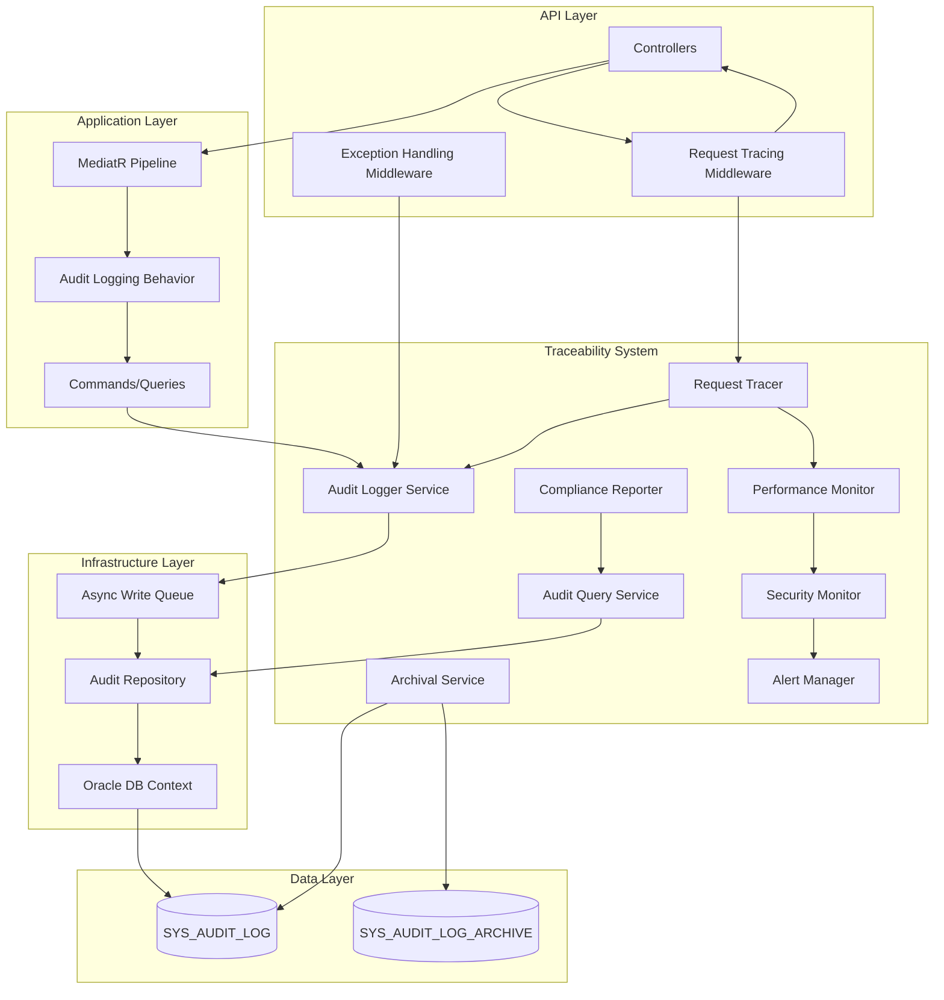
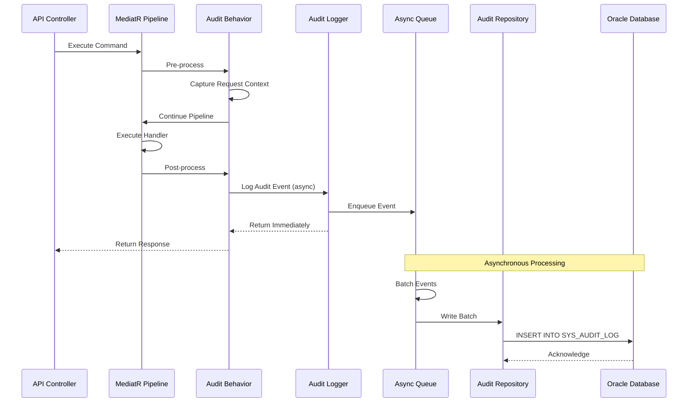
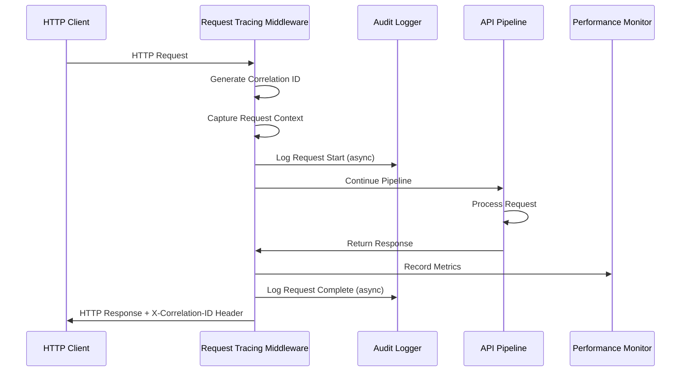
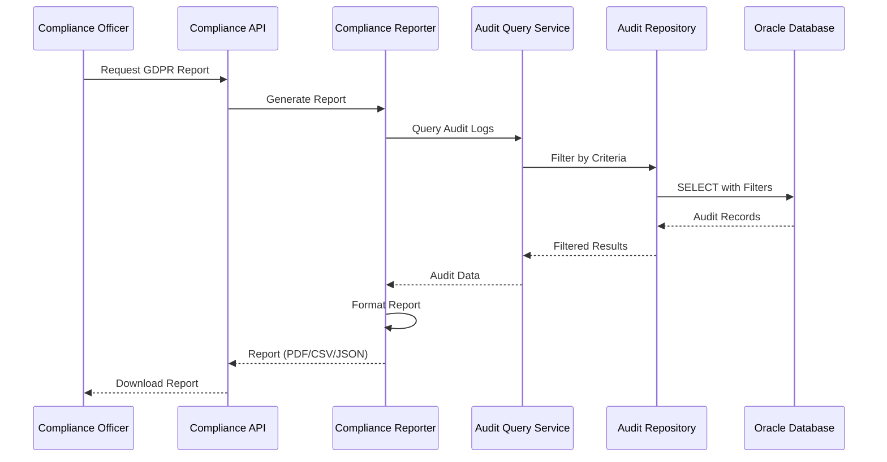

# Design Document: Full Traceability System

## Overview

The Full Traceability System provides comprehensive audit logging, request tracing, and compliance monitoring for the ThinkOnErp API. This system captures all data modifications, authentication events, permission changes, and API requests with complete context, enabling regulatory compliance (GDPR, SOX, ISO 27001), security monitoring, and operational debugging.

### Key Design Goals

- **Non-intrusive Performance**: Add <10ms latency to 99% of API requests through asynchronous processing
- **Comprehensive Coverage**: Capture all data changes, authentication events, and API requests automatically
- **Regulatory Compliance**: Support GDPR, SOX, and ISO 27001 requirements with appropriate retention policies
- **Security Monitoring**: Detect and alert on suspicious activities in real-time
- **Operational Debugging**: Enable request tracing and user action replay for troubleshooting
- **Scalability**: Support 10,000+ requests per minute with horizontal scaling capability

### Integration Points

The traceability system integrates seamlessly with existing ThinkOnErp infrastructure:

- **Oracle Database**: Uses existing SYS_AUDIT_LOG table and connection pooling
- **JWT Authentication**: Captures user identity from JWT claims for actor attribution
- **MediatR Pipeline**: Intercepts commands/queries for automatic audit logging
- **Exception Middleware**: Captures exceptions with full request context
- **Serilog**: Extends structured logging with correlation IDs and audit events

## Architecture

### High-Level Component Diagram



### Data Flow Diagrams

#### Audit Logging Flow



#### Request Tracing Flow




#### Compliance Reporting Flow



## Components and Interfaces

### 1. AuditLogger Service

**Responsibility**: Asynchronously capture and persist audit events to the database.

**Interface**:
```csharp
public interface IAuditLogger
{
    // Core audit logging methods
    Task LogDataChangeAsync(DataChangeAuditEvent auditEvent, CancellationToken cancellationToken = default);
    Task LogAuthenticationAsync(AuthenticationAuditEvent auditEvent, CancellationToken cancellationToken = default);
    Task LogPermissionChangeAsync(PermissionChangeAuditEvent auditEvent, CancellationToken cancellationToken = default);
    Task LogConfigurationChangeAsync(ConfigurationChangeAuditEvent auditEvent, CancellationToken cancellationToken = default);
    Task LogExceptionAsync(ExceptionAuditEvent auditEvent, CancellationToken cancellationToken = default);
    
    // Batch logging for high-volume scenarios
    Task LogBatchAsync(IEnumerable<AuditEvent> auditEvents, CancellationToken cancellationToken = default);
    
    // Health check
    Task<bool> IsHealthyAsync();
}
```

**Implementation Details**:
- Uses `System.Threading.Channels` for high-performance async queue
- Batches writes in 100ms windows or 50 events (whichever comes first)
- Implements circuit breaker pattern for database failures
- Masks sensitive data using configurable field patterns
- Enriches events with correlation ID from AsyncLocal context

**Configuration**:
```json
{
  "AuditLogging": {
    "Enabled": true,
    "BatchSize": 50,
    "BatchWindowMs": 100,
    "MaxQueueSize": 10000,
    "SensitiveFields": ["password", "token", "refreshToken", "creditCard", "ssn"],
    "MaskingPattern": "***MASKED***"
  }
}
```

### 2. RequestTracingMiddleware

**Responsibility**: Generate correlation IDs, capture request/response context, and track request lifecycle.

**Implementation**:
```csharp
public class RequestTracingMiddleware
{
    private readonly RequestDelegate _next;
    private readonly IAuditLogger _auditLogger;
    private readonly IPerformanceMonitor _performanceMonitor;
    private readonly ILogger<RequestTracingMiddleware> _logger;
    private readonly RequestTracingOptions _options;
    
    public async Task InvokeAsync(HttpContext context)
    {
        // Generate or extract correlation ID
        var correlationId = GetOrCreateCorrelationId(context);
        
        // Store in AsyncLocal for access throughout request
        CorrelationContext.Current = correlationId;
        
        // Capture request context
        var requestContext = await CaptureRequestContextAsync(context);
        
        // Start performance tracking
        var stopwatch = Stopwatch.StartNew();
        
        try
        {
            // Continue pipeline
            await _next(context);
            
            stopwatch.Stop();
            
            // Capture response context
            var responseContext = CaptureResponseContext(context, stopwatch.ElapsedMilliseconds);
            
            // Log request completion (async, fire-and-forget)
            _ = LogRequestCompletionAsync(requestContext, responseContext);
        }
        catch (Exception ex)
        {
            stopwatch.Stop();
            
            // Log exception with context
            _ = LogRequestExceptionAsync(requestContext, ex, stopwatch.ElapsedMilliseconds);
            
            throw; // Re-throw for exception middleware
        }
    }
}
```

**Configuration**:
```json
{
  "RequestTracing": {
    "Enabled": true,
    "LogPayloads": true,
    "PayloadLoggingLevel": "Full",
    "MaxPayloadSize": 10240,
    "ExcludedPaths": ["/health", "/metrics"],
    "CorrelationIdHeader": "X-Correlation-ID"
  }
}
```

### 3. PerformanceMonitor

**Responsibility**: Collect and analyze performance metrics for requests and database queries.

**Interface**:
```csharp
public interface IPerformanceMonitor
{
    // Request metrics
    void RecordRequestMetrics(RequestMetrics metrics);
    Task<PerformanceStatistics> GetEndpointStatisticsAsync(string endpoint, TimeSpan period);
    Task<IEnumerable<SlowRequest>> GetSlowRequestsAsync(int thresholdMs, int limit = 100);
    
    // Database metrics
    void RecordQueryMetrics(QueryMetrics metrics);
    Task<IEnumerable<SlowQuery>> GetSlowQueriesAsync(int thresholdMs, int limit = 100);
    
    // System metrics
    Task<SystemHealthMetrics> GetSystemHealthAsync();
    
    // Percentile calculations
    Task<PercentileMetrics> GetPercentileMetricsAsync(string endpoint, TimeSpan period);
}
```

**Implementation Details**:
- Uses in-memory sliding window for recent metrics (last 1 hour)
- Persists aggregated metrics to database hourly
- Calculates p50, p95, p99 percentiles using t-digest algorithm
- Tracks memory, CPU, and connection pool utilization
- Integrates with ASP.NET Core diagnostics

### 4. SecurityMonitor

**Responsibility**: Detect suspicious activities and trigger security alerts.

**Interface**:
```csharp
public interface ISecurityMonitor
{
    // Threat detection
    Task<SecurityThreat?> DetectFailedLoginPatternAsync(string ipAddress);
    Task<SecurityThreat?> DetectUnauthorizedAccessAsync(long userId, long companyId, long branchId);
    Task<SecurityThreat?> DetectSqlInjectionAsync(string input);
    Task<SecurityThreat?> DetectAnomalousActivityAsync(long userId);
    
    // Alert management
    Task TriggerSecurityAlertAsync(SecurityThreat threat);
    Task<IEnumerable<SecurityThreat>> GetActiveThreatsAsync();
    
    // Reporting
    Task<SecuritySummaryReport> GenerateDailySummaryAsync(DateTime date);
}
```

**Implementation Details**:
- Uses Redis cache for tracking failed login attempts (sliding window)
- Implements rate limiting per IP and per user
- Pattern matching for SQL injection, XSS, and path traversal
- Geographic anomaly detection using IP geolocation
- Integrates with AlertManager for notifications


### 5. ComplianceReporter

**Responsibility**: Generate compliance reports for GDPR, SOX, and ISO 27001 requirements.

**Interface**:
```csharp
public interface IComplianceReporter
{
    // GDPR reports
    Task<GdprAccessReport> GenerateGdprAccessReportAsync(long dataSubjectId, DateTime startDate, DateTime endDate);
    Task<GdprDataExportReport> GenerateGdprDataExportReportAsync(long dataSubjectId);
    
    // SOX reports
    Task<SoxFinancialAccessReport> GenerateSoxFinancialAccessReportAsync(DateTime startDate, DateTime endDate);
    Task<SoxSegregationOfDutiesReport> GenerateSoxSegregationReportAsync();
    
    // ISO 27001 reports
    Task<Iso27001SecurityReport> GenerateIso27001SecurityReportAsync(DateTime startDate, DateTime endDate);
    
    // General reports
    Task<UserActivityReport> GenerateUserActivityReportAsync(long userId, DateTime startDate, DateTime endDate);
    Task<DataModificationReport> GenerateDataModificationReportAsync(string entityType, long entityId);
    
    // Export formats
    Task<byte[]> ExportToPdfAsync(IReport report);
    Task<byte[]> ExportToCsvAsync(IReport report);
    Task<string> ExportToJsonAsync(IReport report);
    
    // Scheduled reports
    Task ScheduleReportAsync(ReportSchedule schedule);
}
```

**Implementation Details**:
- Uses background service for scheduled report generation
- Generates PDF reports using QuestPDF library
- Implements report caching for frequently requested reports
- Supports email delivery for scheduled reports
- Stores report metadata in database for audit trail

### 6. AuditQueryService

**Responsibility**: Provide efficient querying and filtering of audit data.

**Interface**:
```csharp
public interface IAuditQueryService
{
    // Query methods
    Task<PagedResult<AuditLogEntry>> QueryAsync(AuditQueryFilter filter, PaginationOptions pagination);
    Task<IEnumerable<AuditLogEntry>> GetByCorrelationIdAsync(string correlationId);
    Task<IEnumerable<AuditLogEntry>> GetByEntityAsync(string entityType, long entityId);
    Task<IEnumerable<AuditLogEntry>> GetByActorAsync(long actorId, DateTime startDate, DateTime endDate);
    
    // Full-text search
    Task<PagedResult<AuditLogEntry>> SearchAsync(string searchTerm, PaginationOptions pagination);
    
    // User action replay
    Task<UserActionReplay> GetUserActionReplayAsync(long userId, DateTime startDate, DateTime endDate);
    
    // Export
    Task<byte[]> ExportToCsvAsync(AuditQueryFilter filter);
    Task<string> ExportToJsonAsync(AuditQueryFilter filter);
}
```

**Query Filter Model**:
```csharp
public class AuditQueryFilter
{
    public DateTime? StartDate { get; set; }
    public DateTime? EndDate { get; set; }
    public long? ActorId { get; set; }
    public string? ActorType { get; set; }
    public long? CompanyId { get; set; }
    public long? BranchId { get; set; }
    public string? EntityType { get; set; }
    public long? EntityId { get; set; }
    public string? Action { get; set; }
    public string? IpAddress { get; set; }
    public string? CorrelationId { get; set; }
}
```

**Implementation Details**:
- Uses Oracle Text for full-text search capabilities
- Implements query result caching with Redis
- Optimizes queries using covering indexes
- Supports parallel query execution for large date ranges
- Implements query timeout protection (30 seconds max)

### 7. ArchivalService

**Responsibility**: Manage data retention policies and archive historical audit data.

**Interface**:
```csharp
public interface IArchivalService
{
    // Archival operations
    Task ArchiveExpiredDataAsync(CancellationToken cancellationToken = default);
    Task<ArchivalResult> ArchiveByDateRangeAsync(DateTime startDate, DateTime endDate);
    
    // Retrieval
    Task<IEnumerable<AuditLogEntry>> RetrieveArchivedDataAsync(AuditQueryFilter filter);
    
    // Verification
    Task<bool> VerifyArchiveIntegrityAsync(long archiveId);
    
    // Configuration
    Task<RetentionPolicy> GetRetentionPolicyAsync(string eventType);
    Task UpdateRetentionPolicyAsync(RetentionPolicy policy);
}
```

**Implementation Details**:
- Runs as background service with configurable schedule (default: daily at 2 AM)
- Compresses archived data using GZip
- Calculates SHA-256 checksums for integrity verification
- Moves data to SYS_AUDIT_LOG_ARCHIVE table
- Supports external storage (S3, Azure Blob) for cold storage
- Implements incremental archival to avoid long-running transactions

### 9. LegacyAuditService

**Responsibility**: Provide audit data in the exact format shown in logs.png for backward compatibility.

**Interface**:
```csharp
public interface ILegacyAuditService
{
    // Legacy view methods (matches logs.png exactly)
    Task<PagedResult<LegacyAuditLogDto>> GetLegacyAuditLogsAsync(
        LegacyAuditLogFilter filter, 
        PaginationOptions pagination);
    
    Task<LegacyDashboardCounters> GetLegacyDashboardCountersAsync();
    
    // Status management (for error resolution workflow)
    Task UpdateStatusAsync(long auditLogId, string status, string? resolutionNotes = null, long? assignedToUserId = null);
    Task<string> GetCurrentStatusAsync(long auditLogId);
    
    // Data transformation methods
    Task<LegacyAuditLogDto> TransformToLegacyFormatAsync(AuditLogEntry auditEntry);
    Task<string> GenerateBusinessDescriptionAsync(AuditLogEntry auditEntry);
    Task<string> ExtractDeviceIdentifierAsync(string userAgent, string? ipAddress);
    Task<string> DetermineBusinessModuleAsync(string entityType, string? endpointPath);
    Task<string> GenerateErrorCodeAsync(string exceptionType, string entityType);
}
```

**Implementation Details**:
- Transforms comprehensive audit data into the simple format shown in logs.png
- Maps technical exception messages to business-friendly descriptions
- Extracts device information from User-Agent strings
- Determines business modules from entity types and endpoints
- Generates standardized error codes for different exception types
- Manages status workflow for error resolution

**Data Transformation Examples**:
```csharp
// Transform technical audit entry to legacy format
var legacyEntry = new LegacyAuditLogDto
{
    Id = auditEntry.RowId,
    ErrorDescription = await GenerateBusinessDescriptionAsync(auditEntry),
    Module = await DetermineBusinessModuleAsync(auditEntry.EntityType, auditEntry.EndpointPath),
    Company = auditEntry.CompanyName ?? "Unknown",
    Branch = auditEntry.BranchName ?? "Unknown", 
    User = auditEntry.ActorName ?? "System",
    Device = await ExtractDeviceIdentifierAsync(auditEntry.UserAgent, auditEntry.IpAddress),
    DateTime = auditEntry.CreationDate,
    Status = await GetCurrentStatusAsync(auditEntry.RowId),
    ErrorCode = await GenerateErrorCodeAsync(auditEntry.ExceptionType, auditEntry.EntityType)
};
```

### 10. AlertManager

**Responsibility**: Manage alert notifications for critical events.

**Interface**:
```csharp
public interface IAlertManager
{
    // Alert triggering
    Task TriggerAlertAsync(Alert alert);
    
    // Alert configuration
    Task<AlertRule> CreateAlertRuleAsync(AlertRule rule);
    Task UpdateAlertRuleAsync(AlertRule rule);
    Task DeleteAlertRuleAsync(long ruleId);
    Task<IEnumerable<AlertRule>> GetAlertRulesAsync();
    
    // Alert history
    Task<PagedResult<AlertHistory>> GetAlertHistoryAsync(PaginationOptions pagination);
    Task AcknowledgeAlertAsync(long alertId, long userId);
    
    // Notification channels
    Task SendEmailAlertAsync(Alert alert, string[] recipients);
    Task SendWebhookAlertAsync(Alert alert, string webhookUrl);
    Task SendSmsAlertAsync(Alert alert, string[] phoneNumbers);
}
```

**Implementation Details**:
- Implements rate limiting to prevent alert flooding (max 10 per rule per hour)
- Supports multiple notification channels with fallback
- Uses background queue for async notification delivery
- Tracks alert acknowledgment and resolution
- Integrates with SMTP for email, Twilio for SMS

## Data Models

### Core Audit Event Models

```csharp
public abstract class AuditEvent
{
    public string CorrelationId { get; set; } = null!;
    public string ActorType { get; set; } = null!; // SUPER_ADMIN, COMPANY_ADMIN, USER, SYSTEM
    public long ActorId { get; set; }
    public long? CompanyId { get; set; }
    public long? BranchId { get; set; }
    public string Action { get; set; } = null!;
    public string EntityType { get; set; } = null!;
    public long? EntityId { get; set; }
    public string? IpAddress { get; set; }
    public string? UserAgent { get; set; }
    public DateTime Timestamp { get; set; } = DateTime.UtcNow;
}

public class DataChangeAuditEvent : AuditEvent
{
    public string? OldValue { get; set; } // JSON
    public string? NewValue { get; set; } // JSON
    public Dictionary<string, object>? ChangedFields { get; set; }
}

public class AuthenticationAuditEvent : AuditEvent
{
    public bool Success { get; set; }
    public string? FailureReason { get; set; }
    public string? TokenId { get; set; }
    public TimeSpan? SessionDuration { get; set; }
}

public class PermissionChangeAuditEvent : AuditEvent
{
    public long? RoleId { get; set; }
    public long? PermissionId { get; set; }
    public string? PermissionBefore { get; set; } // JSON
    public string? PermissionAfter { get; set; } // JSON
}

public class ExceptionAuditEvent : AuditEvent
{
    public string ExceptionType { get; set; } = null!;
    public string ExceptionMessage { get; set; } = null!;
    public string StackTrace { get; set; } = null!;
    public string? InnerException { get; set; }
    public string Severity { get; set; } = "Error"; // Critical, Error, Warning, Info
}

public class ConfigurationChangeAuditEvent : AuditEvent
{
    public string SettingName { get; set; } = null!;
    public string? OldValue { get; set; }
    public string? NewValue { get; set; }
    public string Source { get; set; } = null!; // EnvironmentVariable, ConfigFile, Database
}
```

### Request Context Models

```csharp
public class RequestContext
{
    public string CorrelationId { get; set; } = null!;
    public string HttpMethod { get; set; } = null!;
    public string Path { get; set; } = null!;
    public string? QueryString { get; set; }
    public Dictionary<string, string> Headers { get; set; } = new();
    public string? RequestBody { get; set; }
    public long? UserId { get; set; }
    public long? CompanyId { get; set; }
    public string? IpAddress { get; set; }
    public string? UserAgent { get; set; }
    public DateTime StartTime { get; set; }
}

public class ResponseContext
{
    public int StatusCode { get; set; }
    public long ResponseSize { get; set; }
    public string? ResponseBody { get; set; }
    public long ExecutionTimeMs { get; set; }
    public DateTime EndTime { get; set; }
}
```

### Performance Metrics Models

```csharp
public class RequestMetrics
{
    public string CorrelationId { get; set; } = null!;
    public string Endpoint { get; set; } = null!;
    public long ExecutionTimeMs { get; set; }
    public long DatabaseTimeMs { get; set; }
    public int QueryCount { get; set; }
    public long MemoryAllocatedBytes { get; set; }
    public int StatusCode { get; set; }
    public DateTime Timestamp { get; set; }
}

public class QueryMetrics
{
    public string CorrelationId { get; set; } = null!;
    public string SqlStatement { get; set; } = null!;
    public long ExecutionTimeMs { get; set; }
    public int RowsAffected { get; set; }
    public DateTime Timestamp { get; set; }
}

public class PerformanceStatistics
{
    public string Endpoint { get; set; } = null!;
    public long RequestCount { get; set; }
    public double AverageExecutionTimeMs { get; set; }
    public long MinExecutionTimeMs { get; set; }
    public long MaxExecutionTimeMs { get; set; }
    public PercentileMetrics Percentiles { get; set; } = null!;
}

public class PercentileMetrics
{
    public long P50 { get; set; }
    public long P95 { get; set; }
    public long P99 { get; set; }
}
```


## Database Design

### Extended SYS_AUDIT_LOG Schema

The existing SYS_AUDIT_LOG table will be extended with additional columns to support the full traceability requirements:

```sql
-- Add new columns to existing SYS_AUDIT_LOG table
ALTER TABLE SYS_AUDIT_LOG ADD (
    CORRELATION_ID NVARCHAR2(100),
    BRANCH_ID NUMBER(19),
    HTTP_METHOD NVARCHAR2(10),
    ENDPOINT_PATH NVARCHAR2(500),
    REQUEST_PAYLOAD CLOB,
    RESPONSE_PAYLOAD CLOB,
    EXECUTION_TIME_MS NUMBER(19),
    STATUS_CODE NUMBER(5),
    EXCEPTION_TYPE NVARCHAR2(200),
    EXCEPTION_MESSAGE NVARCHAR2(4000),
    STACK_TRACE CLOB,
    SEVERITY NVARCHAR2(20) DEFAULT 'Info',
    EVENT_CATEGORY NVARCHAR2(50) DEFAULT 'DataChange',
    METADATA CLOB, -- Additional JSON metadata
    
    -- Legacy compatibility fields for logs.png format
    BUSINESS_MODULE NVARCHAR2(50), -- POS, HR, Accounting, etc.
    DEVICE_IDENTIFIER NVARCHAR2(100), -- POS Terminal 03, Desktop-HR-02, etc.
    ERROR_CODE NVARCHAR2(50), -- DB_TIMEOUT_001, API_HR_045, etc.
    BUSINESS_DESCRIPTION NVARCHAR2(4000), -- Human-readable error description
    
    CONSTRAINT FK_AUDIT_LOG_BRANCH FOREIGN KEY (BRANCH_ID) REFERENCES SYS_BRANCH(ROW_ID)
);

-- Add new indexes for performance
CREATE INDEX IDX_AUDIT_LOG_CORRELATION ON SYS_AUDIT_LOG(CORRELATION_ID);
CREATE INDEX IDX_AUDIT_LOG_BRANCH ON SYS_AUDIT_LOG(BRANCH_ID);
CREATE INDEX IDX_AUDIT_LOG_ENDPOINT ON SYS_AUDIT_LOG(ENDPOINT_PATH);
CREATE INDEX IDX_AUDIT_LOG_CATEGORY ON SYS_AUDIT_LOG(EVENT_CATEGORY);
CREATE INDEX IDX_AUDIT_LOG_SEVERITY ON SYS_AUDIT_LOG(SEVERITY);

-- Composite indexes for common query patterns
CREATE INDEX IDX_AUDIT_LOG_COMPANY_DATE ON SYS_AUDIT_LOG(COMPANY_ID, CREATION_DATE);
CREATE INDEX IDX_AUDIT_LOG_ACTOR_DATE ON SYS_AUDIT_LOG(ACTOR_ID, CREATION_DATE);
CREATE INDEX IDX_AUDIT_LOG_ENTITY_DATE ON SYS_AUDIT_LOG(ENTITY_TYPE, ENTITY_ID, CREATION_DATE);

-- Add comments for new columns
COMMENT ON COLUMN SYS_AUDIT_LOG.CORRELATION_ID IS 'Unique identifier tracking request through system';
COMMENT ON COLUMN SYS_AUDIT_LOG.EVENT_CATEGORY IS 'Category: DataChange, Authentication, Permission, Exception, Configuration, Request';
COMMENT ON COLUMN SYS_AUDIT_LOG.SEVERITY IS 'Severity level: Critical, Error, Warning, Info';
COMMENT ON COLUMN SYS_AUDIT_LOG.METADATA IS 'Additional JSON metadata for extensibility';
```

### Status Tracking Table for Legacy Compatibility

```sql
-- Status tracking table for error resolution workflow (matches logs.png status functionality)
CREATE TABLE SYS_AUDIT_STATUS_TRACKING (
    ROW_ID NUMBER(19) PRIMARY KEY,
    AUDIT_LOG_ID NUMBER(19) NOT NULL,
    STATUS NVARCHAR2(20) NOT NULL, -- Unresolved, In Progress, Resolved, Critical
    ASSIGNED_TO_USER_ID NUMBER(19),
    RESOLUTION_NOTES NVARCHAR2(4000),
    STATUS_CHANGED_BY NUMBER(19) NOT NULL,
    STATUS_CHANGED_DATE DATE DEFAULT SYSDATE,
    CONSTRAINT FK_STATUS_AUDIT_LOG FOREIGN KEY (AUDIT_LOG_ID) REFERENCES SYS_AUDIT_LOG(ROW_ID),
    CONSTRAINT FK_STATUS_ASSIGNED_USER FOREIGN KEY (ASSIGNED_TO_USER_ID) REFERENCES SYS_USERS(ROW_ID),
    CONSTRAINT FK_STATUS_CHANGED_BY FOREIGN KEY (STATUS_CHANGED_BY) REFERENCES SYS_USERS(ROW_ID),
    CONSTRAINT CHK_STATUS_VALUES CHECK (STATUS IN ('Unresolved', 'In Progress', 'Resolved', 'Critical'))
);

-- Index for status queries
CREATE INDEX IDX_STATUS_TRACKING_AUDIT ON SYS_AUDIT_STATUS_TRACKING(AUDIT_LOG_ID);
CREATE INDEX IDX_STATUS_TRACKING_STATUS ON SYS_AUDIT_STATUS_TRACKING(STATUS);
CREATE INDEX IDX_STATUS_TRACKING_ASSIGNED ON SYS_AUDIT_STATUS_TRACKING(ASSIGNED_TO_USER_ID);

-- Comments
COMMENT ON TABLE SYS_AUDIT_STATUS_TRACKING IS 'Status tracking for audit log entries (legacy compatibility)';
COMMENT ON COLUMN SYS_AUDIT_STATUS_TRACKING.STATUS IS 'Status values: Unresolved, In Progress, Resolved, Critical';

-- Default status for new audit entries (only for exception-type entries)
-- This will be handled by application logic to create status records for exceptions
```

### Archive Table Schema

```sql
-- Archive table with identical structure to SYS_AUDIT_LOG
CREATE TABLE SYS_AUDIT_LOG_ARCHIVE (
    ROW_ID NUMBER(19) PRIMARY KEY,
    ACTOR_TYPE NVARCHAR2(50) NOT NULL,
    ACTOR_ID NUMBER(19) NOT NULL,
    COMPANY_ID NUMBER(19),
    BRANCH_ID NUMBER(19),
    ACTION NVARCHAR2(100) NOT NULL,
    ENTITY_TYPE NVARCHAR2(100) NOT NULL,
    ENTITY_ID NUMBER(19),
    OLD_VALUE CLOB,
    NEW_VALUE CLOB,
    IP_ADDRESS NVARCHAR2(50),
    USER_AGENT NVARCHAR2(500),
    CORRELATION_ID NVARCHAR2(100),
    HTTP_METHOD NVARCHAR2(10),
    ENDPOINT_PATH NVARCHAR2(500),
    REQUEST_PAYLOAD CLOB,
    RESPONSE_PAYLOAD CLOB,
    EXECUTION_TIME_MS NUMBER(19),
    STATUS_CODE NUMBER(5),
    EXCEPTION_TYPE NVARCHAR2(200),
    EXCEPTION_MESSAGE NVARCHAR2(4000),
    STACK_TRACE CLOB,
    SEVERITY NVARCHAR2(20) DEFAULT 'Info',
    EVENT_CATEGORY NVARCHAR2(50) DEFAULT 'DataChange',
    METADATA CLOB,
    
    -- Legacy compatibility fields
    BUSINESS_MODULE NVARCHAR2(50),
    DEVICE_IDENTIFIER NVARCHAR2(100),
    ERROR_CODE NVARCHAR2(50),
    BUSINESS_DESCRIPTION NVARCHAR2(4000),
    
    CREATION_DATE DATE,
    ARCHIVED_DATE DATE DEFAULT SYSDATE,
    ARCHIVE_BATCH_ID NUMBER(19),
    CHECKSUM NVARCHAR2(64) -- SHA-256 hash for integrity verification
);

-- Indexes for archive table (fewer than active table)
CREATE INDEX IDX_ARCHIVE_COMPANY_DATE ON SYS_AUDIT_LOG_ARCHIVE(COMPANY_ID, CREATION_DATE);
CREATE INDEX IDX_ARCHIVE_CORRELATION ON SYS_AUDIT_LOG_ARCHIVE(CORRELATION_ID);
CREATE INDEX IDX_ARCHIVE_BATCH ON SYS_AUDIT_LOG_ARCHIVE(ARCHIVE_BATCH_ID);

COMMENT ON TABLE SYS_AUDIT_LOG_ARCHIVE IS 'Archived audit logs for long-term retention';
```

### Performance Metrics Tables

```sql
-- Request performance metrics (aggregated hourly)
CREATE TABLE SYS_PERFORMANCE_METRICS (
    ROW_ID NUMBER(19) PRIMARY KEY,
    ENDPOINT_PATH NVARCHAR2(500) NOT NULL,
    HOUR_TIMESTAMP DATE NOT NULL,
    REQUEST_COUNT NUMBER(19) NOT NULL,
    AVG_EXECUTION_TIME_MS NUMBER(19),
    MIN_EXECUTION_TIME_MS NUMBER(19),
    MAX_EXECUTION_TIME_MS NUMBER(19),
    P50_EXECUTION_TIME_MS NUMBER(19),
    P95_EXECUTION_TIME_MS NUMBER(19),
    P99_EXECUTION_TIME_MS NUMBER(19),
    AVG_DATABASE_TIME_MS NUMBER(19),
    AVG_QUERY_COUNT NUMBER(10,2),
    ERROR_COUNT NUMBER(19),
    CREATION_DATE DATE DEFAULT SYSDATE
);

CREATE INDEX IDX_PERF_ENDPOINT_HOUR ON SYS_PERFORMANCE_METRICS(ENDPOINT_PATH, HOUR_TIMESTAMP);

-- Slow query log
CREATE TABLE SYS_SLOW_QUERIES (
    ROW_ID NUMBER(19) PRIMARY KEY,
    CORRELATION_ID NVARCHAR2(100),
    SQL_STATEMENT CLOB NOT NULL,
    EXECUTION_TIME_MS NUMBER(19) NOT NULL,
    ROWS_AFFECTED NUMBER(19),
    ENDPOINT_PATH NVARCHAR2(500),
    USER_ID NUMBER(19),
    COMPANY_ID NUMBER(19),
    CREATION_DATE DATE DEFAULT SYSDATE
);

CREATE INDEX IDX_SLOW_QUERY_DATE ON SYS_SLOW_QUERIES(CREATION_DATE);
CREATE INDEX IDX_SLOW_QUERY_TIME ON SYS_SLOW_QUERIES(EXECUTION_TIME_MS);
```

### Security Monitoring Tables

```sql
-- Security threats and alerts
CREATE TABLE SYS_SECURITY_THREATS (
    ROW_ID NUMBER(19) PRIMARY KEY,
    THREAT_TYPE NVARCHAR2(100) NOT NULL,
    SEVERITY NVARCHAR2(20) NOT NULL,
    IP_ADDRESS NVARCHAR2(50),
    USER_ID NUMBER(19),
    COMPANY_ID NUMBER(19),
    DESCRIPTION NVARCHAR2(4000),
    DETECTION_DATE DATE DEFAULT SYSDATE,
    STATUS NVARCHAR2(20) DEFAULT 'Active',
    ACKNOWLEDGED_BY NUMBER(19),
    ACKNOWLEDGED_DATE DATE,
    RESOLVED_DATE DATE,
    METADATA CLOB
);

CREATE INDEX IDX_THREAT_STATUS ON SYS_SECURITY_THREATS(STATUS, DETECTION_DATE);
CREATE INDEX IDX_THREAT_IP ON SYS_SECURITY_THREATS(IP_ADDRESS);

-- Failed login tracking (for rate limiting)
CREATE TABLE SYS_FAILED_LOGINS (
    ROW_ID NUMBER(19) PRIMARY KEY,
    IP_ADDRESS NVARCHAR2(50) NOT NULL,
    USERNAME NVARCHAR2(100),
    FAILURE_REASON NVARCHAR2(200),
    ATTEMPT_DATE DATE DEFAULT SYSDATE
);

CREATE INDEX IDX_FAILED_LOGIN_IP_DATE ON SYS_FAILED_LOGINS(IP_ADDRESS, ATTEMPT_DATE);

-- Cleanup old failed login records (keep only last 24 hours)
-- This should be run by a scheduled job
```

### Retention Policy Configuration Table

```sql
CREATE TABLE SYS_RETENTION_POLICIES (
    ROW_ID NUMBER(19) PRIMARY KEY,
    EVENT_CATEGORY NVARCHAR2(50) NOT NULL UNIQUE,
    RETENTION_DAYS NUMBER(10) NOT NULL,
    ARCHIVE_ENABLED NUMBER(1) DEFAULT 1,
    DESCRIPTION NVARCHAR2(500),
    LAST_MODIFIED_DATE DATE DEFAULT SYSDATE,
    LAST_MODIFIED_BY NUMBER(19)
);

-- Insert default retention policies
INSERT INTO SYS_RETENTION_POLICIES (ROW_ID, EVENT_CATEGORY, RETENTION_DAYS, DESCRIPTION)
VALUES (SEQ_SYS_RETENTION_POLICY.NEXTVAL, 'Authentication', 365, 'Authentication events retained for 1 year');

INSERT INTO SYS_RETENTION_POLICIES (ROW_ID, EVENT_CATEGORY, RETENTION_DAYS, DESCRIPTION)
VALUES (SEQ_SYS_RETENTION_POLICY.NEXTVAL, 'DataChange', 1095, 'Data changes retained for 3 years');

INSERT INTO SYS_RETENTION_POLICIES (ROW_ID, EVENT_CATEGORY, RETENTION_DAYS, DESCRIPTION)
VALUES (SEQ_SYS_RETENTION_POLICY.NEXTVAL, 'Financial', 2555, 'Financial data retained for 7 years (SOX)');

INSERT INTO SYS_RETENTION_POLICIES (ROW_ID, EVENT_CATEGORY, RETENTION_DAYS, DESCRIPTION)
VALUES (SEQ_SYS_RETENTION_POLICY.NEXTVAL, 'PersonalData', 1095, 'Personal data retained for 3 years (GDPR)');

INSERT INTO SYS_RETENTION_POLICIES (ROW_ID, EVENT_CATEGORY, RETENTION_DAYS, DESCRIPTION)
VALUES (SEQ_SYS_RETENTION_POLICY.NEXTVAL, 'Security', 730, 'Security events retained for 2 years');

INSERT INTO SYS_RETENTION_POLICIES (ROW_ID, EVENT_CATEGORY, RETENTION_DAYS, DESCRIPTION)
VALUES (SEQ_SYS_RETENTION_POLICY.NEXTVAL, 'Configuration', 1825, 'Configuration changes retained for 5 years');

COMMIT;
```

### Table Partitioning Strategy

For high-volume environments, partition the SYS_AUDIT_LOG table by date range:

```sql
-- Partition by month for efficient archival and query performance
ALTER TABLE SYS_AUDIT_LOG
MODIFY PARTITION BY RANGE (CREATION_DATE)
INTERVAL (NUMTOYMINTERVAL(1, 'MONTH'))
(
    PARTITION P_AUDIT_2024_01 VALUES LESS THAN (TO_DATE('2024-02-01', 'YYYY-MM-DD'))
);

-- Partitioning enables:
-- 1. Fast archival by dropping old partitions
-- 2. Partition pruning for date-range queries
-- 3. Parallel query execution across partitions
-- 4. Independent maintenance operations per partition
```


## API Design

### Legacy Audit Logs View (Compatible with logs.png)

```csharp
[ApiController]
[Route("api/[controller]")]
[Authorize]
public class AuditLogsController : ControllerBase
{
    /// <summary>
    /// Get audit logs in legacy format (compatible with existing UI)
    /// </summary>
    /// <remarks>
    /// Returns data in the exact format shown in logs.png interface:
    /// Error Description, Module, Company, Branch, User, Device, Date & Time, Status, Actions
    /// </remarks>
    [HttpGet("legacy-view")]
    [ProducesResponseType(typeof(PagedResult<LegacyAuditLogDto>), StatusCodes.Status200OK)]
    public async Task<IActionResult> GetLegacyAuditLogs(
        [FromQuery] LegacyAuditLogFilter filter,
        [FromQuery] PaginationOptions pagination)
    {
        // Implementation returns data exactly like logs.png
    }

    /// <summary>
    /// Get dashboard counters for legacy view
    /// </summary>
    [HttpGet("legacy-dashboard")]
    [ProducesResponseType(typeof(LegacyDashboardCounters), StatusCodes.Status200OK)]
    public async Task<IActionResult> GetLegacyDashboard()
    {
        // Returns: Unresolved count, In Progress count, Resolved count, Critical Errors count
    }

    /// <summary>
    /// Update status of audit log entry (for error resolution workflow)
    /// </summary>
    [HttpPut("legacy/{id}/status")]
    [ProducesResponseType(StatusCodes.Status200OK)]
    public async Task<IActionResult> UpdateLegacyStatus(long id, [FromBody] UpdateStatusRequest request)
    {
        // Updates status: Unresolved -> In Progress -> Resolved
    }

    /// <summary>
    /// Query audit logs with filtering and pagination
    /// </summary>
    /// <remarks>
    /// Supports filtering by date range, actor, entity, action type, and more.
    /// Results are automatically filtered by user's company access.
    /// </remarks>
    [HttpPost("query")]
    [ProducesResponseType(typeof(PagedResult<AuditLogDto>), StatusCodes.Status200OK)]
    public async Task<IActionResult> QueryAuditLogs(
        [FromBody] AuditQueryRequest request,
        [FromQuery] PaginationOptions pagination)
    {
        // Implementation
    }
    
    /// <summary>
    /// Get all audit logs for a specific correlation ID
    /// </summary>
    /// <remarks>
    /// Returns all log entries associated with a single request, useful for debugging.
    /// </remarks>
    [HttpGet("correlation/{correlationId}")]
    [ProducesResponseType(typeof(IEnumerable<AuditLogDto>), StatusCodes.Status200OK)]
    public async Task<IActionResult> GetByCorrelationId(string correlationId)
    {
        // Implementation
    }
    
    /// <summary>
    /// Get audit history for a specific entity
    /// </summary>
    [HttpGet("entity/{entityType}/{entityId}")]
    [ProducesResponseType(typeof(IEnumerable<AuditLogDto>), StatusCodes.Status200OK)]
    public async Task<IActionResult> GetEntityHistory(string entityType, long entityId)
    {
        // Implementation
    }
    
    /// <summary>
    /// Get user action replay for debugging
    /// </summary>
    [HttpGet("replay/user/{userId}")]
    [ProducesResponseType(typeof(UserActionReplayDto), StatusCodes.Status200OK)]
    public async Task<IActionResult> GetUserActionReplay(
        long userId,
        [FromQuery] DateTime startDate,
        [FromQuery] DateTime endDate)
    {
        // Implementation
    }
    
    /// <summary>
    /// Export audit logs to CSV
    /// </summary>
    [HttpPost("export/csv")]
    [ProducesResponseType(typeof(FileContentResult), StatusCodes.Status200OK)]
    public async Task<IActionResult> ExportToCsv([FromBody] AuditQueryRequest request)
    {
        // Implementation
    }
    
    /// <summary>
    /// Full-text search across audit logs
    /// </summary>
    [HttpGet("search")]
    [ProducesResponseType(typeof(PagedResult<AuditLogDto>), StatusCodes.Status200OK)]
    public async Task<IActionResult> Search(
        [FromQuery] string searchTerm,
        [FromQuery] PaginationOptions pagination)
    {
        // Implementation
    }
}
```

### Compliance Report Endpoints

```csharp
[ApiController]
[Route("api/[controller]")]
[Authorize(Policy = "AdminOnly")]
public class ComplianceController : ControllerBase
{
    /// <summary>
    /// Generate GDPR data access report for a data subject
    /// </summary>
    [HttpGet("gdpr/access-report/{dataSubjectId}")]
    [ProducesResponseType(typeof(GdprAccessReportDto), StatusCodes.Status200OK)]
    public async Task<IActionResult> GenerateGdprAccessReport(
        long dataSubjectId,
        [FromQuery] DateTime startDate,
        [FromQuery] DateTime endDate)
    {
        // Implementation
    }
    
    /// <summary>
    /// Generate SOX financial access report
    /// </summary>
    [HttpGet("sox/financial-access-report")]
    [ProducesResponseType(typeof(SoxFinancialAccessReportDto), StatusCodes.Status200OK)]
    public async Task<IActionResult> GenerateSoxFinancialAccessReport(
        [FromQuery] DateTime startDate,
        [FromQuery] DateTime endDate)
    {
        // Implementation
    }
    
    /// <summary>
    /// Generate SOX segregation of duties report
    /// </summary>
    [HttpGet("sox/segregation-of-duties")]
    [ProducesResponseType(typeof(SoxSegregationReportDto), StatusCodes.Status200OK)]
    public async Task<IActionResult> GenerateSoxSegregationReport()
    {
        // Implementation
    }
    
    /// <summary>
    /// Generate ISO 27001 security event report
    /// </summary>
    [HttpGet("iso27001/security-report")]
    [ProducesResponseType(typeof(Iso27001SecurityReportDto), StatusCodes.Status200OK)]
    public async Task<IActionResult> GenerateIso27001SecurityReport(
        [FromQuery] DateTime startDate,
        [FromQuery] DateTime endDate)
    {
        // Implementation
    }
    
    /// <summary>
    /// Export report to PDF
    /// </summary>
    [HttpPost("export/pdf")]
    [ProducesResponseType(typeof(FileContentResult), StatusCodes.Status200OK)]
    public async Task<IActionResult> ExportReportToPdf([FromBody] ReportExportRequest request)
    {
        // Implementation
    }
    
    /// <summary>
    /// Schedule recurring compliance report
    /// </summary>
    [HttpPost("schedule")]
    [ProducesResponseType(typeof(ReportScheduleDto), StatusCodes.Status201Created)]
    public async Task<IActionResult> ScheduleReport([FromBody] ReportScheduleRequest request)
    {
        // Implementation
    }
}
```

### System Monitoring Endpoints

```csharp
[ApiController]
[Route("api/[controller]")]
[Authorize(Policy = "AdminOnly")]
public class MonitoringController : ControllerBase
{
    /// <summary>
    /// Get system health status
    /// </summary>
    [HttpGet("health")]
    [AllowAnonymous]
    [ProducesResponseType(typeof(SystemHealthDto), StatusCodes.Status200OK)]
    public async Task<IActionResult> GetSystemHealth()
    {
        // Implementation
    }
    
    /// <summary>
    /// Get performance statistics for an endpoint
    /// </summary>
    [HttpGet("performance/endpoint")]
    [ProducesResponseType(typeof(PerformanceStatisticsDto), StatusCodes.Status200OK)]
    public async Task<IActionResult> GetEndpointStatistics(
        [FromQuery] string endpoint,
        [FromQuery] TimeSpan period)
    {
        // Implementation
    }
    
    /// <summary>
    /// Get slow requests exceeding threshold
    /// </summary>
    [HttpGet("performance/slow-requests")]
    [ProducesResponseType(typeof(IEnumerable<SlowRequestDto>), StatusCodes.Status200OK)]
    public async Task<IActionResult> GetSlowRequests(
        [FromQuery] int thresholdMs = 1000,
        [FromQuery] int limit = 100)
    {
        // Implementation
    }
    
    /// <summary>
    /// Get slow database queries
    /// </summary>
    [HttpGet("performance/slow-queries")]
    [ProducesResponseType(typeof(IEnumerable<SlowQueryDto>), StatusCodes.Status200OK)]
    public async Task<IActionResult> GetSlowQueries(
        [FromQuery] int thresholdMs = 500,
        [FromQuery] int limit = 100)
    {
        // Implementation
    }
    
    /// <summary>
    /// Get active security threats
    /// </summary>
    [HttpGet("security/threats")]
    [ProducesResponseType(typeof(IEnumerable<SecurityThreatDto>), StatusCodes.Status200OK)]
    public async Task<IActionResult> GetActiveThreats()
    {
        // Implementation
    }
    
    /// <summary>
    /// Get daily security summary
    /// </summary>
    [HttpGet("security/daily-summary")]
    [ProducesResponseType(typeof(SecuritySummaryDto), StatusCodes.Status200OK)]
    public async Task<IActionResult> GetDailySecuritySummary([FromQuery] DateTime date)
    {
        // Implementation
    }
}
```

### Alert Configuration Endpoints

```csharp
[ApiController]
[Route("api/[controller]")]
[Authorize(Policy = "AdminOnly")]
public class AlertsController : ControllerBase
{
    /// <summary>
    /// Create new alert rule
    /// </summary>
    [HttpPost("rules")]
    [ProducesResponseType(typeof(AlertRuleDto), StatusCodes.Status201Created)]
    public async Task<IActionResult> CreateAlertRule([FromBody] CreateAlertRuleRequest request)
    {
        // Implementation
    }
    
    /// <summary>
    /// Update existing alert rule
    /// </summary>
    [HttpPut("rules/{ruleId}")]
    [ProducesResponseType(typeof(AlertRuleDto), StatusCodes.Status200OK)]
    public async Task<IActionResult> UpdateAlertRule(long ruleId, [FromBody] UpdateAlertRuleRequest request)
    {
        // Implementation
    }
    
    /// <summary>
    /// Delete alert rule
    /// </summary>
    [HttpDelete("rules/{ruleId}")]
    [ProducesResponseType(StatusCodes.Status204NoContent)]
    public async Task<IActionResult> DeleteAlertRule(long ruleId)
    {
        // Implementation
    }
    
    /// <summary>
    /// Get all alert rules
    /// </summary>
    [HttpGet("rules")]
    [ProducesResponseType(typeof(IEnumerable<AlertRuleDto>), StatusCodes.Status200OK)]
    public async Task<IActionResult> GetAlertRules()
    {
        // Implementation
    }
    
    /// <summary>
    /// Get alert history with pagination
    /// </summary>
    [HttpGet("history")]
    [ProducesResponseType(typeof(PagedResult<AlertHistoryDto>), StatusCodes.Status200OK)]
    public async Task<IActionResult> GetAlertHistory([FromQuery] PaginationOptions pagination)
    {
        // Implementation
    }
    
    /// <summary>
    /// Acknowledge an alert
    /// </summary>
    [HttpPost("{alertId}/acknowledge")]
    [ProducesResponseType(StatusCodes.Status200OK)]
    public async Task<IActionResult> AcknowledgeAlert(long alertId)
    {
        // Implementation
    }
}
```

### DTOs

```csharp
/// <summary>
/// Legacy audit log DTO that matches the exact format from logs.png
/// </summary>
public class LegacyAuditLogDto
{
    public long Id { get; set; }
    
    // Matches "Error Description" column in logs.png
    public string ErrorDescription { get; set; } = null!;
    
    // Matches "Module" column in logs.png (POS, HR, Accounting)
    public string Module { get; set; } = null!;
    
    // Matches "Company" column in logs.png
    public string Company { get; set; } = null!;
    
    // Matches "Branch" column in logs.png
    public string Branch { get; set; } = null!;
    
    // Matches "User" column in logs.png
    public string User { get; set; } = null!;
    
    // Matches "Device" column in logs.png (POS Terminal 03, Desktop-HR-02, etc.)
    public string Device { get; set; } = null!;
    
    // Matches "Date & Time" column in logs.png
    public DateTime DateTime { get; set; }
    
    // Matches "Status" column in logs.png (Unresolved, In Progress, Resolved, Critical Errors)
    public string Status { get; set; } = null!;
    
    // For the Actions column functionality
    public bool CanResolve { get; set; }
    public bool CanDelete { get; set; }
    public bool CanViewDetails { get; set; }
    
    // Additional fields for error tracking
    public string? ErrorCode { get; set; } // DB_TIMEOUT_001, API_HR_045, etc.
    public string? CorrelationId { get; set; } // For detailed tracing
}

/// <summary>
/// Dashboard counters that match the top section of logs.png
/// </summary>
public class LegacyDashboardCounters
{
    public int UnresolvedCount { get; set; }      // Red circle with "3"
    public int InProgressCount { get; set; }     // Orange circle with "3"
    public int ResolvedCount { get; set; }       // Green circle with "4"
    public int CriticalErrorsCount { get; set; } // Dark red circle with "2"
}

/// <summary>
/// Filter for legacy audit logs view
/// </summary>
public class LegacyAuditLogFilter
{
    public string? Company { get; set; }
    public string? Module { get; set; }
    public string? Branch { get; set; }
    public string? Status { get; set; }
    public DateTime? StartDate { get; set; }
    public DateTime? EndDate { get; set; }
    public string? SearchTerm { get; set; } // Search by description, user, device, or error code
}

/// <summary>
/// Request to update status of an audit log entry
/// </summary>
public class UpdateStatusRequest
{
    public string Status { get; set; } = null!; // Unresolved, In Progress, Resolved
    public string? ResolutionNotes { get; set; }
    public long? AssignedToUserId { get; set; }
}

public class AuditLogDto
{
    public long Id { get; set; }
    public string CorrelationId { get; set; } = null!;
    public string ActorType { get; set; } = null!;
    public long ActorId { get; set; }
    public string? ActorName { get; set; }
    public long? CompanyId { get; set; }
    public long? BranchId { get; set; }
    public string Action { get; set; } = null!;
    public string EntityType { get; set; } = null!;
    public long? EntityId { get; set; }
    public string? OldValue { get; set; }
    public string? NewValue { get; set; }
    public string? IpAddress { get; set; }
    public string? UserAgent { get; set; }
    public string? HttpMethod { get; set; }
    public string? EndpointPath { get; set; }
    public long? ExecutionTimeMs { get; set; }
    public int? StatusCode { get; set; }
    public string? ExceptionType { get; set; }
    public string? ExceptionMessage { get; set; }
    public string Severity { get; set; } = "Info";
    public string EventCategory { get; set; } = "DataChange";
    public DateTime Timestamp { get; set; }
}

public class AuditQueryRequest
{
    public DateTime? StartDate { get; set; }
    public DateTime? EndDate { get; set; }
    public long? ActorId { get; set; }
    public string? ActorType { get; set; }
    public long? CompanyId { get; set; }
    public long? BranchId { get; set; }
    public string? EntityType { get; set; }
    public long? EntityId { get; set; }
    public string? Action { get; set; }
    public string? EventCategory { get; set; }
    public string? Severity { get; set; }
    public string? IpAddress { get; set; }
    public string? CorrelationId { get; set; }
}

public class PaginationOptions
{
    public int PageNumber { get; set; } = 1;
    public int PageSize { get; set; } = 50;
    
    public int Skip => (PageNumber - 1) * PageSize;
}

public class PagedResult<T>
{
    public IEnumerable<T> Items { get; set; } = Enumerable.Empty<T>();
    public int TotalCount { get; set; }
    public int PageNumber { get; set; }
    public int PageSize { get; set; }
    public int TotalPages => (int)Math.Ceiling(TotalCount / (double)PageSize);
    public bool HasPreviousPage => PageNumber > 1;
    public bool HasNextPage => PageNumber < TotalPages;
}
```


## Integration Design

### MediatR Pipeline Behavior for Automatic Audit Logging

```csharp
/// <summary>
/// MediatR pipeline behavior that automatically logs audit events for commands
/// </summary>
public class AuditLoggingBehavior<TRequest, TResponse> : IPipelineBehavior<TRequest, TResponse>
    where TRequest : IRequest<TResponse>
{
    private readonly IAuditLogger _auditLogger;
    private readonly IHttpContextAccessor _httpContextAccessor;
    private readonly ILogger<AuditLoggingBehavior<TRequest, TResponse>> _logger;

    public AuditLoggingBehavior(
        IAuditLogger auditLogger,
        IHttpContextAccessor httpContextAccessor,
        ILogger<AuditLoggingBehavior<TRequest, TResponse>> logger)
    {
        _auditLogger = auditLogger;
        _httpContextAccessor = httpContextAccessor;
        _logger = logger;
    }

    public async Task<TResponse> Handle(
        TRequest request,
        RequestHandlerDelegate<TResponse> next,
        CancellationToken cancellationToken)
    {
        var requestType = typeof(TRequest).Name;
        var correlationId = CorrelationContext.Current;
        
        // Capture request context before execution
        var beforeState = CaptureRequestState(request);
        
        try
        {
            // Execute the command/query
            var response = await next();
            
            // Log audit event for commands (not queries)
            if (IsAuditableCommand(request))
            {
                var afterState = CaptureResponseState(response);
                await LogAuditEventAsync(request, response, beforeState, afterState, cancellationToken);
            }
            
            return response;
        }
        catch (Exception ex)
        {
            // Log exception with audit context
            await LogExceptionAsync(request, ex, beforeState, cancellationToken);
            throw;
        }
    }

    private bool IsAuditableCommand(TRequest request)
    {
        // Only audit commands, not queries
        // Commands typically have "Command" in their name
        return typeof(TRequest).Name.Contains("Command");
    }

    private async Task LogAuditEventAsync(
        TRequest request,
        TResponse response,
        object? beforeState,
        object? afterState,
        CancellationToken cancellationToken)
    {
        var httpContext = _httpContextAccessor.HttpContext;
        var user = httpContext?.User;
        
        var auditEvent = new DataChangeAuditEvent
        {
            CorrelationId = CorrelationContext.Current ?? Guid.NewGuid().ToString(),
            ActorType = GetActorType(user),
            ActorId = GetActorId(user),
            CompanyId = GetCompanyId(user),
            BranchId = GetBranchId(user),
            Action = DetermineAction(request),
            EntityType = DetermineEntityType(request),
            EntityId = ExtractEntityId(response),
            OldValue = beforeState != null ? JsonSerializer.Serialize(beforeState) : null,
            NewValue = afterState != null ? JsonSerializer.Serialize(afterState) : null,
            IpAddress = httpContext?.Connection.RemoteIpAddress?.ToString(),
            UserAgent = httpContext?.Request.Headers["User-Agent"].ToString()
        };

        await _auditLogger.LogDataChangeAsync(auditEvent, cancellationToken);
    }
}
```

### Exception Handling Middleware Integration

```csharp
/// <summary>
/// Enhanced exception handling middleware with audit logging
/// </summary>
public class ExceptionHandlingMiddleware
{
    private readonly RequestDelegate _next;
    private readonly ILogger<ExceptionHandlingMiddleware> _logger;
    private readonly IAuditLogger _auditLogger;

    public ExceptionHandlingMiddleware(
        RequestDelegate next,
        ILogger<ExceptionHandlingMiddleware> logger,
        IAuditLogger auditLogger)
    {
        _next = next;
        _logger = logger;
        _auditLogger = auditLogger;
    }

    public async Task InvokeAsync(HttpContext context)
    {
        try
        {
            await _next(context);
        }
        catch (Exception ex)
        {
            _logger.LogError(ex, "Unhandled exception occurred. CorrelationId: {CorrelationId}", 
                CorrelationContext.Current);

            // Log exception to audit system
            await LogExceptionToAuditAsync(context, ex);

            // Return error response
            await HandleExceptionAsync(context, ex);
        }
    }

    private async Task LogExceptionToAuditAsync(HttpContext context, Exception ex)
    {
        try
        {
            var user = context.User;
            
            var exceptionEvent = new ExceptionAuditEvent
            {
                CorrelationId = CorrelationContext.Current ?? Guid.NewGuid().ToString(),
                ActorType = GetActorType(user),
                ActorId = GetActorId(user),
                CompanyId = GetCompanyId(user),
                Action = "EXCEPTION",
                EntityType = "System",
                ExceptionType = ex.GetType().Name,
                ExceptionMessage = ex.Message,
                StackTrace = ex.StackTrace ?? string.Empty,
                InnerException = ex.InnerException?.ToString(),
                Severity = DetermineSeverity(ex),
                IpAddress = context.Connection.RemoteIpAddress?.ToString(),
                UserAgent = context.Request.Headers["User-Agent"].ToString()
            };

            await _auditLogger.LogExceptionAsync(exceptionEvent);
        }
        catch (Exception auditEx)
        {
            // Don't let audit logging failure break the exception handling
            _logger.LogError(auditEx, "Failed to log exception to audit system");
        }
    }

    private string DetermineSeverity(Exception ex)
    {
        return ex switch
        {
            UnauthorizedAccessException => "Warning",
            ValidationException => "Info",
            _ => "Error"
        };
    }
}
```

### Entity Framework/ADO.NET Interceptor for Data Change Tracking

```csharp
/// <summary>
/// Oracle command interceptor for automatic data change audit logging
/// </summary>
public class AuditCommandInterceptor : DbCommandInterceptor
{
    private readonly IAuditLogger _auditLogger;
    private readonly IHttpContextAccessor _httpContextAccessor;

    public AuditCommandInterceptor(IAuditLogger auditLogger, IHttpContextAccessor httpContextAccessor)
    {
        _auditLogger = auditLogger;
        _httpContextAccessor = httpContextAccessor;
    }

    public override async ValueTask<int> NonQueryExecutedAsync(
        DbCommand command,
        CommandExecutedEventData eventData,
        int result,
        CancellationToken cancellationToken = default)
    {
        // Only audit INSERT, UPDATE, DELETE commands
        if (IsAuditableCommand(command.CommandText))
        {
            await LogDatabaseChangeAsync(command, result, cancellationToken);
        }

        return await base.NonQueryExecutedAsync(command, eventData, result, cancellationToken);
    }

    private bool IsAuditableCommand(string commandText)
    {
        var upperCommand = commandText.Trim().ToUpperInvariant();
        return upperCommand.StartsWith("INSERT") ||
               upperCommand.StartsWith("UPDATE") ||
               upperCommand.StartsWith("DELETE");
    }

    private async Task LogDatabaseChangeAsync(DbCommand command, int rowsAffected, CancellationToken cancellationToken)
    {
        try
        {
            var httpContext = _httpContextAccessor.HttpContext;
            var user = httpContext?.User;

            var auditEvent = new DataChangeAuditEvent
            {
                CorrelationId = CorrelationContext.Current ?? Guid.NewGuid().ToString(),
                ActorType = GetActorType(user),
                ActorId = GetActorId(user),
                CompanyId = GetCompanyId(user),
                Action = DetermineActionFromSql(command.CommandText),
                EntityType = ExtractTableName(command.CommandText),
                // Note: Entity ID and old/new values are better captured at repository level
                IpAddress = httpContext?.Connection.RemoteIpAddress?.ToString(),
                UserAgent = httpContext?.Request.Headers["User-Agent"].ToString()
            };

            await _auditLogger.LogDataChangeAsync(auditEvent, cancellationToken);
        }
        catch (Exception ex)
        {
            // Don't let audit logging failure break the database operation
            // Log to standard logger instead
        }
    }
}
```

### Correlation Context (AsyncLocal)

```csharp
/// <summary>
/// Provides correlation ID context that flows through async calls
/// </summary>
public static class CorrelationContext
{
    private static readonly AsyncLocal<string?> _correlationId = new();

    public static string? Current
    {
        get => _correlationId.Value;
        set => _correlationId.Value = value;
    }

    public static string GetOrCreate()
    {
        if (string.IsNullOrEmpty(_correlationId.Value))
        {
            _correlationId.Value = Guid.NewGuid().ToString();
        }
        return _correlationId.Value;
    }
}
```

### Serilog Enricher for Correlation ID

```csharp
/// <summary>
/// Serilog enricher that adds correlation ID to all log entries
/// </summary>
public class CorrelationIdEnricher : ILogEventEnricher
{
    public void Enrich(LogEvent logEvent, ILogEventPropertyFactory propertyFactory)
    {
        var correlationId = CorrelationContext.Current;
        if (!string.IsNullOrEmpty(correlationId))
        {
            var property = propertyFactory.CreateProperty("CorrelationId", correlationId);
            logEvent.AddPropertyIfAbsent(property);
        }
    }
}

// Register in Program.cs
Log.Logger = new LoggerConfiguration()
    .Enrich.With<CorrelationIdEnricher>()
    .Enrich.FromLogContext()
    // ... other configuration
    .CreateLogger();
```

## Performance Design

### Asynchronous Audit Writing with Channels

```csharp
/// <summary>
/// High-performance async audit logger using System.Threading.Channels
/// </summary>
public class AuditLogger : IAuditLogger, IHostedService
{
    private readonly Channel<AuditEvent> _channel;
    private readonly IAuditRepository _repository;
    private readonly ILogger<AuditLogger> _logger;
    private readonly AuditLoggingOptions _options;
    private Task? _processingTask;
    private readonly CancellationTokenSource _shutdownCts = new();

    public AuditLogger(
        IAuditRepository repository,
        ILogger<AuditLogger> logger,
        IOptions<AuditLoggingOptions> options)
    {
        _repository = repository;
        _logger = logger;
        _options = options.Value;
        
        // Create bounded channel with backpressure
        _channel = Channel.CreateBounded<AuditEvent>(new BoundedChannelOptions(_options.MaxQueueSize)
        {
            FullMode = BoundedChannelFullMode.Wait // Apply backpressure when full
        });
    }

    public async Task LogDataChangeAsync(DataChangeAuditEvent auditEvent, CancellationToken cancellationToken = default)
    {
        // Mask sensitive data before queuing
        MaskSensitiveData(auditEvent);
        
        // Write to channel (non-blocking unless queue is full)
        await _channel.Writer.WriteAsync(auditEvent, cancellationToken);
    }

    public Task StartAsync(CancellationToken cancellationToken)
    {
        // Start background processing task
        _processingTask = ProcessAuditEventsAsync(_shutdownCts.Token);
        return Task.CompletedTask;
    }

    public async Task StopAsync(CancellationToken cancellationToken)
    {
        // Signal shutdown
        _channel.Writer.Complete();
        _shutdownCts.Cancel();
        
        // Wait for processing to complete
        if (_processingTask != null)
        {
            await _processingTask;
        }
    }

    private async Task ProcessAuditEventsAsync(CancellationToken cancellationToken)
    {
        var batch = new List<AuditEvent>(_options.BatchSize);
        var batchTimer = new PeriodicTimer(TimeSpan.FromMilliseconds(_options.BatchWindowMs));

        try
        {
            while (!cancellationToken.IsCancellationRequested)
            {
                // Try to read events until batch is full or timer expires
                var timerTask = batchTimer.WaitForNextTickAsync(cancellationToken);
                
                while (batch.Count < _options.BatchSize)
                {
                    var readTask = _channel.Reader.ReadAsync(cancellationToken);
                    
                    // Wait for either an event or the timer
                    var completedTask = await Task.WhenAny(readTask.AsTask(), timerTask.AsTask());
                    
                    if (completedTask == readTask.AsTask())
                    {
                        batch.Add(await readTask);
                    }
                    else
                    {
                        // Timer expired, write current batch
                        break;
                    }
                }

                // Write batch to database
                if (batch.Count > 0)
                {
                    await WriteBatchAsync(batch, cancellationToken);
                    batch.Clear();
                }
            }
        }
        catch (OperationCanceledException)
        {
            // Expected during shutdown
        }
        catch (Exception ex)
        {
            _logger.LogError(ex, "Error processing audit events");
        }
        finally
        {
            // Flush remaining events
            if (batch.Count > 0)
            {
                await WriteBatchAsync(batch, CancellationToken.None);
            }
        }
    }

    private async Task WriteBatchAsync(List<AuditEvent> batch, CancellationToken cancellationToken)
    {
        try
        {
            await _repository.InsertBatchAsync(batch, cancellationToken);
            _logger.LogDebug("Wrote {Count} audit events to database", batch.Count);
        }
        catch (Exception ex)
        {
            _logger.LogError(ex, "Failed to write audit batch to database");
            // Could implement retry logic or dead letter queue here
        }
    }

    private void MaskSensitiveData(AuditEvent auditEvent)
    {
        if (auditEvent is DataChangeAuditEvent dataChange)
        {
            dataChange.OldValue = MaskSensitiveFields(dataChange.OldValue);
            dataChange.NewValue = MaskSensitiveFields(dataChange.NewValue);
        }
    }

    private string? MaskSensitiveFields(string? json)
    {
        if (string.IsNullOrEmpty(json)) return json;

        try
        {
            var doc = JsonDocument.Parse(json);
            var root = doc.RootElement;
            
            // Recursively mask sensitive fields
            var masked = MaskJsonElement(root);
            return JsonSerializer.Serialize(masked);
        }
        catch
        {
            return json; // Return original if parsing fails
        }
    }
}
```

### Connection Pooling Optimization

```csharp
/// <summary>
/// Optimized Oracle connection pooling configuration
/// </summary>
public static class OracleConnectionPooling
{
    public static void ConfigureConnectionPool(string connectionString)
    {
        // Oracle connection pooling is enabled by default
        // Optimize pool settings for high-volume audit logging
        
        var builder = new OracleConnectionStringBuilder(connectionString)
        {
            // Connection pool settings
            Pooling = true,
            MinPoolSize = 5,
            MaxPoolSize = 100,
            ConnectionTimeout = 15,
            IncrPoolSize = 5,
            DecrPoolSize = 2,
            
            // Performance settings
            StatementCachePurge = false,
            StatementCacheSize = 50,
            
            // High availability
            ValidateConnection = true,
            ConnectionLifeTime = 300 // 5 minutes
        };
        
        return builder.ConnectionString;
    }
}
```

### Caching Strategy for Audit Queries

```csharp
/// <summary>
/// Caching decorator for audit query service
/// </summary>
public class CachedAuditQueryService : IAuditQueryService
{
    private readonly IAuditQueryService _inner;
    private readonly IDistributedCache _cache;
    private readonly ILogger<CachedAuditQueryService> _logger;
    private readonly TimeSpan _cacheDuration = TimeSpan.FromMinutes(5);

    public async Task<PagedResult<AuditLogEntry>> QueryAsync(
        AuditQueryFilter filter,
        PaginationOptions pagination)
    {
        // Generate cache key from filter and pagination
        var cacheKey = GenerateCacheKey(filter, pagination);
        
        // Try to get from cache
        var cachedResult = await _cache.GetStringAsync(cacheKey);
        if (cachedResult != null)
        {
            return JsonSerializer.Deserialize<PagedResult<AuditLogEntry>>(cachedResult)!;
        }
        
        // Query from database
        var result = await _inner.QueryAsync(filter, pagination);
        
        // Cache the result
        var serialized = JsonSerializer.Serialize(result);
        await _cache.SetStringAsync(cacheKey, serialized, new DistributedCacheEntryOptions
        {
            AbsoluteExpirationRelativeToNow = _cacheDuration
        });
        
        return result;
    }

    private string GenerateCacheKey(AuditQueryFilter filter, PaginationOptions pagination)
    {
        var keyData = $"{filter.StartDate}_{filter.EndDate}_{filter.ActorId}_{filter.CompanyId}_" +
                     $"{filter.EntityType}_{filter.EntityId}_{pagination.PageNumber}_{pagination.PageSize}";
        
        using var sha256 = SHA256.Create();
        var hash = sha256.ComputeHash(Encoding.UTF8.GetBytes(keyData));
        return $"audit_query_{Convert.ToBase64String(hash)}";
    }
}
```


## Security Design

### Sensitive Data Masking

```csharp
/// <summary>
/// Service for masking sensitive data in audit logs
/// </summary>
public class SensitiveDataMasker
{
    private readonly HashSet<string> _sensitiveFields;
    private readonly string _maskPattern;
    private readonly Regex _creditCardRegex;
    private readonly Regex _ssnRegex;

    public SensitiveDataMasker(IOptions<AuditLoggingOptions> options)
    {
        _sensitiveFields = new HashSet<string>(
            options.Value.SensitiveFields,
            StringComparer.OrdinalIgnoreCase);
        _maskPattern = options.Value.MaskingPattern;
        
        // Regex patterns for detecting sensitive data
        _creditCardRegex = new Regex(@"\b\d{4}[\s-]?\d{4}[\s-]?\d{4}[\s-]?\d{4}\b");
        _ssnRegex = new Regex(@"\b\d{3}-\d{2}-\d{4}\b");
    }

    public string MaskJson(string json)
    {
        if (string.IsNullOrEmpty(json)) return json;

        try
        {
            using var doc = JsonDocument.Parse(json);
            var masked = MaskJsonElement(doc.RootElement);
            return JsonSerializer.Serialize(masked);
        }
        catch
        {
            // If JSON parsing fails, mask patterns in raw text
            return MaskRawText(json);
        }
    }

    private object? MaskJsonElement(JsonElement element)
    {
        switch (element.ValueKind)
        {
            case JsonValueKind.Object:
                var obj = new Dictionary<string, object?>();
                foreach (var property in element.EnumerateObject())
                {
                    if (_sensitiveFields.Contains(property.Name))
                    {
                        obj[property.Name] = _maskPattern;
                    }
                    else
                    {
                        obj[property.Name] = MaskJsonElement(property.Value);
                    }
                }
                return obj;

            case JsonValueKind.Array:
                return element.EnumerateArray()
                    .Select(MaskJsonElement)
                    .ToList();

            case JsonValueKind.String:
                var stringValue = element.GetString() ?? string.Empty;
                return MaskRawText(stringValue);

            default:
                return element.ToString();
        }
    }

    private string MaskRawText(string text)
    {
        // Mask credit card numbers
        text = _creditCardRegex.Replace(text, "****-****-****-****");
        
        // Mask SSNs
        text = _ssnRegex.Replace(text, "***-**-****");
        
        return text;
    }
}
```

### Encryption for Audit Data at Rest

```csharp
/// <summary>
/// Service for encrypting sensitive audit data before storage
/// </summary>
public class AuditDataEncryption
{
    private readonly byte[] _encryptionKey;
    private readonly ILogger<AuditDataEncryption> _logger;

    public AuditDataEncryption(IConfiguration configuration, ILogger<AuditDataEncryption> logger)
    {
        var keyString = configuration["AuditEncryption:Key"] 
            ?? throw new InvalidOperationException("Audit encryption key not configured");
        _encryptionKey = Convert.FromBase64String(keyString);
        _logger = logger;
    }

    public string Encrypt(string plainText)
    {
        if (string.IsNullOrEmpty(plainText)) return plainText;

        try
        {
            using var aes = Aes.Create();
            aes.Key = _encryptionKey;
            aes.GenerateIV();

            using var encryptor = aes.CreateEncryptor();
            using var ms = new MemoryStream();
            
            // Write IV first
            ms.Write(aes.IV, 0, aes.IV.Length);
            
            using (var cs = new CryptoStream(ms, encryptor, CryptoStreamMode.Write))
            using (var sw = new StreamWriter(cs))
            {
                sw.Write(plainText);
            }

            return Convert.ToBase64String(ms.ToArray());
        }
        catch (Exception ex)
        {
            _logger.LogError(ex, "Failed to encrypt audit data");
            throw;
        }
    }

    public string Decrypt(string cipherText)
    {
        if (string.IsNullOrEmpty(cipherText)) return cipherText;

        try
        {
            var buffer = Convert.FromBase64String(cipherText);

            using var aes = Aes.Create();
            aes.Key = _encryptionKey;

            // Extract IV from beginning
            var iv = new byte[aes.IV.Length];
            Array.Copy(buffer, 0, iv, 0, iv.Length);
            aes.IV = iv;

            using var decryptor = aes.CreateDecryptor();
            using var ms = new MemoryStream(buffer, iv.Length, buffer.Length - iv.Length);
            using var cs = new CryptoStream(ms, decryptor, CryptoStreamMode.Read);
            using var sr = new StreamReader(cs);
            
            return sr.ReadToEnd();
        }
        catch (Exception ex)
        {
            _logger.LogError(ex, "Failed to decrypt audit data");
            throw;
        }
    }
}
```

### Role-Based Access Control for Audit Data

```csharp
/// <summary>
/// Authorization handler for audit data access
/// </summary>
public class AuditDataAuthorizationHandler : AuthorizationHandler<AuditDataAccessRequirement>
{
    private readonly IHttpContextAccessor _httpContextAccessor;

    public AuditDataAuthorizationHandler(IHttpContextAccessor httpContextAccessor)
    {
        _httpContextAccessor = httpContextAccessor;
    }

    protected override Task HandleRequirementAsync(
        AuthorizationHandlerContext context,
        AuditDataAccessRequirement requirement)
    {
        var user = context.User;
        
        // Super admins can access all audit data
        if (user.HasClaim("isAdmin", "true"))
        {
            context.Succeed(requirement);
            return Task.CompletedTask;
        }

        // Company admins can access their company's audit data
        if (user.HasClaim("role", "COMPANY_ADMIN"))
        {
            var userCompanyId = GetCompanyId(user);
            var requestedCompanyId = GetRequestedCompanyId();
            
            if (userCompanyId == requestedCompanyId)
            {
                context.Succeed(requirement);
            }
        }

        // Regular users can only access their own audit data
        if (requirement.AllowSelfAccess)
        {
            var userId = GetUserId(user);
            var requestedUserId = GetRequestedUserId();
            
            if (userId == requestedUserId)
            {
                context.Succeed(requirement);
            }
        }

        return Task.CompletedTask;
    }
}

public class AuditDataAccessRequirement : IAuthorizationRequirement
{
    public bool AllowSelfAccess { get; set; } = true;
}
```

### Audit Log Tampering Prevention

```csharp
/// <summary>
/// Service for generating and verifying cryptographic signatures for audit logs
/// </summary>
public class AuditLogIntegrityService
{
    private readonly byte[] _signingKey;
    private readonly ILogger<AuditLogIntegrityService> _logger;

    public AuditLogIntegrityService(IConfiguration configuration, ILogger<AuditLogIntegrityService> logger)
    {
        var keyString = configuration["AuditIntegrity:SigningKey"] 
            ?? throw new InvalidOperationException("Audit signing key not configured");
        _signingKey = Convert.FromBase64String(keyString);
        _logger = logger;
    }

    public string GenerateSignature(AuditLogEntry entry)
    {
        // Create canonical representation of audit entry
        var canonical = $"{entry.RowId}|{entry.ActorId}|{entry.Action}|{entry.EntityType}|" +
                       $"{entry.EntityId}|{entry.CreationDate:O}|{entry.OldValue}|{entry.NewValue}";

        using var hmac = new HMACSHA256(_signingKey);
        var hash = hmac.ComputeHash(Encoding.UTF8.GetBytes(canonical));
        return Convert.ToBase64String(hash);
    }

    public bool VerifySignature(AuditLogEntry entry, string signature)
    {
        var expectedSignature = GenerateSignature(entry);
        return signature == expectedSignature;
    }

    public async Task<bool> VerifyAuditLogIntegrityAsync(long auditLogId)
    {
        // Retrieve audit log entry with signature
        // Verify signature matches computed signature
        // Return true if valid, false if tampered
        
        // Implementation would query database and verify
        return true;
    }
}
```

## Configuration Design

### appsettings.json Configuration

```json
{
  "AuditLogging": {
    "Enabled": true,
    "BatchSize": 50,
    "BatchWindowMs": 100,
    "MaxQueueSize": 10000,
    "SensitiveFields": [
      "password",
      "token",
      "refreshToken",
      "accessToken",
      "creditCard",
      "cvv",
      "ssn",
      "taxId",
      "bankAccount"
    ],
    "MaskingPattern": "***MASKED***",
    "EncryptSensitiveData": true
  },
  
  "RequestTracing": {
    "Enabled": true,
    "LogPayloads": true,
    "PayloadLoggingLevel": "Full",
    "MaxPayloadSize": 10240,
    "ExcludedPaths": [
      "/health",
      "/metrics",
      "/swagger"
    ],
    "CorrelationIdHeader": "X-Correlation-ID"
  },
  
  "PerformanceMonitoring": {
    "Enabled": true,
    "SlowRequestThresholdMs": 1000,
    "SlowQueryThresholdMs": 500,
    "TrackMemoryMetrics": true,
    "TrackDatabaseMetrics": true,
    "MetricsRetentionHours": 24,
    "AggregateMetricsHourly": true
  },
  
  "SecurityMonitoring": {
    "Enabled": true,
    "FailedLoginThreshold": 5,
    "FailedLoginWindowMinutes": 5,
    "DetectSqlInjection": true,
    "DetectXss": true,
    "DetectAnomalousActivity": true,
    "GeoLocationEnabled": false
  },
  
  "Archival": {
    "Enabled": true,
    "ScheduleCron": "0 2 * * *",
    "CompressionEnabled": true,
    "VerifyIntegrity": true,
    "ExternalStorageEnabled": false,
    "ExternalStorageProvider": "S3",
    "RetentionPolicies": {
      "Authentication": 365,
      "DataChange": 1095,
      "Financial": 2555,
      "PersonalData": 1095,
      "Security": 730,
      "Configuration": 1825
    }
  },
  
  "Alerts": {
    "Enabled": true,
    "RateLimitPerRulePerHour": 10,
    "NotificationChannels": {
      "Email": {
        "Enabled": true,
        "SmtpServer": "smtp.example.com",
        "SmtpPort": 587,
        "UseSsl": true,
        "FromAddress": "alerts@thinkonerp.com",
        "DefaultRecipients": ["admin@thinkonerp.com"]
      },
      "Webhook": {
        "Enabled": false,
        "Url": "https://hooks.example.com/alerts"
      },
      "Sms": {
        "Enabled": false,
        "Provider": "Twilio",
        "AccountSid": "",
        "AuthToken": "",
        "FromNumber": ""
      }
    }
  },
  
  "ComplianceReporting": {
    "Enabled": true,
    "ScheduledReports": [
      {
        "Name": "Daily Security Summary",
        "Type": "SecuritySummary",
        "Schedule": "0 8 * * *",
        "Format": "PDF",
        "Recipients": ["security@thinkonerp.com"]
      }
    ]
  },
  
  "AuditEncryption": {
    "Key": "BASE64_ENCODED_32_BYTE_KEY",
    "EncryptOldValue": true,
    "EncryptNewValue": true
  },
  
  "AuditIntegrity": {
    "SigningKey": "BASE64_ENCODED_32_BYTE_KEY",
    "VerifyOnRetrieval": false
  }
}
```

### Environment-Specific Configuration

```json
// appsettings.Development.json
{
  "AuditLogging": {
    "BatchSize": 10,
    "BatchWindowMs": 50
  },
  "RequestTracing": {
    "PayloadLoggingLevel": "Full"
  },
  "PerformanceMonitoring": {
    "SlowRequestThresholdMs": 500
  }
}

// appsettings.Production.json
{
  "AuditLogging": {
    "BatchSize": 100,
    "BatchWindowMs": 200,
    "EncryptSensitiveData": true
  },
  "RequestTracing": {
    "PayloadLoggingLevel": "MetadataOnly"
  },
  "PerformanceMonitoring": {
    "SlowRequestThresholdMs": 2000
  },
  "Archival": {
    "ExternalStorageEnabled": true
  }
}
```

## Deployment Considerations

### Service Registration

```csharp
// Infrastructure/DependencyInjection.cs
public static class DependencyInjection
{
    public static IServiceCollection AddTraceabilitySystem(
        this IServiceCollection services,
        IConfiguration configuration)
    {
        // Core services
        services.AddScoped<IAuditLogger, AuditLogger>();
        services.AddScoped<IAuditRepository, AuditRepository>();
        services.AddScoped<IAuditQueryService, AuditQueryService>();
        
        // Caching decorator
        services.Decorate<IAuditQueryService, CachedAuditQueryService>();
        
        // Performance monitoring
        services.AddSingleton<IPerformanceMonitor, PerformanceMonitor>();
        
        // Security monitoring
        services.AddSingleton<ISecurityMonitor, SecurityMonitor>();
        
        // Compliance reporting
        services.AddScoped<IComplianceReporter, ComplianceReporter>();
        
        // Alert management
        services.AddSingleton<IAlertManager, AlertManager>();
        
        // Background services
        services.AddHostedService<AuditLogger>();
        services.AddHostedService<ArchivalService>();
        services.AddHostedService<MetricsAggregationService>();
        
        // Utilities
        services.AddSingleton<SensitiveDataMasker>();
        services.AddSingleton<AuditDataEncryption>();
        services.AddSingleton<AuditLogIntegrityService>();
        
        // Configuration
        services.Configure<AuditLoggingOptions>(
            configuration.GetSection("AuditLogging"));
        services.Configure<RequestTracingOptions>(
            configuration.GetSection("RequestTracing"));
        services.Configure<PerformanceMonitoringOptions>(
            configuration.GetSection("PerformanceMonitoring"));
        
        // MediatR pipeline behavior
        services.AddTransient(typeof(IPipelineBehavior<,>), typeof(AuditLoggingBehavior<,>));
        
        // HTTP context accessor for middleware
        services.AddHttpContextAccessor();
        
        // Distributed cache for query caching
        services.AddStackExchangeRedisCache(options =>
        {
            options.Configuration = configuration.GetConnectionString("Redis");
        });
        
        return services;
    }
}
```

### Middleware Registration

```csharp
// Program.cs
var app = builder.Build();

// Request tracing middleware (must be early in pipeline)
app.UseMiddleware<RequestTracingMiddleware>();

// Exception handling middleware
app.UseMiddleware<ExceptionHandlingMiddleware>();

// Authentication and authorization
app.UseAuthentication();
app.UseAuthorization();

app.MapControllers();
app.Run();
```

### Database Migration Script

```sql
-- Migration script to add traceability system tables and columns
-- Run this script to upgrade existing database

-- Step 1: Add new columns to SYS_AUDIT_LOG
ALTER TABLE SYS_AUDIT_LOG ADD (
    CORRELATION_ID NVARCHAR2(100),
    BRANCH_ID NUMBER(19),
    HTTP_METHOD NVARCHAR2(10),
    ENDPOINT_PATH NVARCHAR2(500),
    REQUEST_PAYLOAD CLOB,
    RESPONSE_PAYLOAD CLOB,
    EXECUTION_TIME_MS NUMBER(19),
    STATUS_CODE NUMBER(5),
    EXCEPTION_TYPE NVARCHAR2(200),
    EXCEPTION_MESSAGE NVARCHAR2(4000),
    STACK_TRACE CLOB,
    SEVERITY NVARCHAR2(20) DEFAULT 'Info',
    EVENT_CATEGORY NVARCHAR2(50) DEFAULT 'DataChange',
    METADATA CLOB
);

-- Step 2: Add foreign key constraint
ALTER TABLE SYS_AUDIT_LOG ADD CONSTRAINT FK_AUDIT_LOG_BRANCH 
    FOREIGN KEY (BRANCH_ID) REFERENCES SYS_BRANCH(ROW_ID);

-- Step 3: Create new indexes
CREATE INDEX IDX_AUDIT_LOG_CORRELATION ON SYS_AUDIT_LOG(CORRELATION_ID);
CREATE INDEX IDX_AUDIT_LOG_BRANCH ON SYS_AUDIT_LOG(BRANCH_ID);
CREATE INDEX IDX_AUDIT_LOG_ENDPOINT ON SYS_AUDIT_LOG(ENDPOINT_PATH);
CREATE INDEX IDX_AUDIT_LOG_CATEGORY ON SYS_AUDIT_LOG(EVENT_CATEGORY);
CREATE INDEX IDX_AUDIT_LOG_SEVERITY ON SYS_AUDIT_LOG(SEVERITY);
CREATE INDEX IDX_AUDIT_LOG_COMPANY_DATE ON SYS_AUDIT_LOG(COMPANY_ID, CREATION_DATE);
CREATE INDEX IDX_AUDIT_LOG_ACTOR_DATE ON SYS_AUDIT_LOG(ACTOR_ID, CREATION_DATE);
CREATE INDEX IDX_AUDIT_LOG_ENTITY_DATE ON SYS_AUDIT_LOG(ENTITY_TYPE, ENTITY_ID, CREATION_DATE);

-- Step 4: Create archive table
-- (See Database Design section for full schema)

-- Step 5: Create performance metrics tables
-- (See Database Design section for full schema)

-- Step 6: Create security monitoring tables
-- (See Database Design section for full schema)

-- Step 7: Create retention policies table
-- (See Database Design section for full schema)

COMMIT;
```

### Performance Tuning Parameters

```
Oracle Database Parameters:
- processes: 500 (increase for high concurrency)
- sessions: 600
- open_cursors: 300
- db_cache_size: 2GB (adjust based on audit data volume)
- shared_pool_size: 1GB
- pga_aggregate_target: 2GB

Connection Pool Settings:
- MinPoolSize: 5
- MaxPoolSize: 100
- ConnectionTimeout: 15 seconds
- StatementCacheSize: 50

Application Settings:
- Batch Size: 50-100 events
- Batch Window: 100-200ms
- Max Queue Size: 10,000 events
- Worker Threads: CPU count * 2
```


## Error Handling

### Audit Logging Failure Handling

The traceability system must never cause application failures. All audit logging operations are designed to fail gracefully:

```csharp
public class ResilientAuditLogger : IAuditLogger
{
    private readonly IAuditLogger _inner;
    private readonly ILogger<ResilientAuditLogger> _logger;
    private readonly CircuitBreakerPolicy _circuitBreaker;

    public async Task LogDataChangeAsync(DataChangeAuditEvent auditEvent, CancellationToken cancellationToken = default)
    {
        try
        {
            await _circuitBreaker.ExecuteAsync(async () =>
            {
                await _inner.LogDataChangeAsync(auditEvent, cancellationToken);
            });
        }
        catch (Exception ex)
        {
            // Log failure but don't throw - audit logging must not break application
            _logger.LogError(ex, "Failed to log audit event. CorrelationId: {CorrelationId}", 
                auditEvent.CorrelationId);
            
            // Could write to fallback storage (file system, message queue)
            await WriteTo fallbackStorageAsync(auditEvent);
        }
    }
}
```

### Circuit Breaker Pattern

```csharp
// Polly circuit breaker configuration
var circuitBreakerPolicy = Policy
    .Handle<Exception>()
    .CircuitBreakerAsync(
        exceptionsAllowedBeforeBreaking: 5,
        durationOfBreak: TimeSpan.FromMinutes(1),
        onBreak: (exception, duration) =>
        {
            _logger.LogWarning("Audit logging circuit breaker opened for {Duration}", duration);
        },
        onReset: () =>
        {
            _logger.LogInformation("Audit logging circuit breaker reset");
        });
```

### Retry Policy for Transient Failures

```csharp
var retryPolicy = Policy
    .Handle<OracleException>(ex => IsTransient(ex))
    .WaitAndRetryAsync(
        retryCount: 3,
        sleepDurationProvider: attempt => TimeSpan.FromSeconds(Math.Pow(2, attempt)),
        onRetry: (exception, timeSpan, retryCount, context) =>
        {
            _logger.LogWarning("Audit write retry {RetryCount} after {Delay}ms", 
                retryCount, timeSpan.TotalMilliseconds);
        });

private bool IsTransient(OracleException ex)
{
    // Oracle transient error codes
    return ex.Number switch
    {
        1 => true,      // ORA-00001: unique constraint violated (retry with new ID)
        60 => true,     // ORA-00060: deadlock detected
        1013 => true,   // ORA-01013: user requested cancel of current operation
        _ => false
    };
}
```

### Exception Categorization

```csharp
public enum ExceptionSeverity
{
    Info,       // Expected exceptions (validation errors)
    Warning,    // Recoverable exceptions (unauthorized access)
    Error,      // Unexpected exceptions (null reference)
    Critical    // System failures (database down)
}

public static ExceptionSeverity DetermineSeverity(Exception ex)
{
    return ex switch
    {
        ValidationException => ExceptionSeverity.Info,
        UnauthorizedAccessException => ExceptionSeverity.Warning,
        ArgumentException => ExceptionSeverity.Warning,
        OracleException oracleEx when oracleEx.Number == 1017 => ExceptionSeverity.Warning, // Invalid credentials
        OracleException => ExceptionSeverity.Critical,
        OutOfMemoryException => ExceptionSeverity.Critical,
        _ => ExceptionSeverity.Error
    };
}
```

### Fallback Storage for Audit Events

```csharp
/// <summary>
/// Fallback storage for audit events when database is unavailable
/// </summary>
public class FileSystemAuditFallback
{
    private readonly string _fallbackPath;
    private readonly ILogger<FileSystemAuditFallback> _logger;

    public async Task WriteAsync(AuditEvent auditEvent)
    {
        try
        {
            var fileName = $"audit_fallback_{DateTime.UtcNow:yyyyMMdd_HHmmss}_{Guid.NewGuid()}.json";
            var filePath = Path.Combine(_fallbackPath, fileName);
            
            var json = JsonSerializer.Serialize(auditEvent);
            await File.WriteAllTextAsync(filePath, json);
            
            _logger.LogInformation("Wrote audit event to fallback storage: {FilePath}", filePath);
        }
        catch (Exception ex)
        {
            _logger.LogError(ex, "Failed to write to fallback storage");
            // Last resort: write to Windows Event Log or syslog
        }
    }

    public async Task ReplayFallbackEventsAsync()
    {
        // Background service to replay fallback events when database is available
        var files = Directory.GetFiles(_fallbackPath, "audit_fallback_*.json");
        
        foreach (var file in files)
        {
            try
            {
                var json = await File.ReadAllTextAsync(file);
                var auditEvent = JsonSerializer.Deserialize<AuditEvent>(json);
                
                // Attempt to write to database
                await _auditLogger.LogDataChangeAsync((DataChangeAuditEvent)auditEvent);
                
                // Delete file after successful replay
                File.Delete(file);
            }
            catch (Exception ex)
            {
                _logger.LogError(ex, "Failed to replay fallback event from {File}", file);
            }
        }
    }
}
```

## Testing Strategy

### Unit Testing Approach

The traceability system will use a combination of example-based unit tests and property-based tests:

**Example-Based Unit Tests** will cover:
- Specific configuration scenarios (payload logging levels, excluded paths)
- Error handling paths (audit logging failures, database errors)
- Report generation with known data sets
- Alert rule evaluation with specific conditions
- Archival scheduling and execution

**Property-Based Tests** will cover:
- Data masking across all input variations
- Correlation ID uniqueness and propagation
- Audit log completeness for all operation types
- Query filtering correctness across all filter combinations
- Batch processing behavior under various loads

### Integration Testing Approach

Integration tests will verify:
- Database schema compatibility and migrations
- Oracle connection pooling and transaction management
- MediatR pipeline behavior integration
- Middleware ordering and request flow
- Background service coordination
- External storage integration (S3, Azure Blob)
- Alert notification delivery (email, webhook, SMS)

### Performance Testing Approach

Performance tests will validate:
- Throughput: 10,000 requests per minute
- Latency: <10ms overhead for 99% of requests
- Audit write latency: <50ms for 95% of operations
- Query performance: <2 seconds for 30-day ranges
- Archive retrieval: <5 minutes for compressed data
- Memory usage under sustained load
- Connection pool utilization and saturation

### Load Testing Scenarios

1. **Sustained Load**: 10,000 requests/minute for 1 hour
2. **Spike Load**: Burst to 50,000 requests/minute for 5 minutes
3. **Database Failure**: Simulate database unavailability and recovery
4. **Memory Pressure**: Test backpressure mechanism when queue fills
5. **Concurrent Queries**: Multiple users querying audit logs simultaneously


## Correctness Properties

*A property is a characteristic or behavior that should hold true across all valid executions of a system—essentially, a formal statement about what the system should do. Properties serve as the bridge between human-readable specifications and machine-verifiable correctness guarantees.*

### Property 1: Audit Log Completeness for Data Changes

*For any* database operation (INSERT, UPDATE, DELETE), the audit log SHALL contain an entry with the entity type, entity ID, actor information, timestamp, and appropriate value fields (new values for INSERT, old and new values for UPDATE, deleted values for DELETE).

**Validates: Requirements 1.1, 1.2, 1.3**

### Property 2: Multi-Tenant Context Capture

*For any* audit event occurring within a multi-tenant context, the audit log SHALL contain both the company ID and branch ID associated with the operation.

**Validates: Requirements 1.4**

### Property 3: Sensitive Data Masking

*For any* audit log entry containing sensitive fields (password, token, refreshToken, creditCard, ssn, etc.), those fields SHALL be masked with the configured masking pattern before storage.

**Validates: Requirements 1.5, 5.3**

### Property 4: Authentication Event Completeness

*For any* authentication event (login success, login failure, logout, token refresh, token revocation), the audit log SHALL contain all required fields specific to that event type (user ID, IP address, user agent, timestamp, and event-specific fields like failure reason or session duration).

**Validates: Requirements 2.1, 2.2, 2.3, 2.4, 2.5, 2.7**

### Property 5: Failed Login Pattern Detection

*For any* sequence of failed login attempts from the same IP address, when the count reaches the configured threshold within the time window, the Security_Monitor SHALL flag the IP address as suspicious.

**Validates: Requirements 2.6**

### Property 6: Permission Change Audit Completeness

*For any* permission-related operation (role assignment, role revocation, permission grant, permission revocation, permission query), the audit log SHALL contain the relevant IDs (user ID, role ID, permission ID), the actor performing the operation, and the timestamp.

**Validates: Requirements 3.1, 3.2, 3.3, 3.4, 3.5**

### Property 7: Bulk Permission Change State Capture

*For any* bulk permission change operation, the audit log SHALL contain complete snapshots of the permission state both before and after the operation.

**Validates: Requirements 3.6**

### Property 8: Correlation ID Uniqueness

*For any* two concurrent API requests, the generated correlation IDs SHALL be unique.

**Validates: Requirements 4.1**

### Property 9: Correlation ID Propagation

*For any* API request, all log entries generated during that request's lifecycle SHALL contain the same correlation ID.

**Validates: Requirements 4.2**

### Property 10: Correlation ID in Response

*For any* API request, the response headers SHALL contain the correlation ID that was generated or extracted for that request.

**Validates: Requirements 4.3**

### Property 11: Request Context Capture

*For any* API request, the audit log SHALL contain the HTTP method, endpoint path, query parameters, request headers, response status code, response size, and execution time.

**Validates: Requirements 4.4, 4.5**

### Property 12: Exception Correlation

*For any* exception that occurs during request processing, the exception audit log entry SHALL contain the correlation ID associated with that request.

**Validates: Requirements 4.6**

### Property 13: Payload Logging

*For any* API request with a non-empty body, when payload logging is enabled, the audit log SHALL contain the request payload; and for any response with a non-empty body, the audit log SHALL contain the response payload.

**Validates: Requirements 5.1, 5.2**

### Property 14: Payload Truncation

*For any* payload exceeding the configured maximum size (10KB), the logged payload SHALL be truncated to the maximum size and SHALL include a truncation indicator.

**Validates: Requirements 5.4**

### Property 15: Performance Metrics Capture

*For any* completed API request, the Performance_Monitor SHALL record the total execution time, database query execution time, query count, and when the execution time exceeds the slow request threshold, SHALL flag it as slow.

**Validates: Requirements 6.1, 6.2, 6.3, 6.5, 6.7**

### Property 16: Exception Detail Capture

*For any* exception, the audit log SHALL contain the exception type, message, full stack trace, correlation ID, user ID, company ID, request context, and severity classification; and for nested exceptions, SHALL capture the complete exception chain.

**Validates: Requirements 7.1, 7.2, 7.3, 7.6**

### Property 17: Validation Error Capture

*For any* validation error, the audit log SHALL contain the validation failures and the invalid input values that caused the failures.

**Validates: Requirements 7.4**

### Property 18: Database Error Capture

*For any* database error, the audit log SHALL contain the SQL error code and error message.

**Validates: Requirements 7.5**

### Property 19: GDPR Personal Data Event Capture

*For any* operation on personal data (access, modification, deletion, export), the audit log SHALL contain the data subject ID, the operation-specific fields (purpose, legal basis, modified fields, deletion reason, recipient), and timestamp.

**Validates: Requirements 8.1, 8.2, 8.3, 8.4**

### Property 20: Audit Query Filtering

*For any* audit query with specified filters (date range, actor ID, company ID, branch ID, entity type, action type), the results SHALL contain only audit log entries that match all specified filter criteria.

**Validates: Requirements 11.1, 11.2, 11.3**

### Property 21: Audit Query Pagination

*For any* audit query with pagination parameters, the results SHALL respect the page size limit and return the correct page of results based on the page number.

**Validates: Requirements 11.6**

### Property 22: Archival Based on Retention Policy

*For any* audit log entry where the age exceeds the retention period defined for its event category, the Archival_Service SHALL move it to archive storage.

**Validates: Requirements 12.2**

### Property 23: Archive Compression

*For any* audit data moved to archive storage, the data SHALL be compressed to reduce storage size.

**Validates: Requirements 12.3**

### Property 24: Archive Integrity Verification

*For any* audit data archived, the checksum calculated before archival SHALL match the checksum calculated after retrieval and decompression.

**Validates: Requirements 12.6**

### Property 25: Asynchronous Audit Writing

*For any* audit logging operation, the method SHALL return immediately without blocking on database write completion.

**Validates: Requirements 13.2**

### Property 26: Audit Write Batching

*For any* sequence of audit events, when multiple events are queued within the batch window or the batch size is reached, they SHALL be written to the database in a single batch operation.

**Validates: Requirements 13.3**

### Property 27: Queue Backpressure

*For any* scenario where the audit write queue size reaches the configured maximum, the Audit_Logger SHALL apply backpressure by blocking new writes until space is available.

**Validates: Requirements 13.4**

### Property 28: Audit Resilience and Retry

*For any* transient database failure during audit logging, the Audit_Logger SHALL queue the events in memory and retry writing them when the database becomes available.

**Validates: Requirements 13.7**

### Property 29: Audit Table Column Population

*For any* audit event written to the SYS_AUDIT_LOG table, all applicable columns SHALL be populated with the correct values from the audit event.

**Validates: Requirements 14.2**

### Property 30: Complex Object JSON Serialization

*For any* audit event containing complex objects in old values or new values, those objects SHALL be serialized to JSON format before storage in CLOB columns.

**Validates: Requirements 14.3**


## Implementation Roadmap

### Phase 1: Core Infrastructure (Weeks 1-2)

1. **Database Schema Updates**
   - Extend SYS_AUDIT_LOG table with new columns
   - Create archive, performance metrics, and security monitoring tables
   - Create indexes for query performance
   - Create retention policy configuration table

2. **Core Services**
   - Implement AuditLogger with async channel-based queue
   - Implement AuditRepository with batch write support
   - Implement SensitiveDataMasker
   - Implement CorrelationContext with AsyncLocal

3. **Middleware**
   - Implement RequestTracingMiddleware
   - Enhance ExceptionHandlingMiddleware with audit integration
   - Implement correlation ID enricher for Serilog

### Phase 2: Monitoring and Security (Weeks 3-4)

1. **Performance Monitoring**
   - Implement PerformanceMonitor service
   - Implement metrics aggregation background service
   - Create performance metrics tables and queries

2. **Security Monitoring**
   - Implement SecurityMonitor service
   - Implement failed login tracking
   - Implement threat detection algorithms
   - Create security threat tables

3. **Alert System**
   - Implement AlertManager service
   - Implement notification channels (email, webhook)
   - Implement alert rate limiting
   - Create alert configuration tables

### Phase 3: Querying and Reporting (Weeks 5-6)

1. **Audit Query Service**
   - Implement AuditQueryService with filtering
   - Implement pagination support
   - Implement full-text search integration
   - Implement query result caching

2. **Compliance Reporting**
   - Implement ComplianceReporter service
   - Implement GDPR report generation
   - Implement SOX report generation
   - Implement ISO 27001 report generation
   - Implement PDF export using QuestPDF
   - Implement CSV/JSON export

3. **User Action Replay**
   - Implement replay data retrieval
   - Implement replay visualization

### Phase 4: Archival and Optimization (Weeks 7-8)

1. **Archival Service**
   - Implement ArchivalService background service
   - Implement compression and decompression
   - Implement checksum verification
   - Implement archive retrieval
   - Implement retention policy enforcement

2. **Performance Optimization**
   - Implement connection pooling optimization
   - Implement query optimization
   - Implement caching strategies
   - Conduct load testing and tuning

3. **API Endpoints**
   - Implement AuditLogsController
   - Implement ComplianceController
   - Implement MonitoringController
   - Implement AlertsController

### Phase 5: Testing and Documentation (Weeks 9-10)

1. **Testing**
   - Write property-based tests for all correctness properties
   - Write unit tests for error handling and edge cases
   - Write integration tests for database and external services
   - Conduct performance and load testing
   - Conduct security testing

2. **Documentation**
   - Write API documentation
   - Write configuration guide
   - Write deployment guide
   - Write troubleshooting guide
   - Write compliance audit guide

3. **Deployment**
   - Create database migration scripts
   - Create deployment automation
   - Configure monitoring and alerting
   - Conduct user acceptance testing

## Success Criteria

The Full Traceability System will be considered successfully implemented when:

1. **Functional Completeness**
   - All 30 correctness properties pass property-based tests
   - All acceptance criteria from requirements are validated
   - All API endpoints are functional and documented

2. **Performance Targets**
   - System adds <10ms latency to 99% of API requests
   - Audit writes complete within 50ms for 95% of operations
   - System handles 10,000 requests per minute without degradation
   - Audit queries return results within 2 seconds for 30-day ranges

3. **Reliability**
   - System achieves 99.9% availability
   - Audit logging failures do not cause application failures
   - System recovers automatically from transient failures
   - No audit data loss during database outages (queued and retried)

4. **Security**
   - All sensitive data is masked in audit logs
   - Audit data access is controlled by RBAC
   - Audit logs are tamper-evident with cryptographic signatures
   - Security threats are detected and alerted within 60 seconds

5. **Compliance**
   - GDPR audit reports demonstrate complete data access tracking
   - SOX audit reports demonstrate financial data controls
   - ISO 27001 security reports demonstrate security event tracking
   - Retention policies are enforced automatically

6. **Operational Readiness**
   - Comprehensive documentation is available
   - Monitoring dashboards are configured
   - Alert rules are configured and tested
   - Runbooks for common issues are documented
   - Team is trained on system operation

## Risks and Mitigations

### Risk 1: Performance Impact on API

**Risk**: Audit logging adds unacceptable latency to API requests.

**Mitigation**:
- Use asynchronous, non-blocking audit writes
- Implement batching to reduce database round trips
- Use connection pooling for efficient database access
- Conduct performance testing early and continuously
- Implement circuit breaker to disable audit logging if it impacts performance

### Risk 2: Database Storage Growth

**Risk**: Audit logs consume excessive database storage.

**Mitigation**:
- Implement automatic archival based on retention policies
- Compress archived data
- Use table partitioning for efficient data management
- Monitor storage usage and set up alerts
- Consider external cold storage for very old data

### Risk 3: Audit Data Loss

**Risk**: Audit events are lost during database outages.

**Mitigation**:
- Implement in-memory queue with retry logic
- Implement fallback storage to file system
- Use bounded channel with backpressure to prevent memory exhaustion
- Monitor queue depth and alert on high water marks
- Implement replay mechanism for fallback events

### Risk 4: Query Performance Degradation

**Risk**: Audit log queries become slow as data volume grows.

**Mitigation**:
- Create comprehensive indexes on query columns
- Implement query result caching
- Use table partitioning for date-range queries
- Implement query timeout protection
- Archive old data to reduce active table size

### Risk 5: Compliance Gaps

**Risk**: Audit logging doesn't capture all required data for compliance.

**Mitigation**:
- Work with compliance officers to validate requirements
- Implement comprehensive property-based tests
- Conduct regular compliance audits
- Document all audit event types and fields
- Implement extensibility for future compliance requirements

## Conclusion

The Full Traceability System provides comprehensive audit logging, request tracing, and compliance monitoring for the ThinkOnErp API. The design prioritizes non-intrusive performance, automatic capture of all relevant events, and support for regulatory compliance requirements.

Key design decisions include:

- **Asynchronous Architecture**: All audit writes are asynchronous to avoid blocking API requests
- **Batching and Queuing**: Events are batched and queued for efficient database writes
- **Resilience**: Circuit breakers, retry logic, and fallback storage ensure no data loss
- **Security**: Sensitive data masking, encryption, and RBAC protect audit data
- **Scalability**: Connection pooling, caching, and partitioning support high-volume scenarios
- **Compliance**: Dedicated support for GDPR, SOX, and ISO 27001 requirements

The implementation roadmap provides a structured approach to building the system over 10 weeks, with clear phases for infrastructure, monitoring, reporting, archival, and testing. Success criteria ensure the system meets all functional, performance, reliability, security, and compliance requirements.

