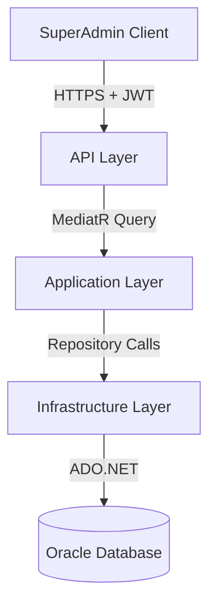
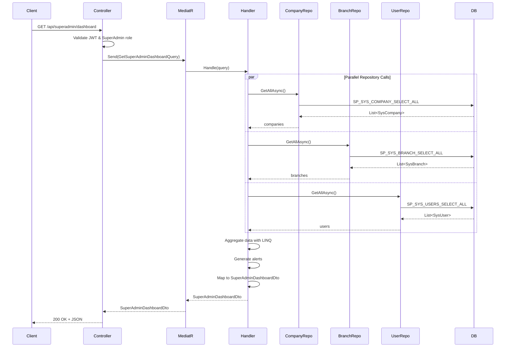

# SuperAdmin Dashboard - Technical Design Document

## Overview

The SuperAdmin Dashboard feature provides a high-performance, single-request API endpoint that aggregates comprehensive system metrics, alerts, and activity summaries for SuperAdmin users. This design leverages existing repository infrastructure and implements efficient parallel data retrieval to meet the 500ms response time requirement.

### Key Design Principles

1. **No Database Changes**: Uses existing tables and stored procedures exclusively
2. **Application-Layer Aggregation**: All data aggregation performed using LINQ in the application layer
3. **Parallel Execution**: Concurrent repository calls using Task.WhenAll for optimal performance
4. **Clean Architecture**: Strict separation of concerns across Domain, Application, Infrastructure, and API layers
5. **CQRS Pattern**: Read-only query using MediatR for dashboard data retrieval
6. **Security First**: SuperAdmin-only access enforced via JWT authorization

### Technology Stack

- **Framework**: ASP.NET Core 8.0
- **Architecture**: Clean Architecture with CQRS
- **Mediator**: MediatR for command/query handling
- **Database**: Oracle with ADO.NET
- **Authentication**: JWT with role-based authorization
- **Serialization**: System.Text.Json with camelCase naming

## Architecture

### System Context



### Layer Responsibilities

#### API Layer
- Exposes REST endpoint: `GET /api/superadmin/dashboard`
- Validates JWT token and SuperAdmin role
- Sends query to MediatR
- Returns JSON response with camelCase naming

#### Application Layer
- Defines `GetSuperAdminDashboardQuery` and `GetSuperAdminDashboardQueryHandler`
- Orchestrates parallel repository calls
- Aggregates data using LINQ
- Generates system alerts based on business rules
- Maps domain entities to DTOs

#### Infrastructure Layer
- Provides existing repository implementations (no changes needed)
- Executes stored procedures via ADO.NET
- Returns domain entities

#### Domain Layer
- Contains existing entity definitions (no changes needed)
- Defines repository interfaces (no changes needed)

## Components and Interfaces

### 1. API Layer Components

#### SuperAdminController

**Location**: `src/ThinkOnErp.API/Controllers/SuperAdminController.cs`

**Responsibilities**:
- Expose dashboard endpoint
- Enforce SuperAdmin authorization
- Handle HTTP concerns

**Endpoint Specification**:
```
GET /api/superadmin/dashboard
Authorization: Bearer {jwt_token}
Role Required: SuperAdmin

Response: 200 OK
{
  "stats": {
    "totalCompanies": 150,
    "activeCompanies": 142,
    "inactiveCompanies": 8,
    "totalBranches": 487,
    "activeBranches": 465,
    "totalSystemAdmins": 12
  },
  "recentCompanies": [
    // Array contains up to 4 most recently created companies
    {
      "nameAr": "شركة المثال",
      "nameEn": "Example Company",
      "country": "Saudi Arabia",
      "branchCount": 5,
      "status": "Active",
      "createdDate": "2024-01-15T10:30:00Z"
    }
  ],
  "recentBranches": [
    // Array contains up to 4 most recently updated branches
    {
      "branchNameAr": "الفرع الرئيسي",
      "branchNameEn": "Main Branch",
      "companyNameAr": "شركة المثال",
      "companyNameEn": "Example Company",
      "activityType": "New",
      "activityDate": "2024-01-15T14:20:00Z"
    }
  ],
  "pendingRequests": [],
  "alerts": [
    "8 companies are currently inactive"
  ]
}

Error Responses:
401 Unauthorized - Missing or invalid JWT token
403 Forbidden - User is not a SuperAdmin
500 Internal Server Error - Server error occurred
```

### 2. Application Layer Components

#### GetSuperAdminDashboardQuery

**Location**: `src/ThinkOnErp.Application/Features/SuperAdmin/Queries/GetSuperAdminDashboardQuery.cs`

**Purpose**: Query object for MediatR (no parameters needed)

```csharp
public class GetSuperAdminDashboardQuery : IRequest<SuperAdminDashboardDto>
{
    // No parameters - retrieves all dashboard data
}
```

#### GetSuperAdminDashboardQueryHandler

**Location**: `src/ThinkOnErp.Application/Features/SuperAdmin/Queries/GetSuperAdminDashboardQueryHandler.cs`

**Dependencies**:
- `ICompanyRepository`
- `IBranchRepository`
- `IUserRepository`

**Algorithm**:
```
1. Execute parallel repository calls:
   - GetAllAsync() on ICompanyRepository
   - GetAllAsync() on IBranchRepository
   - GetAllAsync() on IUserRepository

2. Calculate metrics using LINQ:
   - Total companies = companies.Count
   - Active companies = companies.Count(c => c.IsActive)
   - Inactive companies = companies.Count(c => !c.IsActive)
   - Total branches = branches.Count
   - Active branches = branches.Count(b => b.IsActive)
   - Total system admins = users.Count(u => u.IsAdmin)

3. Get recent companies:
   - Sort by CreationDate descending
   - Take top 4
   - For each company:
     - Count branches using branches.Count(b => b.ParRowId == company.RowId)
     - Map to RecentCompanyDto

4. Get recent branch activities:
   - Sort by UpdateDate descending
   - Take top 4
   - For each branch:
     - Find company using companies.FirstOrDefault(c => c.RowId == branch.ParRowId)
     - Determine activity type (New if CreationDate == UpdateDate, else Update)
     - Map to RecentBranchActivityDto

5. Generate alerts:
   - If inactiveCompanies > 0: Add alert message
   - Future: Check pending requests

6. Return SuperAdminDashboardDto
```

**Performance Optimization**:
- Use `Task.WhenAll` for parallel repository calls
- Use LINQ `Count()` with predicates (single pass)
- Use `Take(4)` to limit result sets early
- Avoid multiple enumerations with `.ToList()` where needed

### 3. DTOs (Data Transfer Objects)

#### SuperAdminDashboardDto

**Location**: `src/ThinkOnErp.Application/DTOs/SuperAdmin/SuperAdminDashboardDto.cs`

```csharp
public class SuperAdminDashboardDto
{
    public DashboardStatsDto Stats { get; set; }
    public List<RecentCompanyDto> RecentCompanies { get; set; }
    public List<RecentBranchActivityDto> RecentBranches { get; set; }
    public List<PendingRequestDto> PendingRequests { get; set; }
    public List<string> Alerts { get; set; }
}
```

#### DashboardStatsDto

```csharp
public class DashboardStatsDto
{
    public int TotalCompanies { get; set; }
    public int ActiveCompanies { get; set; }
    public int InactiveCompanies { get; set; }
    public int TotalBranches { get; set; }
    public int ActiveBranches { get; set; }
    public int TotalSystemAdmins { get; set; }
}
```

#### RecentCompanyDto

```csharp
public class RecentCompanyDto
{
    public string NameAr { get; set; }
    public string NameEn { get; set; }
    public string? Country { get; set; }
    public int BranchCount { get; set; }
    public string Status { get; set; } // "Active" or "Inactive"
    public DateTime CreatedDate { get; set; }
}
```

#### RecentBranchActivityDto

```csharp
public class RecentBranchActivityDto
{
    public string BranchNameAr { get; set; }
    public string BranchNameEn { get; set; }
    public string CompanyNameAr { get; set; }
    public string CompanyNameEn { get; set; }
    public string ActivityType { get; set; } // "New" or "Update"
    public DateTime ActivityDate { get; set; }
}
```

#### PendingRequestDto

```csharp
public class PendingRequestDto
{
    // Future implementation
    // Will include: RequestType, RequestorName, RequestDate, Status
}
```

## Data Models

### Existing Domain Entities (No Changes)

The design uses existing entities without modification:

#### SysCompany
- **RowId**: Primary key
- **RowDesc**: Arabic name
- **RowDescE**: English name
- **CountryId**: Foreign key to country
- **IsActive**: Active status flag
- **CreationDate**: Creation timestamp
- **UpdateDate**: Last update timestamp

#### SysBranch
- **RowId**: Primary key
- **ParRowId**: Foreign key to SysCompany
- **RowDesc**: Arabic name
- **RowDescE**: English name
- **IsActive**: Active status flag
- **CreationDate**: Creation timestamp
- **UpdateDate**: Last update timestamp

#### SysUser
- **RowId**: Primary key
- **UserName**: Username
- **IsAdmin**: Admin flag (used for SuperAdmin identification)
- **IsActive**: Active status flag
- **BranchId**: Foreign key to SysBranch

### Data Flow Diagram



## Error Handling

### Error Handling Strategy

#### 1. Authentication/Authorization Errors

**Scenario**: Missing or invalid JWT token
- **HTTP Status**: 401 Unauthorized
- **Response**: `{ "error": "Unauthorized" }`
- **Logging**: Info level (expected behavior)

**Scenario**: Valid token but not SuperAdmin role
- **HTTP Status**: 403 Forbidden
- **Response**: `{ "error": "Access denied. SuperAdmin role required." }`
- **Logging**: Warning level (potential security concern)

#### 2. Repository Errors

**Scenario**: Database connection failure
- **HTTP Status**: 500 Internal Server Error
- **Response**: `{ "error": "An error occurred while retrieving dashboard data." }`
- **Logging**: Error level with full exception details
- **Action**: Log connection string (sanitized), exception stack trace

**Scenario**: Stored procedure execution failure
- **HTTP Status**: 500 Internal Server Error
- **Response**: `{ "error": "An error occurred while retrieving dashboard data." }`
- **Logging**: Error level with procedure name and parameters
- **Action**: Do NOT expose SQL details to client

#### 3. Data Processing Errors

**Scenario**: Null or empty data from repository
- **HTTP Status**: 200 OK
- **Response**: Return zeros for counts, empty arrays for lists
- **Logging**: Warning level
- **Action**: Graceful degradation

**Scenario**: LINQ operation exception (e.g., null reference)
- **HTTP Status**: 500 Internal Server Error
- **Response**: `{ "error": "An error occurred while processing dashboard data." }`
- **Logging**: Error level with full exception
- **Action**: Investigate data integrity

#### 4. Unexpected Exceptions

**Scenario**: Any unhandled exception
- **HTTP Status**: 500 Internal Server Error
- **Response**: `{ "error": "An unexpected error occurred." }`
- **Logging**: Critical level with full exception
- **Action**: Alert monitoring system

### Error Handling Implementation

```csharp
// In GetSuperAdminDashboardQueryHandler
public async Task<SuperAdminDashboardDto> Handle(
    GetSuperAdminDashboardQuery request, 
    CancellationToken cancellationToken)
{
    try
    {
        // Parallel repository calls with error handling
        var (companies, branches, users) = await Task.WhenAll(
            _companyRepository.GetAllAsync(),
            _branchRepository.GetAllAsync(),
            _userRepository.GetAllAsync()
        ).ContinueWith(task =>
        {
            if (task.IsFaulted)
            {
                _logger.LogError(task.Exception, 
                    "Error retrieving data from repositories");
                throw new ApplicationException(
                    "Failed to retrieve dashboard data", 
                    task.Exception);
            }
            return (task.Result[0], task.Result[1], task.Result[2]);
        }, cancellationToken);

        // Null safety checks
        companies ??= new List<SysCompany>();
        branches ??= new List<SysBranch>();
        users ??= new List<SysUser>();

        // Data aggregation with null-safe operations
        // ... (implementation details)
    }
    catch (ApplicationException ex)
    {
        _logger.LogError(ex, "Application error in dashboard query handler");
        throw; // Re-throw to be handled by global exception handler
    }
    catch (Exception ex)
    {
        _logger.LogCritical(ex, "Unexpected error in dashboard query handler");
        throw new ApplicationException(
            "An unexpected error occurred while processing dashboard data", 
            ex);
    }
}
```

### Security Considerations

1. **No Sensitive Data Exposure**: Error messages never expose:
   - Database schema details
   - Stored procedure names
   - Connection strings
   - Internal file paths
   - Stack traces (in production)

2. **Logging Best Practices**:
   - Sanitize sensitive data before logging
   - Use structured logging with correlation IDs
   - Log security events (failed authorization) separately

3. **Rate Limiting**: Consider implementing rate limiting for dashboard endpoint to prevent abuse

## Testing Strategy

### Unit Tests

#### Query Handler Tests

**Test Class**: `GetSuperAdminDashboardQueryHandlerTests`

**Test Cases**:
1. **Successful Data Retrieval**
   - Mock repositories return valid data
   - Verify correct metrics calculation
   - Verify correct DTO mapping
   - Assert response time < 500ms

2. **Empty Data Handling**
   - Mock repositories return empty lists
   - Verify zero counts returned
   - Verify empty arrays for activities
   - Verify no alerts generated

3. **Inactive Companies Alert**
   - Mock data with inactive companies
   - Verify alert message generated
   - Verify alert count matches inactive companies

4. **Recent Companies Sorting**
   - Mock 10 companies with different creation dates
   - Verify only top 4 returned
   - Verify sorted by CreationDate descending

5. **Recent Branches Sorting**
   - Mock 10 branches with different update dates
   - Verify only top 4 returned
   - Verify sorted by UpdateDate descending

6. **Branch Count Calculation**
   - Mock companies with varying branch counts
   - Verify accurate branch count per company

7. **Activity Type Determination**
   - Mock branches with CreationDate == UpdateDate (New)
   - Mock branches with CreationDate < UpdateDate (Update)
   - Verify correct activity type assigned

8. **Repository Exception Handling**
   - Mock repository throws exception
   - Verify exception logged
   - Verify ApplicationException thrown

9. **Null Data Handling**
   - Mock repository returns null
   - Verify graceful handling with empty lists

10. **Parallel Execution**
    - Verify Task.WhenAll used
    - Verify repositories called concurrently

#### Controller Tests

**Test Class**: `SuperAdminControllerTests`

**Test Cases**:
1. **Successful Request**
   - Valid SuperAdmin JWT
   - Verify 200 OK response
   - Verify JSON structure

2. **Unauthorized Request**
   - No JWT token
   - Verify 401 Unauthorized

3. **Forbidden Request**
   - Valid JWT but not SuperAdmin
   - Verify 403 Forbidden

4. **Internal Server Error**
   - Handler throws exception
   - Verify 500 Internal Server Error
   - Verify generic error message

### Integration Tests

**Test Class**: `SuperAdminDashboardIntegrationTests`

**Test Cases**:
1. **End-to-End Dashboard Retrieval**
   - Use test database with seed data
   - Make HTTP request with valid SuperAdmin JWT
   - Verify response structure and data accuracy

2. **Performance Test**
   - Load test database with realistic data volume
   - Measure response time
   - Assert response time < 500ms

3. **Database Connection Failure**
   - Simulate database unavailability
   - Verify 500 error and proper logging

### Manual Testing Checklist

- [ ] Dashboard loads successfully for SuperAdmin user
- [ ] Dashboard returns 403 for non-SuperAdmin user
- [ ] Dashboard returns 401 for unauthenticated request
- [ ] Metrics display correct counts
- [ ] Recent companies show top 4 by creation date
- [ ] Recent branches show top 4 by update date
- [ ] Branch count per company is accurate
- [ ] Activity type (New/Update) is correct
- [ ] Alerts appear when inactive companies exist
- [ ] Response time is under 500ms
- [ ] JSON uses camelCase naming
- [ ] Error messages don't expose sensitive data

## Performance Optimization

### Optimization Strategies

#### 1. Parallel Repository Calls

**Implementation**:
```csharp
var (companies, branches, users) = await Task.WhenAll(
    _companyRepository.GetAllAsync(),
    _branchRepository.GetAllAsync(),
    _userRepository.GetAllAsync()
);
```

**Benefit**: Reduces total execution time from sum of individual calls to max of individual calls

**Expected Impact**: 
- Sequential: 150ms + 100ms + 50ms = 300ms
- Parallel: max(150ms, 100ms, 50ms) = 150ms
- **Savings: 50% reduction**

#### 2. Efficient LINQ Operations

**Count with Predicate** (Single Pass):
```csharp
// Good: Single enumeration
int activeCount = companies.Count(c => c.IsActive);

// Bad: Multiple enumerations
int activeCount = companies.Where(c => c.IsActive).Count();
```

**Early Limiting with Take**:
```csharp
// Good: Limits before mapping
var recent = companies
    .OrderByDescending(c => c.CreationDate)
    .Take(4)
    .Select(c => MapToDto(c))
    .ToList();

// Bad: Maps all then limits
var recent = companies
    .OrderByDescending(c => c.CreationDate)
    .Select(c => MapToDto(c))
    .Take(4)
    .ToList();
```

#### 3. Minimize Memory Allocation

**Reuse Collections**:
```csharp
// Convert to list once if multiple enumerations needed
var companiesList = companies.ToList();
int total = companiesList.Count;
int active = companiesList.Count(c => c.IsActive);
```

**Use Capacity Hints**:
```csharp
var alerts = new List<string>(capacity: 3); // Pre-allocate
```

#### 4. Database-Level Optimization (No Changes Needed)

- Existing stored procedures already optimized
- Indexes on foreign keys already exist
- No N+1 query issues (all data retrieved in 3 calls)

### Performance Monitoring

**Metrics to Track**:
- Total request duration
- Individual repository call duration
- LINQ aggregation duration
- Memory allocation
- Database query execution time

**Logging**:
```csharp
using var activity = Activity.StartActivity("GetSuperAdminDashboard");
_logger.LogInformation("Dashboard query started");

var stopwatch = Stopwatch.StartNew();
// ... execute query ...
stopwatch.Stop();

_logger.LogInformation(
    "Dashboard query completed in {Duration}ms", 
    stopwatch.ElapsedMilliseconds);
```

### Performance Targets

| Metric | Target | Maximum |
|--------|--------|---------|
| Total Response Time | 300ms | 500ms |
| Repository Calls (Parallel) | 150ms | 250ms |
| Data Aggregation | 50ms | 100ms |
| DTO Mapping | 50ms | 100ms |
| Alert Generation | 10ms | 50ms |

## Implementation Checklist

### Phase 1: DTOs and Query Definition
- [ ] Create `SuperAdminDashboardDto`
- [ ] Create `DashboardStatsDto`
- [ ] Create `RecentCompanyDto`
- [ ] Create `RecentBranchActivityDto`
- [ ] Create `PendingRequestDto` (empty for now)
- [ ] Create `GetSuperAdminDashboardQuery`

### Phase 2: Query Handler
- [ ] Create `GetSuperAdminDashboardQueryHandler`
- [ ] Implement parallel repository calls
- [ ] Implement metrics calculation
- [ ] Implement recent companies logic
- [ ] Implement recent branches logic
- [ ] Implement alert generation
- [ ] Add error handling and logging

### Phase 3: API Controller
- [ ] Create `SuperAdminController`
- [ ] Add `GetDashboard` endpoint
- [ ] Add `[Authorize(Roles = "SuperAdmin")]` attribute
- [ ] Configure JSON serialization (camelCase)
- [ ] Add error handling middleware

### Phase 4: Testing
- [ ] Write unit tests for query handler
- [ ] Write unit tests for controller
- [ ] Write integration tests
- [ ] Perform manual testing
- [ ] Performance testing with realistic data

### Phase 5: Documentation
- [ ] Update API documentation
- [ ] Add Swagger/OpenAPI annotations
- [ ] Create deployment notes
- [ ] Update user documentation

## Deployment Considerations

### Configuration

**appsettings.json**:
```json
{
  "Jwt": {
    "SuperAdminRole": "SuperAdmin"
  },
  "Dashboard": {
    "MaxResponseTimeMs": 500,
    "RecentItemsLimit": 4
  }
}
```

### Database Requirements

**No Changes Required**:
- Uses existing tables: SYS_COMPANY, SYS_BRANCH, SYS_USERS
- Uses existing stored procedures: SP_SYS_COMPANY_SELECT_ALL, SP_SYS_BRANCH_SELECT_ALL, SP_SYS_USERS_SELECT_ALL
- No new indexes needed

### Monitoring and Alerts

**Recommended Monitoring**:
- Dashboard endpoint response time
- Dashboard endpoint error rate
- Repository call failures
- SuperAdmin access attempts (security audit)

**Alert Thresholds**:
- Response time > 500ms for 3 consecutive requests
- Error rate > 5% over 5 minutes
- Failed authorization attempts > 10 per minute

## Future Enhancements

### Pending Requests Feature

When implemented, the handler will:
1. Add `IPendingRequestRepository` dependency
2. Call `GetPendingAsync()` in parallel with other repositories
3. Sort by request date and take top 4
4. Map to `PendingRequestDto`
5. Generate alerts for pending requests count

### Caching Strategy

For improved performance:
1. Cache dashboard data for 30 seconds
2. Use distributed cache (Redis) for multi-instance deployments
3. Invalidate cache on company/branch/user changes
4. Add cache-control headers to HTTP response

### Real-Time Updates

For future real-time dashboard:
1. Implement SignalR hub
2. Push updates when data changes
3. Subscribe to domain events (company created, branch updated, etc.)

### Additional Metrics

Potential future metrics:
- User login activity (last 24 hours)
- System performance metrics
- Storage usage statistics
- License utilization
- API usage statistics

## Appendix

### Glossary

- **SuperAdmin**: Platform-wide administrator with access to all companies
- **Dashboard_API**: The GET /api/superadmin/dashboard endpoint
- **CQRS**: Command Query Responsibility Segregation pattern
- **MediatR**: .NET library for implementing mediator pattern
- **DTO**: Data Transfer Object for API responses
- **ADO.NET**: Data access technology for Oracle database

### References

- Requirements Document: `.kiro/specs/superadmin-dashboard/requirements.md`
- Clean Architecture: https://blog.cleancoder.com/uncle-bob/2012/08/13/the-clean-architecture.html
- MediatR Documentation: https://github.com/jbogard/MediatR
- ASP.NET Core Authorization: https://docs.microsoft.com/en-us/aspnet/core/security/authorization/

### Related Features

- JWT Authentication System
- SuperAdmin Login (Database/Scripts/26_Add_SuperAdmin_Login_Procedure.sql)
- Permissions System (docs/PERMISSIONS_SYSTEM.md)
- Company Management API
- Branch Management API
- User Management API
