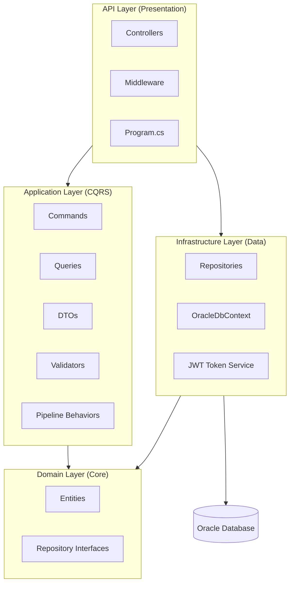
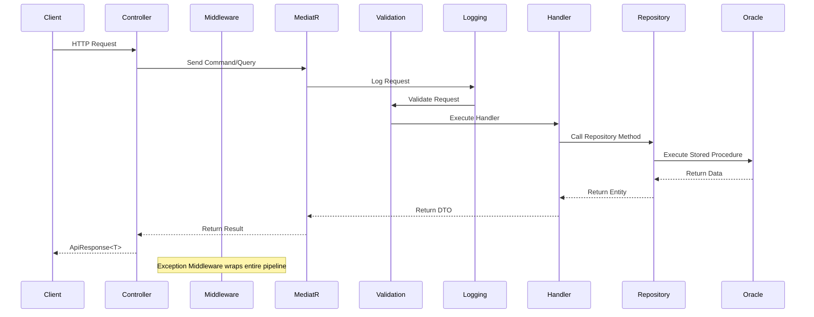
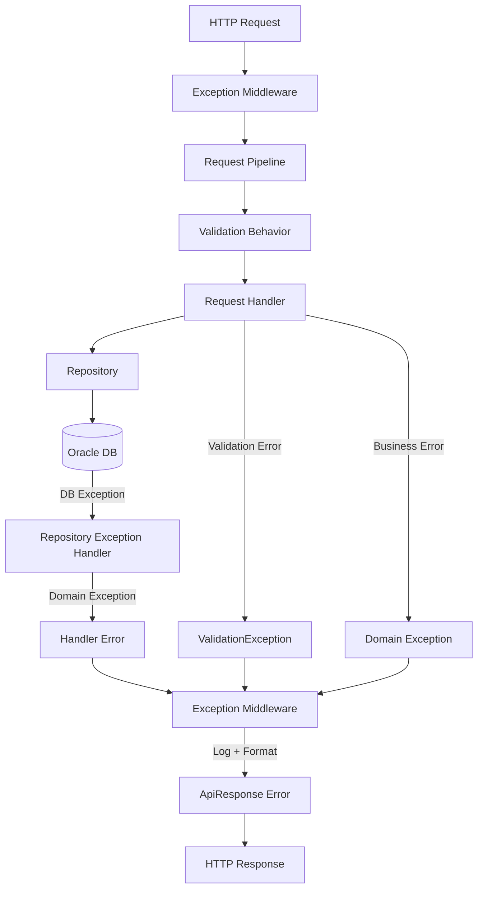

# Design Document: ThinkOnErp API

## Overview

ThinkOnErp API is a production-ready ASP.NET Core 8 Web API implementing an Enterprise Resource Planning system using Clean Architecture principles. The system provides secure, role-based access to manage organizational data through a RESTful API backed by Oracle database with stored procedures.

### Key Design Principles

- **Clean Architecture**: Four-layer separation (API, Application, Domain, Infrastructure) with strict dependency rules
- **CQRS Pattern**: Command Query Responsibility Segregation using MediatR for clear separation of read and write operations
- **Security First**: JWT Bearer authentication with role-based authorization and SHA-256 password hashing
- **Database Abstraction**: All data access through Oracle stored procedures using ADO.NET
- **Validation Pipeline**: FluentValidation integrated into MediatR pipeline for automatic request validation
- **Structured Logging**: Serilog with console and file sinks for comprehensive observability
- **Unified Response Format**: Consistent ApiResponse wrapper for all endpoints

### Technology Stack

- **Framework**: ASP.NET Core 8
- **Database**: Oracle with stored procedures
- **Authentication**: JWT Bearer tokens
- **CQRS**: MediatR
- **Validation**: FluentValidation
- **Logging**: Serilog
- **Data Access**: ADO.NET with Oracle.ManagedDataAccess.Core

## Architecture

### Clean Architecture Layers



### Dependency Rules

1. **Domain Layer**: Zero external dependencies, no references to other layers
2. **Application Layer**: References Domain only
3. **Infrastructure Layer**: References Domain and Application
4. **API Layer**: References all layers for dependency injection configuration

### Request Flow



## Components and Interfaces

### API Layer Components

#### Controllers

Each controller handles HTTP requests for a specific entity and delegates to MediatR:

- **AuthController**: Handles login without authorization
- **RolesController**: CRUD operations for roles (admin-only for CUD)
- **CurrencyController**: CRUD operations for currencies (admin-only for CUD)
- **CompanyController**: CRUD operations for companies (admin-only for CUD)
- **BranchController**: CRUD operations for branches (admin-only for CUD)
- **UsersController**: CRUD operations for users (all admin-only except change password)

**Controller Pattern**:
```csharp
[ApiController]
[Route("api/[controller]")]
[Authorize]
public class RolesController : ControllerBase
{
    private readonly IMediator _mediator;
    
    [HttpGet]
    public async Task<ActionResult<ApiResponse<List<RoleDto>>>> GetAll()
    {
        var result = await _mediator.Send(new GetAllRolesQuery());
        return Ok(ApiResponse<List<RoleDto>>.Success(result, "Roles retrieved successfully"));
    }
    
    [HttpPost]
    [Authorize(Policy = "AdminOnly")]
    public async Task<ActionResult<ApiResponse<decimal>>> Create([FromBody] CreateRoleCommand command)
    {
        var id = await _mediator.Send(command);
        return Ok(ApiResponse<decimal>.Success(id, "Role created successfully", 201));
    }
}
```

#### Middleware

**ExceptionHandlingMiddleware**: Global exception handler that catches all unhandled exceptions, logs them, and returns formatted ApiResponse with appropriate status codes.

**Responsibilities**:
- Catch all unhandled exceptions
- Log exceptions with full details using Serilog
- Convert ValidationException to 400 Bad Request
- Convert all other exceptions to 500 Internal Server Error
- Never expose stack traces to clients
- Return ApiResponse format consistently

#### Program.cs Configuration

**Responsibilities**:
- Configure Serilog before building the host
- Register JWT Bearer authentication
- Configure authorization policies (AdminOnly)
- Register Application and Infrastructure services
- Add Swagger with JWT Bearer support (Development only)
- Configure exception handling middleware
- Set up CORS if needed

### Application Layer Components

#### Commands

Commands represent write operations (Create, Update, Delete). Each command:
- Implements `IRequest<TResponse>` from MediatR
- Contains all data needed for the operation
- Has a corresponding handler implementing `IRequestHandler<TCommand, TResponse>`
- Has a FluentValidation validator

**Example Structure**:
```
Features/
  Roles/
    Commands/
      CreateRole/
        CreateRoleCommand.cs          (IRequest<decimal>)
        CreateRoleCommandHandler.cs   (IRequestHandler)
        CreateRoleCommandValidator.cs (AbstractValidator)
```

#### Queries

Queries represent read operations (GetAll, GetById). Each query:
- Implements `IRequest<TResponse>` from MediatR
- Contains filter/search parameters if needed
- Has a corresponding handler implementing `IRequestHandler<TQuery, TResponse>`
- May have a validator for complex queries

#### DTOs (Data Transfer Objects)

DTOs are used for all data transfer between layers:
- Separate DTOs for different operations (e.g., CreateRoleDto, RoleDto)
- Include XML documentation for Swagger schema generation
- Never expose domain entities directly through API
- Handlers map entities to DTOs before returning

#### Pipeline Behaviors

**LoggingBehavior**: Logs all MediatR requests and responses
- Executes first in the pipeline
- Logs request type and parameters
- Logs response data and execution time
- Uses Serilog structured logging

**ValidationBehavior**: Validates all requests using FluentValidation
- Executes after logging, before handler
- Collects all validation errors
- Throws ValidationException with all errors if validation fails
- Skips validation if no validators registered for request type

### Domain Layer Components

#### Entities

Domain entities represent the core business objects:

- **SysRole**: System roles for authorization
- **SysCurrency**: Currency definitions with exchange rates
- **SysCompany**: Company/organization entities
- **SysBranch**: Branch locations within companies
- **SysUser**: User accounts with authentication data

**Common Entity Properties**:
- `RowId` (decimal): Primary key
- `CreationUser` (string): User who created the record
- `CreationDate` (DateTime?): Creation timestamp
- `UpdateUser` (string): User who last updated the record
- `UpdateDate` (DateTime?): Last update timestamp
- `IsActive` (bool): Soft delete flag

#### Repository Interfaces

Each entity has a corresponding repository interface in the Domain layer:

```csharp
public interface IRoleRepository
{
    Task<List<SysRole>> GetAllAsync();
    Task<SysRole?> GetByIdAsync(decimal rowId);
    Task<decimal> CreateAsync(SysRole role);
    Task<int> UpdateAsync(SysRole role);
    Task<int> DeleteAsync(decimal rowId);
}
```

**Special Interface**:
```csharp
public interface IAuthRepository
{
    Task<SysUser?> AuthenticateAsync(string userName, string passwordHash);
}
```

### Infrastructure Layer Components

#### OracleDbContext

Manages Oracle database connections:
- Reads connection string from configuration
- Provides connection creation method
- Implements IDisposable for proper resource cleanup
- Used by all repositories

#### Repositories

Each repository implements its domain interface using ADO.NET:

**Pattern**:
1. Create OracleConnection
2. Create OracleCommand with CommandType.StoredProcedure
3. Add OracleParameters with explicit OracleDbType
4. For SELECT: Use OracleDataReader with SYS_REFCURSOR
5. For INSERT/UPDATE/DELETE: Use ExecuteNonQuery
6. Map Oracle data to domain entities
7. Handle exceptions and wrap in domain exceptions
8. Dispose all resources using `using` statements

**Data Type Mapping**:
- Oracle NUMBER → C# decimal
- Oracle VARCHAR2 → C# string
- Oracle DATE → C# DateTime?
- Oracle 'Y'/'1' → C# true
- Oracle 'N'/'0' → C# false

#### JWT Token Service

Handles JWT token generation and validation:
- Reads JWT settings from configuration (SecretKey, Issuer, Audience, ExpiryInMinutes)
- Generates tokens with claims: userId, userName, role, branchId, isAdmin
- Signs tokens using HMAC-SHA256
- Sets expiration time based on configuration

#### Password Hashing Service

Handles password security:
- Hashes passwords using SHA-256
- Converts hash to hexadecimal string representation
- Used during user creation and authentication

## Data Models

### SysRole Entity

```csharp
public class SysRole
{
    public decimal RowId { get; set; }
    public string RowDesc { get; set; }        // Arabic description
    public string RowDescE { get; set; }       // English description
    public string? Note { get; set; }
    public bool IsActive { get; set; }
    public string CreationUser { get; set; }
    public DateTime? CreationDate { get; set; }
    public string? UpdateUser { get; set; }
    public DateTime? UpdateDate { get; set; }
}
```

**Database Table**: `SYS_ROLE`
**Sequence**: `SEQ_SYS_ROLE`
**Stored Procedures**:
- `SP_SYS_ROLE_SELECT_ALL`
- `SP_SYS_ROLE_SELECT_BY_ID`
- `SP_SYS_ROLE_INSERT`
- `SP_SYS_ROLE_UPDATE`
- `SP_SYS_ROLE_DELETE`

### SysCurrency Entity

```csharp
public class SysCurrency
{
    public decimal RowId { get; set; }
    public string RowDesc { get; set; }        // Arabic description
    public string RowDescE { get; set; }       // English description
    public string ShortDesc { get; set; }      // Arabic short description
    public string ShortDescE { get; set; }     // English short description
    public string SingulerDesc { get; set; }   // Arabic singular
    public string SingulerDescE { get; set; }  // English singular
    public string DualDesc { get; set; }       // Arabic dual
    public string DualDescE { get; set; }      // English dual
    public string SumDesc { get; set; }        // Arabic sum
    public string SumDescE { get; set; }       // English sum
    public string FracDesc { get; set; }       // Arabic fraction
    public string FracDescE { get; set; }      // English fraction
    public decimal? CurrRate { get; set; }     // Exchange rate
    public DateTime? CurrRateDate { get; set; }
    public string CreationUser { get; set; }
    public DateTime? CreationDate { get; set; }
    public string? UpdateUser { get; set; }
    public DateTime? UpdateDate { get; set; }
}
```

**Database Table**: `SYS_CURRENCY`
**Sequence**: `SEQ_SYS_CURRENCY`
**Stored Procedures**:
- `SP_SYS_CURRENCY_SELECT_ALL`
- `SP_SYS_CURRENCY_SELECT_BY_ID`
- `SP_SYS_CURRENCY_INSERT`
- `SP_SYS_CURRENCY_UPDATE`
- `SP_SYS_CURRENCY_DELETE`

### SysCompany Entity

```csharp
public class SysCompany
{
    public decimal RowId { get; set; }
    public string RowDesc { get; set; }        // Arabic description
    public string RowDescE { get; set; }       // English description
    public decimal? CountryId { get; set; }
    public decimal? CurrId { get; set; }       // Foreign key to SYS_CURRENCY
    public bool IsActive { get; set; }
    public string CreationUser { get; set; }
    public DateTime? CreationDate { get; set; }
    public string? UpdateUser { get; set; }
    public DateTime? UpdateDate { get; set; }
}
```

**Database Table**: `SYS_COMPANY`
**Sequence**: `SEQ_SYS_COMPANY`
**Stored Procedures**:
- `SP_SYS_COMPANY_SELECT_ALL`
- `SP_SYS_COMPANY_SELECT_BY_ID`
- `SP_SYS_COMPANY_INSERT`
- `SP_SYS_COMPANY_UPDATE`
- `SP_SYS_COMPANY_DELETE`

### SysBranch Entity

```csharp
public class SysBranch
{
    public decimal RowId { get; set; }
    public decimal? ParRowId { get; set; }     // Foreign key to SYS_COMPANY
    public string RowDesc { get; set; }        // Arabic description
    public string RowDescE { get; set; }       // English description
    public string? Phone { get; set; }
    public string? Mobile { get; set; }
    public string? Fax { get; set; }
    public string? Email { get; set; }
    public bool IsHeadBranch { get; set; }
    public bool IsActive { get; set; }
    public string CreationUser { get; set; }
    public DateTime? CreationDate { get; set; }
    public string? UpdateUser { get; set; }
    public DateTime? UpdateDate { get; set; }
}
```

**Database Table**: `SYS_BRANCH`
**Sequence**: `SEQ_SYS_BRANCH`
**Stored Procedures**:
- `SP_SYS_BRANCH_SELECT_ALL`
- `SP_SYS_BRANCH_SELECT_BY_ID`
- `SP_SYS_BRANCH_INSERT`
- `SP_SYS_BRANCH_UPDATE`
- `SP_SYS_BRANCH_DELETE`

### SysUser Entity

```csharp
public class SysUser
{
    public decimal RowId { get; set; }
    public string RowDesc { get; set; }        // Arabic description
    public string RowDescE { get; set; }       // English description
    public string UserName { get; set; }       // Unique username
    public string Password { get; set; }       // SHA-256 hash
    public string? Phone { get; set; }
    public string? Phone2 { get; set; }
    public decimal? Role { get; set; }         // Foreign key to SYS_ROLE
    public decimal? BranchId { get; set; }     // Foreign key to SYS_BRANCH
    public string? Email { get; set; }
    public DateTime? LastLoginDate { get; set; }
    public bool IsActive { get; set; }
    public bool IsAdmin { get; set; }
    public string CreationUser { get; set; }
    public DateTime? CreationDate { get; set; }
    public string? UpdateUser { get; set; }
    public DateTime? UpdateDate { get; set; }
}
```

**Database Table**: `SYS_USERS`
**Sequence**: `SEQ_SYS_USERS`
**Stored Procedures**:
- `SP_SYS_USERS_SELECT_ALL`
- `SP_SYS_USERS_SELECT_BY_ID`
- `SP_SYS_USERS_INSERT`
- `SP_SYS_USERS_UPDATE`
- `SP_SYS_USERS_DELETE`
- `SP_SYS_USERS_LOGIN` (special authentication procedure)

### API Response Model

```csharp
public class ApiResponse<T>
{
    public bool Success { get; set; }
    public int StatusCode { get; set; }
    public string Message { get; set; }
    public T? Data { get; set; }
    public List<string>? Errors { get; set; }
    public DateTime Timestamp { get; set; }
    public string TraceId { get; set; }
    
    public static ApiResponse<T> Success(T data, string message, int statusCode = 200)
    {
        return new ApiResponse<T>
        {
            Success = true,
            StatusCode = statusCode,
            Message = message,
            Data = data,
            Timestamp = DateTime.UtcNow,
            TraceId = Guid.NewGuid().ToString()
        };
    }
    
    public static ApiResponse<T> Fail(string message, List<string>? errors = null, int statusCode = 400)
    {
        return new ApiResponse<T>
        {
            Success = false,
            StatusCode = statusCode,
            Message = message,
            Errors = errors,
            Timestamp = DateTime.UtcNow,
            TraceId = Guid.NewGuid().ToString()
        };
    }
}
```

### JWT Token Claims

```csharp
public class TokenDto
{
    public string AccessToken { get; set; }
    public DateTime ExpiresAt { get; set; }
    public string TokenType { get; set; } = "Bearer";
}
```

**JWT Claims Structure**:
- `userId`: User's RowId (decimal)
- `userName`: User's UserName (string)
- `role`: User's Role ID (decimal)
- `branchId`: User's Branch ID (decimal)
- `isAdmin`: User's IsAdmin flag (bool)
- `iss`: Issuer from configuration
- `aud`: Audience from configuration
- `exp`: Expiration timestamp

### Stored Procedure Parameter Patterns

**SELECT_ALL Pattern**:
```sql
CREATE OR REPLACE PROCEDURE SP_SYS_ROLE_SELECT_ALL (
    P_RESULT_CURSOR OUT SYS_REFCURSOR
)
AS
BEGIN
    OPEN P_RESULT_CURSOR FOR
    SELECT * FROM SYS_ROLE WHERE IS_ACTIVE = '1';
END;
```

**SELECT_BY_ID Pattern**:
```sql
CREATE OR REPLACE PROCEDURE SP_SYS_ROLE_SELECT_BY_ID (
    P_ROW_ID IN NUMBER,
    P_RESULT_CURSOR OUT SYS_REFCURSOR
)
AS
BEGIN
    OPEN P_RESULT_CURSOR FOR
    SELECT * FROM SYS_ROLE WHERE ROW_ID = P_ROW_ID;
END;
```

**INSERT Pattern**:
```sql
CREATE OR REPLACE PROCEDURE SP_SYS_ROLE_INSERT (
    P_ROW_DESC IN VARCHAR2,
    P_ROW_DESC_E IN VARCHAR2,
    P_NOTE IN VARCHAR2,
    P_CREATION_USER IN VARCHAR2,
    P_NEW_ID OUT NUMBER
)
AS
BEGIN
    SELECT SEQ_SYS_ROLE.NEXTVAL INTO P_NEW_ID FROM DUAL;
    
    INSERT INTO SYS_ROLE (
        ROW_ID, ROW_DESC, ROW_DESC_E, NOTE, IS_ACTIVE,
        CREATION_USER, CREATION_DATE
    ) VALUES (
        P_NEW_ID, P_ROW_DESC, P_ROW_DESC_E, P_NOTE, '1',
        P_CREATION_USER, SYSDATE
    );
    
    COMMIT;
EXCEPTION
    WHEN OTHERS THEN
        ROLLBACK;
        RAISE;
END;
```

**UPDATE Pattern**:
```sql
CREATE OR REPLACE PROCEDURE SP_SYS_ROLE_UPDATE (
    P_ROW_ID IN NUMBER,
    P_ROW_DESC IN VARCHAR2,
    P_ROW_DESC_E IN VARCHAR2,
    P_NOTE IN VARCHAR2,
    P_UPDATE_USER IN VARCHAR2
)
AS
BEGIN
    UPDATE SYS_ROLE
    SET ROW_DESC = P_ROW_DESC,
        ROW_DESC_E = P_ROW_DESC_E,
        NOTE = P_NOTE,
        UPDATE_USER = P_UPDATE_USER,
        UPDATE_DATE = SYSDATE
    WHERE ROW_ID = P_ROW_ID;
    
    COMMIT;
EXCEPTION
    WHEN OTHERS THEN
        ROLLBACK;
        RAISE;
END;
```

**DELETE Pattern (Soft Delete)**:
```sql
CREATE OR REPLACE PROCEDURE SP_SYS_ROLE_DELETE (
    P_ROW_ID IN NUMBER
)
AS
BEGIN
    UPDATE SYS_ROLE
    SET IS_ACTIVE = '0'
    WHERE ROW_ID = P_ROW_ID;
    
    COMMIT;
EXCEPTION
    WHEN OTHERS THEN
        ROLLBACK;
        RAISE;
END;
```

**LOGIN Pattern**:
```sql
CREATE OR REPLACE PROCEDURE SP_SYS_USERS_LOGIN (
    P_USER_NAME IN VARCHAR2,
    P_PASSWORD IN VARCHAR2,
    P_RESULT_CURSOR OUT SYS_REFCURSOR
)
AS
BEGIN
    OPEN P_RESULT_CURSOR FOR
    SELECT * FROM SYS_USERS
    WHERE USER_NAME = P_USER_NAME
      AND PASSWORD = P_PASSWORD
      AND IS_ACTIVE = '1';
END;
```


## Correctness Properties

A property is a characteristic or behavior that should hold true across all valid executions of a system—essentially, a formal statement about what the system should do. Properties serve as the bridge between human-readable specifications and machine-verifiable correctness guarantees.

### Property Reflection

After analyzing all acceptance criteria, I identified the following redundancies and consolidations:

**JWT Token Properties (2.1-2.7)**: Properties 2.1, 2.3, 2.4, and 2.5 all test different aspects of token generation. These can be consolidated into a single comprehensive property that validates all token claims and structure.

**CRUD Properties (6.1-10.6)**: The same five CRUD operations (GetAll returns active, GetById returns match or null, Create returns ID, Update succeeds, Delete is soft) are repeated for all five entities (Role, Currency, Company, Branch, User). These can be consolidated into generic CRUD properties that apply to all entities.

**ApiResponse Properties (11.1-11.7)**: Properties about ApiResponse structure (success flag, statusCode, message, data, timestamp, traceId) can be consolidated into a single property that validates the complete response structure.

**Validation Properties (12.3-12.6)**: Properties about validation behavior can be consolidated into properties about validation execution and error collection.

**Exception Handling Properties (14.1-14.7)**: Properties about exception middleware behavior can be consolidated into properties about exception catching, logging, and response format.

After consolidation, the following properties provide unique validation value:

### Property 1: JWT Token Structure Completeness

For any valid user credentials, when a JWT token is generated, the token must contain all required claims (userId, userName, role, branchId, isAdmin), be signed with the configured secret key, include the configured issuer and audience, and have an expiration time matching the configured ExpiryInMinutes.

**Validates: Requirements 2.1, 2.3, 2.4, 2.5**

### Property 2: Authentication Failure Returns 401

For any invalid credentials (non-existent username, incorrect password, or inactive user), authentication must return status code 401.

**Validates: Requirements 2.2**

### Property 3: Valid Token Authentication

For any valid JWT token, when included in a request to a protected endpoint, the API must authenticate the user and allow access.

**Validates: Requirements 2.6**

### Property 4: Invalid Token Rejection

For any invalid or expired JWT token, when included in a request, the API must return status code 401.

**Validates: Requirements 2.7**

### Property 5: Password Hashing on Storage

For any user password, when stored in the database, it must be hashed using SHA-256 and stored as a hexadecimal string representation, never in plain text.

**Validates: Requirements 3.1, 3.4**

### Property 6: Password Hashing on Authentication

For any login attempt, the provided password must be hashed using SHA-256 before comparison with the stored hash.

**Validates: Requirements 3.2, 3.3**

### Property 7: Protected Endpoint Authorization

For any protected endpoint (all except /api/auth/login), when accessed without a valid JWT token, the API must return status code 401.

**Validates: Requirements 4.1, 4.4**

### Property 8: Admin-Only Endpoint Authorization

For any admin-only endpoint, when accessed by a non-admin user (isAdmin claim is false), the API must return status code 403.

**Validates: Requirements 4.3, 4.5**

### Property 9: GetAll Returns Only Active Records

For any entity type (Role, Currency, Company, Branch, User), when retrieving all records, the system must return only records where IS_ACTIVE is true.

**Validates: Requirements 6.1, 7.1, 8.1, 9.1, 10.1**

### Property 10: GetById Returns Match or Null

For any entity type and any ID, when retrieving by ID, the system must return the matching record if it exists, or null if it does not exist.

**Validates: Requirements 6.2, 7.2, 8.2, 9.2, 10.2**

### Property 11: Create Returns Valid ID

For any entity type and any valid entity data, when creating a new record, the system must return a valid positive decimal ID generated from the corresponding Oracle sequence.

**Validates: Requirements 6.3, 7.3, 8.3, 9.3, 10.3**

### Property 12: Update Succeeds for Valid Data

For any entity type, any existing record ID, and any valid update data, when updating a record, the system must succeed and the updated values must be persisted.

**Validates: Requirements 6.4, 7.4, 8.4, 9.4, 10.4**

### Property 13: Delete is Soft Delete

For any entity type and any existing record ID, when deleting a record, the system must set IS_ACTIVE to false rather than physically removing the record, and the record must no longer appear in GetAll results.

**Validates: Requirements 6.5, 7.5, 8.5, 9.5, 10.5**

### Property 14: Change Password Updates Hash

For any user and any new valid password, when changing password, the system must hash the new password using SHA-256 and update the stored hash.

**Validates: Requirements 10.6**

### Property 15: Success Response Structure

For any successful API operation, the response must be wrapped in ApiResponse with success=true, appropriate statusCode (200/201), descriptive message, data payload, ISO 8601 timestamp, and traceId.

**Validates: Requirements 11.1, 11.3, 11.4, 11.5, 11.6, 11.7**

### Property 16: Error Response Structure

For any failed API operation, the response must be wrapped in ApiResponse with success=false, appropriate statusCode (400/401/403/404/500), descriptive message, null data, ISO 8601 timestamp, and traceId.

**Validates: Requirements 11.2, 11.3, 11.4, 11.5, 11.6, 11.7**

### Property 17: Validation Error Response

For any request that fails validation, the response must include an errors array containing all validation error messages, with status code 400.

**Validates: Requirements 11.8, 12.4, 12.5, 12.6**

### Property 18: Validation Executes for All Requests

For any command or query with registered validators, the validation behavior must execute all validators before the handler runs.

**Validates: Requirements 12.3**

### Property 19: Unhandled Exception Returns 500

For any unhandled exception in the request pipeline, the exception middleware must catch it, log it at Error level, and return ApiResponse with status code 500 and a generic error message without stack trace.

**Validates: Requirements 14.1, 14.2, 14.3, 14.4, 14.5**

### Property 20: ValidationException Returns 400

For any ValidationException thrown in the pipeline, the exception middleware must convert it to ApiResponse with status code 400 and include all validation errors.

**Validates: Requirements 14.6**

### Property 21: Exception Response is JSON

For any exception handled by the middleware, the response content type must be application/json.

**Validates: Requirements 14.7**

### Property 22: All Requests Logged

For any MediatR request (command or query), the logging behavior must log the request type, parameters, response data, and execution time.

**Validates: Requirements 13.8**

### Property 23: All Exceptions Logged

For any exception caught by the exception middleware, the exception must be logged at Error level with full details.

**Validates: Requirements 13.9**

### Property 24: Database Exception Handling

For any database operation that throws an exception, the repository must log the exception and rethrow it as a domain exception.

**Validates: Requirements 22.7**

### Property 25: IS_ACTIVE Mapping to Boolean

For any Oracle IS_ACTIVE value of 'Y' or '1', the repository must map it to C# true, and for any value of 'N' or '0', must map it to C# false.

**Validates: Requirements 23.4, 23.5**

### Property 26: Success Message Format

For any successful create operation, the response message must follow the format "{EntityName} created successfully."

**Validates: Requirements 26.1**

### Property 27: Not Found Message Format

For any GetById operation that returns null, the response message must follow the format "No {entityName} found with the specified identifier."

**Validates: Requirements 26.2**

### Property 28: Authorization Error Message

For any authorization failure (403), the response message must be "Access denied. Administrator privileges are required."

**Validates: Requirements 26.3**

### Property 29: Authentication Error Message

For any authentication failure (401 from login), the response message must be "Invalid credentials. Please verify your username and password."

**Validates: Requirements 26.4**

### Property 30: Validation Error Message

For any validation failure, the response message must be "One or more validation errors occurred."

**Validates: Requirements 26.5**

### Property 31: Server Error Message

For any unhandled exception, the response message must be "An unexpected error occurred. Please try again later."

**Validates: Requirements 26.6**

### Property 32: No Domain Entities in API Responses

For any API endpoint response, the data must be a DTO, never a domain entity directly.

**Validates: Requirements 30.3**

## Error Handling

### Exception Handling Strategy

The system implements a layered exception handling approach:

**1. Global Exception Middleware**
- Catches all unhandled exceptions at the API layer
- Logs exceptions with full details using Serilog
- Converts exceptions to ApiResponse format
- Never exposes stack traces or sensitive information to clients
- Returns appropriate HTTP status codes

**2. Validation Exceptions**
- FluentValidation throws ValidationException with all errors
- Validation behavior collects all validation failures before throwing
- Exception middleware converts to 400 Bad Request with error details
- All validation messages included in errors array

**3. Domain Exceptions**
- Repositories wrap database exceptions in domain exceptions
- Domain exceptions include business-friendly error messages
- Exception middleware converts to appropriate status codes
- Logged with full context for troubleshooting

**4. Authentication/Authorization Exceptions**
- JWT middleware handles authentication failures (401)
- Authorization policy handlers return 403 for insufficient permissions
- Consistent error messages for security failures

### Exception Flow



### Error Response Formats

**Validation Error (400)**:
```json
{
  "success": false,
  "statusCode": 400,
  "message": "One or more validation errors occurred.",
  "data": null,
  "errors": [
    "RowDesc is required.",
    "RowDescE must not exceed 100 characters."
  ],
  "timestamp": "2025-01-15T10:30:00Z",
  "traceId": "abc123-def456"
}
```

**Authentication Error (401)**:
```json
{
  "success": false,
  "statusCode": 401,
  "message": "Invalid credentials. Please verify your username and password.",
  "data": null,
  "timestamp": "2025-01-15T10:30:00Z",
  "traceId": "abc123-def456"
}
```

**Authorization Error (403)**:
```json
{
  "success": false,
  "statusCode": 403,
  "message": "Access denied. Administrator privileges are required.",
  "data": null,
  "timestamp": "2025-01-15T10:30:00Z",
  "traceId": "abc123-def456"
}
```

**Not Found Error (404)**:
```json
{
  "success": false,
  "statusCode": 404,
  "message": "No role found with the specified identifier.",
  "data": null,
  "timestamp": "2025-01-15T10:30:00Z",
  "traceId": "abc123-def456"
}
```

**Server Error (500)**:
```json
{
  "success": false,
  "statusCode": 500,
  "message": "An unexpected error occurred. Please try again later.",
  "data": null,
  "timestamp": "2025-01-15T10:30:00Z",
  "traceId": "abc123-def456"
}
```

### Logging Strategy

**Serilog Configuration**:
- Console sink with colored output for development
- File sink with daily rolling logs (logs/log-YYYYMMDD.txt)
- Minimum level: Information (production), Debug (development)
- Enrichment: LogContext, MachineName, ThreadId

**Log Levels**:
- **Debug**: Development diagnostics, detailed flow information
- **Information**: Normal operation events (requests, responses)
- **Warning**: Unexpected but handled situations
- **Error**: Exceptions and error conditions
- **Fatal**: Critical failures requiring immediate attention

**Logging Points**:

1. **Request Logging** (Information)
   - MediatR request type and parameters
   - User identity from JWT claims
   - Timestamp and correlation ID

2. **Response Logging** (Information)
   - Response data (sanitized)
   - Execution time
   - Success/failure status

3. **Exception Logging** (Error)
   - Exception type and message
   - Full stack trace
   - Request context
   - User identity
   - Correlation ID for tracing

4. **Database Logging** (Debug/Error)
   - Stored procedure calls (Debug)
   - Database exceptions (Error)
   - Connection issues (Error)

5. **Authentication Logging** (Information/Warning)
   - Successful logins (Information)
   - Failed login attempts (Warning)
   - Token validation failures (Warning)

**Log Format**:
```
[2025-01-15 10:30:00.123 INF] RoleController | GetAllRolesQuery executed successfully | Duration: 45ms | User: admin@system
[2025-01-15 10:30:05.456 ERR] ExceptionMiddleware | Unhandled exception occurred | TraceId: abc123-def456 | Exception: OracleException: Connection timeout
```

## Testing Strategy

### Dual Testing Approach

The system requires both unit tests and property-based tests for comprehensive coverage:

**Unit Tests**: Focus on specific examples, edge cases, and integration points
**Property Tests**: Verify universal properties across all inputs through randomization

Both approaches are complementary and necessary. Unit tests catch concrete bugs in specific scenarios, while property tests verify general correctness across a wide range of inputs.

### Property-Based Testing

**Library**: Use **FsCheck** for .NET property-based testing (minimum 100 iterations per test)

**Test Organization**:
- Create separate test projects for each layer
- Group property tests by feature (Auth, Roles, Currency, etc.)
- Tag each test with feature name and property number

**Tag Format**:
```csharp
[Property]
[Trait("Feature", "thinkonerp-api")]
[Trait("Property", "1: JWT Token Structure Completeness")]
public Property JwtTokenContainsAllRequiredClaims()
{
    // Property test implementation
}
```

**Property Test Examples**:

**Property 1: JWT Token Structure**
```csharp
// For any valid user, generated token contains all required claims
Prop.ForAll(
    Arb.Generate<ValidUser>(),
    user => {
        var token = authService.GenerateToken(user);
        var claims = DecodeToken(token);
        
        return claims.ContainsKey("userId") &&
               claims.ContainsKey("userName") &&
               claims.ContainsKey("role") &&
               claims.ContainsKey("branchId") &&
               claims.ContainsKey("isAdmin") &&
               claims["iss"] == config.Issuer &&
               claims["aud"] == config.Audience &&
               TokenExpirationMatchesConfig(token, config.ExpiryInMinutes);
    }
);
```

**Property 9: GetAll Returns Only Active**
```csharp
// For any entity type, GetAll returns only active records
Prop.ForAll(
    Arb.Generate<List<SysRole>>(),
    roles => {
        // Setup: Insert roles with mixed IS_ACTIVE values
        repository.InsertMany(roles);
        
        var result = repository.GetAllAsync().Result;
        
        // All returned records must have IS_ACTIVE = true
        return result.All(r => r.IsActive);
    }
);
```

**Property 13: Soft Delete**
```csharp
// For any entity, delete sets IS_ACTIVE to false
Prop.ForAll(
    Arb.Generate<SysRole>(),
    role => {
        // Setup: Create role
        var id = repository.CreateAsync(role).Result;
        
        // Delete
        repository.DeleteAsync(id).Wait();
        
        // Verify: Record still exists but IS_ACTIVE = false
        var deleted = repository.GetByIdAsync(id).Result;
        var notInGetAll = !repository.GetAllAsync().Result.Any(r => r.RowId == id);
        
        return deleted != null && !deleted.IsActive && notInGetAll;
    }
);
```

**Property 15: Success Response Structure**
```csharp
// For any successful operation, response has correct structure
Prop.ForAll(
    Arb.Generate<CreateRoleCommand>(),
    command => {
        var response = controller.Create(command).Result.Value;
        
        return response.Success == true &&
               response.StatusCode >= 200 && response.StatusCode < 300 &&
               !string.IsNullOrEmpty(response.Message) &&
               response.Data != null &&
               response.Timestamp != default &&
               !string.IsNullOrEmpty(response.TraceId);
    }
);
```

**Property 19: Unhandled Exception Returns 500**
```csharp
// For any unhandled exception, middleware returns 500
Prop.ForAll(
    Arb.Generate<Exception>(),
    exception => {
        // Setup: Configure handler to throw exception
        var context = CreateHttpContext();
        middleware.InvokeAsync(context, _ => throw exception).Wait();
        
        var response = DeserializeResponse<ApiResponse<object>>(context.Response);
        
        return response.Success == false &&
               response.StatusCode == 500 &&
               response.Message == "An unexpected error occurred. Please try again later." &&
               !response.Message.Contains("StackTrace");
    }
);
```

### Unit Testing

**Focus Areas**:
1. **Specific Examples**: Test concrete scenarios with known inputs/outputs
2. **Edge Cases**: Empty strings, null values, boundary conditions
3. **Integration Points**: Controller → MediatR → Repository flow
4. **Error Conditions**: Specific exception types and error messages

**Unit Test Examples**:

**Authentication Tests**:
```csharp
[Fact]
public async Task Login_WithValidCredentials_ReturnsToken()
{
    // Arrange
    var command = new LoginCommand { UserName = "admin", Password = "password123" };
    
    // Act
    var result = await controller.Login(command);
    
    // Assert
    Assert.True(result.Value.Success);
    Assert.NotNull(result.Value.Data.AccessToken);
}

[Fact]
public async Task Login_WithInvalidCredentials_Returns401()
{
    // Arrange
    var command = new LoginCommand { UserName = "invalid", Password = "wrong" };
    
    // Act
    var result = await controller.Login(command);
    
    // Assert
    Assert.False(result.Value.Success);
    Assert.Equal(401, result.Value.StatusCode);
}
```

**Validation Tests**:
```csharp
[Fact]
public async Task CreateRole_WithEmptyDescription_FailsValidation()
{
    // Arrange
    var command = new CreateRoleCommand { RowDesc = "", RowDescE = "Test" };
    
    // Act & Assert
    await Assert.ThrowsAsync<ValidationException>(() => mediator.Send(command));
}

[Fact]
public async Task CreateRole_WithTooLongDescription_FailsValidation()
{
    // Arrange
    var command = new CreateRoleCommand 
    { 
        RowDesc = new string('a', 101), 
        RowDescE = "Test" 
    };
    
    // Act & Assert
    var exception = await Assert.ThrowsAsync<ValidationException>(() => mediator.Send(command));
    Assert.Contains("100 characters", exception.Message);
}
```

**Repository Tests**:
```csharp
[Fact]
public async Task GetById_WithExistingId_ReturnsRole()
{
    // Arrange
    var role = new SysRole { RowDesc = "Test", RowDescE = "Test", IsActive = true };
    var id = await repository.CreateAsync(role);
    
    // Act
    var result = await repository.GetByIdAsync(id);
    
    // Assert
    Assert.NotNull(result);
    Assert.Equal(id, result.RowId);
}

[Fact]
public async Task GetById_WithNonExistentId_ReturnsNull()
{
    // Act
    var result = await repository.GetByIdAsync(99999);
    
    // Assert
    Assert.Null(result);
}
```

**Edge Case Tests**:
```csharp
[Fact]
public async Task CreateRole_WithNullNote_Succeeds()
{
    // Arrange
    var command = new CreateRoleCommand 
    { 
        RowDesc = "Test", 
        RowDescE = "Test", 
        Note = null 
    };
    
    // Act
    var id = await mediator.Send(command);
    
    // Assert
    Assert.True(id > 0);
}

[Fact]
public async Task GetAll_WithNoRecords_ReturnsEmptyList()
{
    // Arrange: Delete all records
    var all = await repository.GetAllAsync();
    foreach (var role in all)
    {
        await repository.DeleteAsync(role.RowId);
    }
    
    // Act
    var result = await repository.GetAllAsync();
    
    // Assert
    Assert.Empty(result);
}
```

### Test Configuration

**Property Test Configuration**:
- Minimum 100 iterations per property test
- Use FsCheck generators for random data
- Configure appropriate size limits for generated data
- Use shrinking to find minimal failing cases

**Test Data Generators**:
```csharp
public static class Generators
{
    public static Arbitrary<SysRole> RoleGenerator() =>
        Arb.From(
            from rowDesc in Arb.Generate<NonEmptyString>()
            from rowDescE in Arb.Generate<NonEmptyString>()
            from note in Arb.Generate<string>()
            from isActive in Arb.Generate<bool>()
            select new SysRole
            {
                RowDesc = rowDesc.Get,
                RowDescE = rowDescE.Get,
                Note = note,
                IsActive = isActive,
                CreationUser = "test",
                CreationDate = DateTime.UtcNow
            }
        );
}
```

**Test Database**:
- Use separate test Oracle database or schema
- Reset database state between test runs
- Use transactions for test isolation where possible
- Seed test data for integration tests

### Coverage Goals

- **Unit Test Coverage**: Minimum 80% code coverage
- **Property Test Coverage**: All 32 correctness properties implemented
- **Integration Test Coverage**: All API endpoints tested end-to-end
- **Edge Case Coverage**: All validation rules and boundary conditions tested

### Continuous Integration

- Run all tests on every commit
- Property tests run with 100 iterations in CI
- Fail build on any test failure
- Generate coverage reports
- Track test execution time and optimize slow tests

