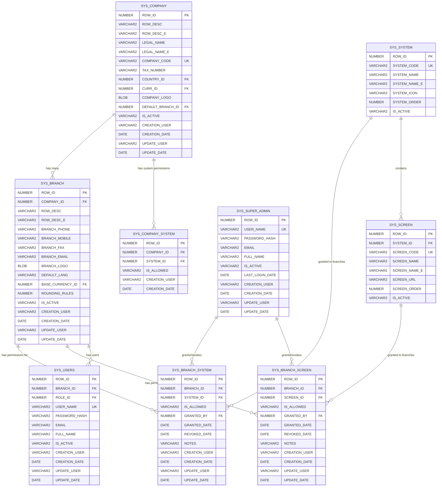
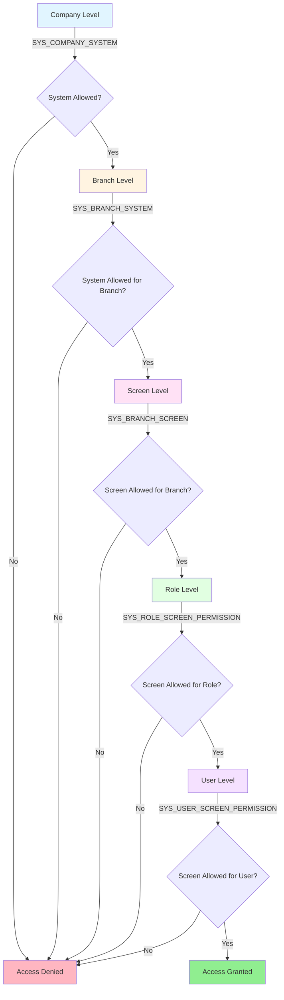

# Branch-Level Permissions - Entity Relationship Diagram

## UML Class Diagram (Database Tables)



## Permission Hierarchy Flow



## Table Relationships Summary

### Core Tables
- **SYS_COMPANY**: Root entity for multi-tenant system
- **SYS_BRANCH**: Branches belong to companies
- **SYS_SYSTEM**: Modules/systems in the ERP (Accounting, Inventory, HR, etc.)
- **SYS_SCREEN**: Screens/pages within each system

### New Permission Tables
- **SYS_BRANCH_SYSTEM**: Controls which systems are accessible per branch
- **SYS_BRANCH_SCREEN**: Controls which screens are accessible per branch

### Key Relationships

1. **Company → Branch** (1:N)
   - One company has many branches
   - FK: `SYS_BRANCH.COMPANY_ID → SYS_COMPANY.ROW_ID`

2. **Branch → Branch System Permissions** (1:N)
   - One branch has many system permissions
   - FK: `SYS_BRANCH_SYSTEM.BRANCH_ID → SYS_BRANCH.ROW_ID`

3. **Branch → Branch Screen Permissions** (1:N)
   - One branch has many screen permissions
   - FK: `SYS_BRANCH_SCREEN.BRANCH_ID → SYS_BRANCH.ROW_ID`

4. **System → Branch System Permissions** (1:N)
   - One system can be granted to many branches
   - FK: `SYS_BRANCH_SYSTEM.SYSTEM_ID → SYS_SYSTEM.ROW_ID`

5. **Screen → Branch Screen Permissions** (1:N)
   - One screen can be granted to many branches
   - FK: `SYS_BRANCH_SCREEN.SCREEN_ID → SYS_SCREEN.ROW_ID`

6. **System → Screens** (1:N)
   - One system contains many screens
   - FK: `SYS_SCREEN.SYSTEM_ID → SYS_SYSTEM.ROW_ID`

7. **Super Admin → Permissions** (1:N)
   - Super admin grants/revokes permissions
   - FK: `SYS_BRANCH_SYSTEM.GRANTED_BY → SYS_SUPER_ADMIN.ROW_ID`
   - FK: `SYS_BRANCH_SCREEN.GRANTED_BY → SYS_SUPER_ADMIN.ROW_ID`

8. **Branch → Users** (1:N)
   - One branch has many users
   - FK: `SYS_USERS.BRANCH_ID → SYS_BRANCH.ROW_ID`

## Indexes

### SYS_BRANCH_SYSTEM
- `IDX_BRANCH_SYSTEM_BRANCH` on `BRANCH_ID`
- `IDX_BRANCH_SYSTEM_SYSTEM` on `SYSTEM_ID`
- `UK_BRANCH_SYSTEM` unique on `(BRANCH_ID, SYSTEM_ID)`

### SYS_BRANCH_SCREEN
- `IDX_BRANCH_SCREEN_BRANCH` on `BRANCH_ID`
- `IDX_BRANCH_SCREEN_SCREEN` on `SCREEN_ID`
- `UK_BRANCH_SCREEN` unique on `(BRANCH_ID, SCREEN_ID)`

## Sequences

- `SEQ_SYS_BRANCH_SYSTEM` - Generates ROW_ID for SYS_BRANCH_SYSTEM
- `SEQ_SYS_BRANCH_SCREEN` - Generates ROW_ID for SYS_BRANCH_SCREEN

## Permission Resolution Logic

When a user tries to access a screen:

1. **Check Company Level**: Is the system allowed for the company? (SYS_COMPANY_SYSTEM)
   - If blocked → Deny access
   - If allowed or no record → Continue

2. **Check Branch Level - System**: Is the system allowed for the branch? (SYS_BRANCH_SYSTEM)
   - If blocked (IS_ALLOWED = '0') → Deny access
   - If allowed (IS_ALLOWED = '1') or no record → Continue

3. **Check Branch Level - Screen**: Is the screen allowed for the branch? (SYS_BRANCH_SCREEN)
   - If blocked (IS_ALLOWED = '0') → Deny access
   - If allowed (IS_ALLOWED = '1') or no record → Continue

4. **Check Role Level**: Is the screen allowed for the user's role? (SYS_ROLE_SCREEN_PERMISSION)
   - If blocked → Deny access
   - If allowed or no record → Continue

5. **Check User Level**: Is the screen allowed for the specific user? (SYS_USER_SCREEN_PERMISSION)
   - If blocked → Deny access
   - If allowed or no record → Grant access

**Default Behavior**: If no permission record exists, access is allowed (backward compatible).

## Use Case Examples

### Example 1: Restrict Accounting to HQ Only
```sql
-- Block Accounting system for Branch 2
INSERT INTO SYS_BRANCH_SYSTEM (ROW_ID, BRANCH_ID, SYSTEM_ID, IS_ALLOWED, GRANTED_BY, CREATION_USER)
VALUES (SEQ_SYS_BRANCH_SYSTEM.NEXTVAL, 2, 1, '0', 1, 'superadmin');
```

### Example 2: Allow Only Invoice Viewing for Remote Branch
```sql
-- Allow Accounting system
INSERT INTO SYS_BRANCH_SYSTEM (ROW_ID, BRANCH_ID, SYSTEM_ID, IS_ALLOWED, GRANTED_BY, CREATION_USER)
VALUES (SEQ_SYS_BRANCH_SYSTEM.NEXTVAL, 3, 1, '1', 1, 'superadmin');

-- Block invoice creation screen
INSERT INTO SYS_BRANCH_SCREEN (ROW_ID, BRANCH_ID, SCREEN_ID, IS_ALLOWED, GRANTED_BY, CREATION_USER)
VALUES (SEQ_SYS_BRANCH_SCREEN.NEXTVAL, 3, 15, '0', 1, 'superadmin');
```

### Example 3: Grant Full Access to Main Branch
```sql
-- No blocking records needed - default is allow
-- Or explicitly grant all systems
INSERT INTO SYS_BRANCH_SYSTEM (ROW_ID, BRANCH_ID, SYSTEM_ID, IS_ALLOWED, GRANTED_BY, CREATION_USER)
SELECT SEQ_SYS_BRANCH_SYSTEM.NEXTVAL, 1, ROW_ID, '1', 1, 'superadmin'
FROM SYS_SYSTEM WHERE IS_ACTIVE = '1';
```

## Data Types

- **NUMBER**: Oracle numeric type for IDs and foreign keys
- **VARCHAR2**: Variable-length character strings
- **DATE**: Oracle date/time type
- **BLOB**: Binary Large Object for images (logos)
- **VARCHAR2(1)**: Single character for flags ('Y'/'N', '1'/'0')

## Audit Fields

All tables include standard audit fields:
- `CREATION_USER`: Username who created the record
- `CREATION_DATE`: Timestamp of creation
- `UPDATE_USER`: Username who last updated the record
- `UPDATE_DATE`: Timestamp of last update

## Notes

1. **Soft Delete**: Tables use `IS_ACTIVE` flag instead of physical deletion
2. **Unique Constraints**: Prevent duplicate permissions for same branch-system or branch-screen combination
3. **Cascading**: No cascade delete - referential integrity maintained manually
4. **Backward Compatible**: If no permission record exists, access is allowed by default
5. **Audit Trail**: All permission changes are tracked with granted/revoked dates and super admin who made the change
