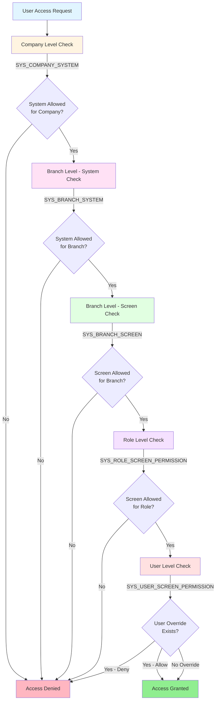

# ThinkOnERP - Complete Database Entity Relationship Diagram

## Overview

This document provides a comprehensive Entity-Relationship Diagram (ERD) for the entire ThinkOnERP database schema, including all core tables, permission tables, audit tables, and ticketing system tables.

## Complete UML Class Diagram

```mermaid
erDiagram
    %% Core Organizational Structure
    SYS_COMPANY ||--o{ SYS_BRANCH : "has many"
    SYS_COMPANY ||--o{ SYS_FISCAL_YEAR : "has fiscal years"
    SYS_COMPANY ||--o{ SYS_COMPANY_SYSTEM : "has system permissions"
    SYS_COMPANY ||--o{ SYS_REQUEST_TICKET : "has tickets"
    
    SYS_BRANCH ||--o{ SYS_USERS : "has users"
    SYS_BRANCH ||--o{ SYS_FISCAL_YEAR : "has fiscal years"
    SYS_BRANCH ||--o{ SYS_BRANCH_SYSTEM : "has system permissions"
    SYS_BRANCH ||--o{ SYS_BRANCH_SCREEN : "has screen permissions"
    SYS_BRANCH ||--o{ SYS_REQUEST_TICKET : "has tickets"
    
    SYS_CURRENCY ||--o{ SYS_COMPANY : "used by"
    SYS_CURRENCY ||--o{ SYS_BRANCH : "used by"
    
    %% User and Role Management
    SYS_ROLE ||--o{ SYS_USERS : "assigned to"
    SYS_ROLE ||--o{ SYS_ROLE_SCREEN_PERMISSION : "has permissions"
    SYS_ROLE ||--o{ SYS_USER_ROLE : "assigned to users"
    
    SYS_USERS ||--o{ SYS_USER_ROLE : "has roles"
    SYS_USERS ||--o{ SYS_USER_SCREEN_PERMISSION : "has direct permissions"
    SYS_USERS ||--o{ SYS_SAVED_SEARCH : "creates searches"
    SYS_USERS ||--o{ SYS_SEARCH_ANALYTICS : "performs searches"
    SYS_USERS ||--o{ SYS_REQUEST_TICKET : "creates tickets"
    SYS_USERS ||--o{ SYS_REQUEST_TICKET : "assigned tickets"
    SYS_USERS ||--o{ SYS_TICKET_COMMENT : "writes comments"
    
    %% System and Screen Structure
    SYS_SYSTEM ||--o{ SYS_SCREEN : "contains"
    SYS_SYSTEM ||--o{ SYS_COMPANY_SYSTEM : "granted to companies"
    SYS_SYSTEM ||--o{ SYS_BRANCH_SYSTEM : "granted to branches"
    
    SYS_SCREEN ||--o{ SYS_SCREEN : "has child screens"
    SYS_SCREEN ||--o{ SYS_ROLE_SCREEN_PERMISSION : "has role permissions"
    SYS_SCREEN ||--o{ SYS_USER_SCREEN_PERMISSION : "has user permissions"
    SYS_SCREEN ||--o{ SYS_BRANCH_SCREEN : "granted to branches"
    
    %% Permission Management
    SYS_SUPER_ADMIN ||--o{ SYS_COMPANY_SYSTEM : "grants/revokes"
    SYS_SUPER_ADMIN ||--o{ SYS_BRANCH_SYSTEM : "grants/revokes"
    SYS_SUPER_ADMIN ||--o{ SYS_BRANCH_SCREEN : "grants/revokes"
    SYS_SUPER_ADMIN ||--o{ SYS_AUDIT_LOG : "actions logged"
    
    %% Ticketing System
    SYS_TICKET_TYPE ||--o{ SYS_REQUEST_TICKET : "categorizes"
    SYS_TICKET_STATUS ||--o{ SYS_REQUEST_TICKET : "tracks status"
    SYS_TICKET_PRIORITY ||--o{ SYS_REQUEST_TICKET : "sets priority"
    SYS_TICKET_PRIORITY ||--o{ SYS_TICKET_TYPE : "default priority"
    SYS_TICKET_CATEGORY ||--o{ SYS_REQUEST_TICKET : "categorizes"
    SYS_TICKET_CATEGORY ||--o{ SYS_TICKET_CATEGORY : "has subcategories"
    
    SYS_REQUEST_TICKET ||--o{ SYS_TICKET_COMMENT : "has comments"
    
    %% Audit and Analytics
    SYS_AUDIT_LOG ||--o{ SYS_AUDIT_LOG_ARCHIVE : "archived to"

    %% Table Definitions
    
    SYS_COMPANY {
        NUMBER ROW_ID PK
        VARCHAR2 ROW_DESC
        VARCHAR2 ROW_DESC_E
        VARCHAR2 LEGAL_NAME
        VARCHAR2 LEGAL_NAME_E
        VARCHAR2 COMPANY_CODE UK
        VARCHAR2 TAX_NUMBER
        NUMBER COUNTRY_ID FK
        NUMBER CURR_ID FK
        BLOB COMPANY_LOGO
        NUMBER DEFAULT_BRANCH_ID FK
        CHAR IS_ACTIVE
        VARCHAR2 CREATION_USER
        DATE CREATION_DATE
        VARCHAR2 UPDATE_USER
        DATE UPDATE_DATE
    }

    SYS_BRANCH {
        NUMBER ROW_ID PK
        NUMBER PAR_ROW_ID FK
        VARCHAR2 ROW_DESC
        VARCHAR2 ROW_DESC_E
        VARCHAR2 PHONE
        VARCHAR2 MOBILE
        VARCHAR2 FAX
        VARCHAR2 EMAIL
        CHAR IS_HEAD_BRANCH
        BLOB BRANCH_LOGO
        VARCHAR2 DEFAULT_LANG
        NUMBER BASE_CURRENCY_ID FK
        NUMBER ROUNDING_RULES
        CHAR IS_ACTIVE
        VARCHAR2 CREATION_USER
        DATE CREATION_DATE
        VARCHAR2 UPDATE_USER
        DATE UPDATE_DATE
    }

    SYS_CURRENCY {
        NUMBER ROW_ID PK
        VARCHAR2 ROW_DESC
        VARCHAR2 ROW_DESC_E
        VARCHAR2 SHORT_DESC
        VARCHAR2 SHORT_DESC_E
        VARCHAR2 SINGULER_DESC
        VARCHAR2 SINGULER_DESC_E
        VARCHAR2 DUAL_DESC
        VARCHAR2 DUAL_DESC_E
        VARCHAR2 SUM_DESC
        VARCHAR2 SUM_DESC_E
        VARCHAR2 FRAC_DESC
        VARCHAR2 FRAC_DESC_E
        NUMBER CURR_RATE
        DATE CURR_RATE_DATE
        CHAR IS_ACTIVE
        VARCHAR2 CREATION_USER
        DATE CREATION_DATE
        VARCHAR2 UPDATE_USER
        DATE UPDATE_DATE
    }

    SYS_FISCAL_YEAR {
        NUMBER ROW_ID PK
        NUMBER COMPANY_ID FK
        NUMBER BRANCH_ID FK
        VARCHAR2 FISCAL_YEAR_CODE UK
        VARCHAR2 ROW_DESC
        VARCHAR2 ROW_DESC_E
        DATE START_DATE
        DATE END_DATE
        CHAR IS_CLOSED
        CHAR IS_ACTIVE
        VARCHAR2 CREATION_USER
        DATE CREATION_DATE
        VARCHAR2 UPDATE_USER
        DATE UPDATE_DATE
    }

    SYS_ROLE {
        NUMBER ROW_ID PK
        VARCHAR2 ROW_DESC
        VARCHAR2 ROW_DESC_E
        VARCHAR2 NOTE
        CHAR IS_ACTIVE
        VARCHAR2 CREATION_USER
        DATE CREATION_DATE
        VARCHAR2 UPDATE_USER
        DATE UPDATE_DATE
    }

    SYS_USERS {
        NUMBER ROW_ID PK
        VARCHAR2 ROW_DESC
        VARCHAR2 ROW_DESC_E
        VARCHAR2 USER_NAME UK
        VARCHAR2 PASSWORD
        VARCHAR2 PHONE
        VARCHAR2 PHONE2
        NUMBER ROLE FK
        NUMBER BRANCH_ID FK
        VARCHAR2 EMAIL
        DATE LAST_LOGIN_DATE
        CHAR IS_ACTIVE
        CHAR IS_ADMIN
        CHAR IS_SUPER_ADMIN
        VARCHAR2 REFRESH_TOKEN
        DATE REFRESH_TOKEN_EXPIRY
        DATE FORCE_LOGOUT_DATE
        VARCHAR2 CREATION_USER
        DATE CREATION_DATE
        VARCHAR2 UPDATE_USER
        DATE UPDATE_DATE
    }

    SYS_SUPER_ADMIN {
        NUMBER ROW_ID PK
        VARCHAR2 ROW_DESC
        VARCHAR2 ROW_DESC_E
        VARCHAR2 USER_NAME UK
        VARCHAR2 PASSWORD
        VARCHAR2 EMAIL
        VARCHAR2 PHONE
        VARCHAR2 TWO_FA_SECRET
        CHAR TWO_FA_ENABLED
        CHAR IS_ACTIVE
        DATE LAST_LOGIN_DATE
        VARCHAR2 REFRESH_TOKEN
        DATE REFRESH_TOKEN_EXPIRY
        VARCHAR2 CREATION_USER
        DATE CREATION_DATE
        VARCHAR2 UPDATE_USER
        DATE UPDATE_DATE
    }

    SYS_SYSTEM {
        NUMBER ROW_ID PK
        VARCHAR2 SYSTEM_CODE UK
        VARCHAR2 SYSTEM_NAME
        VARCHAR2 SYSTEM_NAME_E
        VARCHAR2 DESCRIPTION
        VARCHAR2 DESCRIPTION_E
        VARCHAR2 ICON
        NUMBER DISPLAY_ORDER
        CHAR IS_ACTIVE
        VARCHAR2 CREATION_USER
        DATE CREATION_DATE
        VARCHAR2 UPDATE_USER
        DATE UPDATE_DATE
    }

    SYS_SCREEN {
        NUMBER ROW_ID PK
        NUMBER SYSTEM_ID FK
        NUMBER PARENT_SCREEN_ID FK
        VARCHAR2 SCREEN_CODE UK
        VARCHAR2 SCREEN_NAME
        VARCHAR2 SCREEN_NAME_E
        VARCHAR2 ROUTE
        VARCHAR2 DESCRIPTION
        VARCHAR2 DESCRIPTION_E
        VARCHAR2 ICON
        NUMBER DISPLAY_ORDER
        CHAR IS_ACTIVE
        VARCHAR2 CREATION_USER
        DATE CREATION_DATE
        VARCHAR2 UPDATE_USER
        DATE UPDATE_DATE
    }

    SYS_COMPANY_SYSTEM {
        NUMBER ROW_ID PK
        NUMBER COMPANY_ID FK
        NUMBER SYSTEM_ID FK
        CHAR IS_ALLOWED
        NUMBER GRANTED_BY FK
        DATE GRANTED_DATE
        DATE REVOKED_DATE
        VARCHAR2 NOTES
        VARCHAR2 CREATION_USER
        DATE CREATION_DATE
        VARCHAR2 UPDATE_USER
        DATE UPDATE_DATE
    }

    SYS_BRANCH_SYSTEM {
        NUMBER ROW_ID PK
        NUMBER BRANCH_ID FK
        NUMBER SYSTEM_ID FK
        CHAR IS_ALLOWED
        NUMBER GRANTED_BY FK
        DATE GRANTED_DATE
        DATE REVOKED_DATE
        VARCHAR2 NOTES
        VARCHAR2 CREATION_USER
        DATE CREATION_DATE
        VARCHAR2 UPDATE_USER
        DATE UPDATE_DATE
    }

    SYS_BRANCH_SCREEN {
        NUMBER ROW_ID PK
        NUMBER BRANCH_ID FK
        NUMBER SCREEN_ID FK
        CHAR IS_ALLOWED
        NUMBER GRANTED_BY FK
        DATE GRANTED_DATE
        DATE REVOKED_DATE
        VARCHAR2 NOTES
        VARCHAR2 CREATION_USER
        DATE CREATION_DATE
        VARCHAR2 UPDATE_USER
        DATE UPDATE_DATE
    }

    SYS_ROLE_SCREEN_PERMISSION {
        NUMBER ROW_ID PK
        NUMBER ROLE_ID FK
        NUMBER SCREEN_ID FK
        CHAR CAN_VIEW
        CHAR CAN_INSERT
        CHAR CAN_UPDATE
        CHAR CAN_DELETE
        NUMBER ASSIGNED_BY FK
        DATE ASSIGNED_DATE
        VARCHAR2 NOTES
        VARCHAR2 CREATION_USER
        DATE CREATION_DATE
        VARCHAR2 UPDATE_USER
        DATE UPDATE_DATE
    }

    SYS_USER_SCREEN_PERMISSION {
        NUMBER ROW_ID PK
        NUMBER USER_ID FK
        NUMBER SCREEN_ID FK
        CHAR CAN_VIEW
        CHAR CAN_INSERT
        CHAR CAN_UPDATE
        CHAR CAN_DELETE
        NUMBER ASSIGNED_BY FK
        DATE ASSIGNED_DATE
        VARCHAR2 NOTES
        VARCHAR2 CREATION_USER
        DATE CREATION_DATE
        VARCHAR2 UPDATE_USER
        DATE UPDATE_DATE
    }

    SYS_USER_ROLE {
        NUMBER ROW_ID PK
        NUMBER USER_ID FK
        NUMBER ROLE_ID FK
        NUMBER ASSIGNED_BY FK
        DATE ASSIGNED_DATE
        VARCHAR2 CREATION_USER
        DATE CREATION_DATE
    }

    SYS_SAVED_SEARCH {
        NUMBER ROW_ID PK
        NUMBER USER_ID FK
        VARCHAR2 SEARCH_NAME
        VARCHAR2 SEARCH_DESCRIPTION
        NCLOB SEARCH_CRITERIA
        CHAR IS_PUBLIC
        CHAR IS_DEFAULT
        NUMBER USAGE_COUNT
        DATE LAST_USED_DATE
        CHAR IS_ACTIVE
        VARCHAR2 CREATION_USER
        DATE CREATION_DATE
        VARCHAR2 UPDATE_USER
        DATE UPDATE_DATE
    }

    SYS_SEARCH_ANALYTICS {
        NUMBER ROW_ID PK
        NUMBER USER_ID FK
        NUMBER COMPANY_ID FK
        NUMBER BRANCH_ID FK
        VARCHAR2 SEARCH_TERM
        NCLOB SEARCH_CRITERIA
        VARCHAR2 FILTER_LOGIC
        NUMBER RESULT_COUNT
        NUMBER EXECUTION_TIME_MS
        DATE SEARCH_DATE
    }

    SYS_REQUEST_TICKET {
        NUMBER ROW_ID PK
        VARCHAR2 TITLE_AR
        VARCHAR2 TITLE_EN
        NCLOB DESCRIPTION
        NUMBER COMPANY_ID FK
        NUMBER BRANCH_ID FK
        NUMBER REQUESTER_ID FK
        NUMBER ASSIGNEE_ID FK
        NUMBER TICKET_TYPE_ID FK
        NUMBER TICKET_STATUS_ID FK
        NUMBER TICKET_PRIORITY_ID FK
        NUMBER TICKET_CATEGORY_ID FK
        DATE EXPECTED_RESOLUTION_DATE
        DATE ACTUAL_RESOLUTION_DATE
        CHAR IS_ACTIVE
        VARCHAR2 CREATION_USER
        DATE CREATION_DATE
        VARCHAR2 UPDATE_USER
        DATE UPDATE_DATE
    }

    SYS_TICKET_TYPE {
        NUMBER ROW_ID PK
        VARCHAR2 TYPE_NAME_AR
        VARCHAR2 TYPE_NAME_EN
        VARCHAR2 DESCRIPTION_AR
        VARCHAR2 DESCRIPTION_EN
        NUMBER DEFAULT_PRIORITY_ID FK
        NUMBER SLA_TARGET_HOURS
        CHAR IS_ACTIVE
        VARCHAR2 CREATION_USER
        DATE CREATION_DATE
        VARCHAR2 UPDATE_USER
        DATE UPDATE_DATE
    }

    SYS_TICKET_STATUS {
        NUMBER ROW_ID PK
        VARCHAR2 STATUS_NAME_AR
        VARCHAR2 STATUS_NAME_EN
        VARCHAR2 STATUS_CODE UK
        NUMBER DISPLAY_ORDER
        CHAR IS_FINAL_STATUS
        CHAR IS_ACTIVE
        VARCHAR2 CREATION_USER
        DATE CREATION_DATE
        VARCHAR2 UPDATE_USER
        DATE UPDATE_DATE
    }

    SYS_TICKET_PRIORITY {
        NUMBER ROW_ID PK
        VARCHAR2 PRIORITY_NAME_AR
        VARCHAR2 PRIORITY_NAME_EN
        NUMBER PRIORITY_LEVEL
        NUMBER SLA_TARGET_HOURS
        NUMBER ESCALATION_THRESHOLD_HOURS
        CHAR IS_ACTIVE
        VARCHAR2 CREATION_USER
        DATE CREATION_DATE
        VARCHAR2 UPDATE_USER
        DATE UPDATE_DATE
    }

    SYS_TICKET_CATEGORY {
        NUMBER ROW_ID PK
        VARCHAR2 CATEGORY_NAME_AR
        VARCHAR2 CATEGORY_NAME_EN
        VARCHAR2 DESCRIPTION_AR
        VARCHAR2 DESCRIPTION_EN
        NUMBER PARENT_CATEGORY_ID FK
        CHAR IS_ACTIVE
        VARCHAR2 CREATION_USER
        DATE CREATION_DATE
        VARCHAR2 UPDATE_USER
        DATE UPDATE_DATE
    }

    SYS_TICKET_COMMENT {
        NUMBER ROW_ID PK
        NUMBER TICKET_ID FK
        NCLOB COMMENT_TEXT
        CHAR IS_INTERNAL
        VARCHAR2 CREATION_USER
        DATE CREATION_DATE
    }

    SYS_TICKET_CONFIG {
        NUMBER ROW_ID PK
        VARCHAR2 CONFIG_KEY UK
        NCLOB CONFIG_VALUE
        VARCHAR2 CONFIG_TYPE
        VARCHAR2 DESCRIPTION_AR
        VARCHAR2 DESCRIPTION_EN
        CHAR IS_ACTIVE
        VARCHAR2 CREATION_USER
        DATE CREATION_DATE
        VARCHAR2 UPDATE_USER
        DATE UPDATE_DATE
    }

    SYS_AUDIT_LOG {
        NUMBER ROW_ID PK
        VARCHAR2 ACTOR_TYPE
        NUMBER ACTOR_ID
        VARCHAR2 ACTION_TYPE
        VARCHAR2 ENTITY_TYPE
        NUMBER ENTITY_ID
        VARCHAR2 OLD_VALUE
        VARCHAR2 NEW_VALUE
        VARCHAR2 IP_ADDRESS
        VARCHAR2 USER_AGENT
        DATE ACTION_DATE
        NUMBER COMPANY_ID FK
        NUMBER BRANCH_ID FK
    }

    SYS_AUDIT_LOG_ARCHIVE {
        NUMBER ROW_ID PK
        VARCHAR2 ACTOR_TYPE
        NUMBER ACTOR_ID
        VARCHAR2 ACTION_TYPE
        VARCHAR2 ENTITY_TYPE
        NUMBER ENTITY_ID
        VARCHAR2 OLD_VALUE
        VARCHAR2 NEW_VALUE
        VARCHAR2 IP_ADDRESS
        VARCHAR2 USER_AGENT
        DATE ACTION_DATE
        NUMBER COMPANY_ID FK
        NUMBER BRANCH_ID FK
        DATE ARCHIVED_DATE
    }

    SYS_THINKON_CLIENTS {
        NUMBER ROW_ID PK
        VARCHAR2 COMPANY_NAME
        VARCHAR2 COMPANY_NAME_E
        VARCHAR2 SCHEMA_NAME
        VARCHAR2 SCHEMA_PASSWORD
        CHAR IS_ACTIVE
    }
```



## Permission Hierarchy Flowchart



## Database Schema Categories

### 1. Core Organizational Tables
- **SYS_COMPANY**: Multi-tenant root entity
- **SYS_BRANCH**: Branch/location management
- **SYS_CURRENCY**: Currency definitions
- **SYS_FISCAL_YEAR**: Fiscal year management per company/branch

### 2. User Management Tables
- **SYS_USERS**: Regular system users
- **SYS_SUPER_ADMIN**: Platform super administrators
- **SYS_ROLE**: Role definitions
- **SYS_USER_ROLE**: User-to-role assignments (many-to-many)

### 3. System and Screen Structure
- **SYS_SYSTEM**: Modules/systems (Accounting, Inventory, HR, etc.)
- **SYS_SCREEN**: Screens/pages within systems (hierarchical)

### 4. Permission Management Tables
- **SYS_COMPANY_SYSTEM**: Company-level system access control
- **SYS_BRANCH_SYSTEM**: Branch-level system access control (NEW)
- **SYS_BRANCH_SCREEN**: Branch-level screen access control (NEW)
- **SYS_ROLE_SCREEN_PERMISSION**: Role-based screen permissions (CRUD)
- **SYS_USER_SCREEN_PERMISSION**: User-specific permission overrides

### 5. Ticketing System Tables
- **SYS_REQUEST_TICKET**: Main ticket entity
- **SYS_TICKET_TYPE**: Ticket type definitions
- **SYS_TICKET_STATUS**: Ticket status workflow
- **SYS_TICKET_PRIORITY**: Priority levels with SLA
- **SYS_TICKET_CATEGORY**: Hierarchical categorization
- **SYS_TICKET_COMMENT**: Ticket comments and communication
- **SYS_TICKET_CONFIG**: Ticketing system configuration

### 6. Search and Analytics Tables
- **SYS_SAVED_SEARCH**: User-saved search criteria
- **SYS_SEARCH_ANALYTICS**: Search usage analytics

### 7. Audit and Compliance Tables
- **SYS_AUDIT_LOG**: Comprehensive audit trail
- **SYS_AUDIT_LOG_ARCHIVE**: Archived audit logs

### 8. System Configuration
- **SYS_THINKON_CLIENTS**: Multi-schema client management

## Key Relationships Summary

### Organizational Hierarchy
```
SYS_COMPANY (1) ──→ (N) SYS_BRANCH
SYS_BRANCH (1) ──→ (N) SYS_USERS
SYS_COMPANY (1) ──→ (N) SYS_FISCAL_YEAR
SYS_BRANCH (1) ──→ (N) SYS_FISCAL_YEAR
```

### Permission Hierarchy
```
Company Level:    SYS_COMPANY_SYSTEM
                         ↓
Branch Level:     SYS_BRANCH_SYSTEM → SYS_BRANCH_SCREEN
                         ↓
Role Level:       SYS_ROLE_SCREEN_PERMISSION
                         ↓
User Level:       SYS_USER_SCREEN_PERMISSION
```

### Ticketing Relationships
```
SYS_REQUEST_TICKET
    ├─→ SYS_TICKET_TYPE
    ├─→ SYS_TICKET_STATUS
    ├─→ SYS_TICKET_PRIORITY
    ├─→ SYS_TICKET_CATEGORY
    ├─→ SYS_COMPANY
    ├─→ SYS_BRANCH
    ├─→ SYS_USERS (Requester)
    ├─→ SYS_USERS (Assignee)
    └─→ SYS_TICKET_COMMENT (1:N)
```

## Indexes and Performance

### Key Indexes
- **Company/Branch**: `IDX_FISCAL_YEAR_COMPANY`, `IDX_FISCAL_YEAR_BRANCH`
- **Permissions**: `UK_BRANCH_SYSTEM`, `UK_BRANCH_SCREEN`, `IDX_BRANCH_SYSTEM_BRANCH`
- **Tickets**: `IDX_COMMENT_TICKET`, `IDX_COMMENT_DATE`, `IDX_COMMENT_USER`
- **Search**: `IDX_SAVED_SEARCH_USER`, `IDX_SEARCH_ANALYTICS_USER`
- **Screens**: `IDX_SCREEN_SYSTEM`, `IDX_SCREEN_PARENT`

### Unique Constraints
- `SYS_COMPANY.COMPANY_CODE`
- `SYS_SYSTEM.SYSTEM_CODE`
- `SYS_SCREEN.SCREEN_CODE`
- `SYS_TICKET_STATUS.STATUS_CODE`
- `SYS_TICKET_CONFIG.CONFIG_KEY`
- `SYS_BRANCH_SYSTEM (BRANCH_ID, SYSTEM_ID)`
- `SYS_BRANCH_SCREEN (BRANCH_ID, SCREEN_ID)`

## Sequences

All tables use Oracle sequences for primary key generation:
- `SEQ_SYS_COMPANY`
- `SEQ_SYS_BRANCH`
- `SEQ_SYS_USERS`
- `SEQ_SYS_ROLE`
- `SEQ_SYS_SYSTEM`
- `SEQ_SYS_SCREEN`
- `SEQ_SYS_BRANCH_SYSTEM`
- `SEQ_SYS_BRANCH_SCREEN`
- `SEQ_SYS_REQUEST_TICKET`
- `SEQ_SYS_AUDIT_LOG`
- And more...

## Data Types

### Common Patterns
- **Primary Keys**: `NUMBER(19)`
- **Foreign Keys**: `NUMBER(19)`
- **Flags**: `CHAR(1)` ('Y'/'N', '1'/'0')
- **Descriptions**: `VARCHAR2(4000)` or `NVARCHAR2(200)`
- **Large Text**: `NCLOB`
- **Images**: `BLOB` (SECUREFILE)
- **Dates**: `DATE`

## Audit Fields

All tables include standard audit fields:
- `CREATION_USER`: Username who created the record
- `CREATION_DATE`: Timestamp of creation (default SYSDATE)
- `UPDATE_USER`: Username who last updated
- `UPDATE_DATE`: Timestamp of last update
- `IS_ACTIVE`: Soft delete flag

## Security Features

### Authentication
- Password hashing (BCrypt)
- JWT tokens with refresh tokens
- Force logout capability
- Two-factor authentication (Super Admin)

### Authorization
- Multi-level permission hierarchy
- Role-based access control (RBAC)
- User-specific overrides
- Branch-level isolation

### Audit Trail
- Comprehensive action logging
- Actor tracking (Super Admin, Company Admin, User)
- IP address and user agent capture
- Archival for compliance

## Multi-Tenancy

The system supports multi-tenancy through:
1. **Company Level**: Root tenant entity
2. **Branch Level**: Sub-tenant within company
3. **Data Isolation**: All transactional data linked to company/branch
4. **Permission Isolation**: Branch-level access control

## Multilingual Support

Tables support Arabic and English:
- `ROW_DESC` (Arabic)
- `ROW_DESC_E` (English)
- `*_NAME_AR` / `*_NAME_EN`
- `DESCRIPTION_AR` / `DESCRIPTION_EN`

## Notes

1. **Soft Delete**: All tables use `IS_ACTIVE` flag
2. **BLOB Storage**: SECUREFILE for efficient large object storage
3. **Partitioning**: Audit logs support partitioning for performance
4. **Referential Integrity**: Foreign keys enforced at application level
5. **Default Values**: Many fields have sensible defaults (SYSDATE, '1', etc.)

## Database Size Estimates

Based on typical ERP usage:
- **Core Tables**: ~100MB (companies, branches, users, roles)
- **Permission Tables**: ~50MB (permissions, roles)
- **Ticketing System**: ~500MB-2GB (tickets, comments)
- **Audit Logs**: ~1GB-10GB (depending on retention)
- **Search Analytics**: ~100MB-500MB

**Total Estimated Size**: 2GB-15GB (varies by usage)

## Backup and Maintenance

### Recommended Maintenance
- **Daily**: Incremental backups
- **Weekly**: Full database backup
- **Monthly**: Audit log archival
- **Quarterly**: Index rebuild and statistics update
- **Yearly**: Partition maintenance

### Retention Policies
- **Audit Logs**: 90 days active, 7 years archived
- **Search Analytics**: 1 year
- **Tickets**: Indefinite (soft delete)
- **User Sessions**: 30 days

## Version History

- **v1.0**: Initial schema (Core tables)
- **v1.1**: Added fiscal year support
- **v1.2**: Added ticketing system
- **v1.3**: Added branch-level permissions
- **v1.4**: Added search and analytics
- **v1.5**: Enhanced audit logging

---

**Document Version**: 1.0  
**Last Updated**: 2024  
**Maintained By**: ThinkOnERP Development Team
