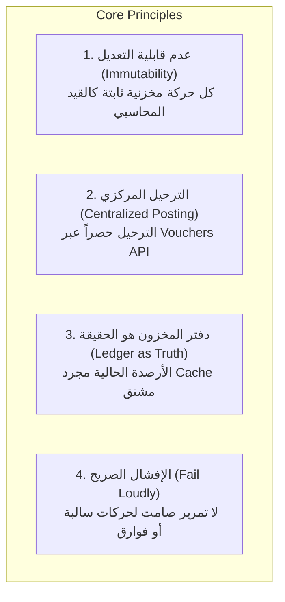
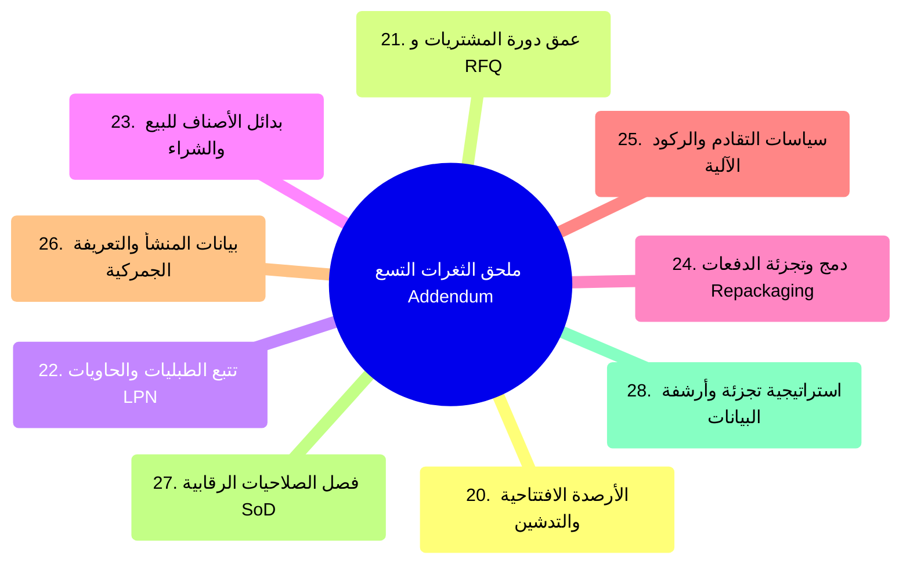

# دراسة معمارية وفنية شاملة لمواصفات موديول إدارة المخزون في ThinkOn ERP
## (دراسة تحليلية تفصيلية للوثيقة الفنية: v2 — شاملة الملحق Addendum)

---

## 1. مدخل عام والغرض من الدراسة

تُعدّ إدارة المخزون (Inventory Management) في أنظمة تخطيط موارد المؤسسات (ERP) الركيزة التشغيلية والمالية الأكثر حساسية؛ إذ تمثل حلقة الوصل المباشرة بين التدفق الفيزيائي للبضائع (Physical Flow) والتدفق المحاسبي للقيمة (Financial Valuation). أي اختلال في دقة حركة المخزون ينعكس فوراً على القوائم المالية، وتحديداً:
- **الميزانية العمومية (Balance Sheet):** تضخيم أو تخفيض الأصول المتداولة (Current Assets).
- **قائمة الدخل (Income Statement):** تشويه تكلفة المبيعات (Cost of Goods Sold - COGS) وبالتالي هامش الربح التشغيلي.

هدفت هذه الدراسة إلى تفكيك وتحليل وثيقة **"ThinkOn ERP — Inventory Management Module: Complete Technical Roadmap & Build Specification for the Backend Team (v2 — includes Addendum)"** المؤرخة في 28 أغسطس 2026. وتستعرض الدراسة الوثيقة بمستوييها: **النطاق الأساسي (Part 1: §1–§19)** و**الملحق التكميلي لسد الفجوات (Part 2: §20–§28)**، مع تقديم قراءة نقدية، هندسية، ومحاسبية متصلة مباشرة بالبنية التحتية البرمجية لـ ThinkOn ERP القائمة على قاعدة بيانات Oracle، و.NET C#، ودليل الحسابات المعتمد (COA V2).

---

## 2. الفلسفة المعمارية والمبادئ الحاكمة للموديول (§1 - §3)

وضعت الوثيقة أربعة مبادئ تصميمية غير قابلة للتفاوض (Non-negotiable Principles)، تم استنساخها وتطويرها من موديول المحاسبة العام:



### 2.1 المقارنة المعيارية مع الأنظمة العالمية (Benchmarking)
أجرت الوثيقة مقارنة تشريحية مع كبرى الأنظمة العالمية المعتمدة في السوق (NetSuite, Odoo, SAP, Dynamics 365, Zoho) وحددت مكامن القصور الشائعة فيها لتبني حلولاً مسبقة لها:

| النظام المعياري | الفجوة الشائعة فيه عالمياً | الحل المعتمد في تصميم ThinkOn ERP | الأثر المالي والتشغيلي |
| :--- | :--- | :--- | :--- |
| **Oracle NetSuite** | إدارة المواقع (Bins)، التوجيه، والماسح المحمول تُباع كـ SuiteApp منفصل ومكلف. | دمج الـ Bins، وتتبع الدفعات/السيريال، والموبايل في صميم النواة (Native) منذ البداية. | انعدام الحاجة لأي إعادة هيكلة لقاعدة البيانات مستقبلاً، وشمولية النظام لقطاع التوزيع والتجزئة فوراً. |
| **Odoo Community** | غياب احتساب تكاليف الإنزال (Landed Cost) وفروقات الشراء (PPV) إلا في النسخة المدفوعة Enterprise. | دمج حسابات الشحن والجمارك (`531101`, `531102`) وتباين الأسعار (`532101`) ضمن محرك الاستلام. | دقة تسعير تكلفة المخزون الفعلية المحملة بجميع مصاريف الوصول للمستودع. |
| **أنظمة SMB عموماً** | احتساب الوعد بالبيع (ATP) بمعادلة بدائية: (الرصيد الفعلي - المحجوز) وتجاهل المشتريات القادمة. | احتساب ATP بمعادلة ديناميكية تشمل أوامر الشراء المعتمدة وتاريخ وصولها المتوقع وحد الأمان. | إعطاء فريق المبيعات تواريخ تسليم حقيقية ودقيقة للعملاء ومنع خسارة الصفقات. |
| **تطبيقات المستودعات** | اشتراط اتصال دائم بالشبكة؛ توقف العمل كلياً عند الدخول في مناطق الممرات الميتة. | بناء طبقة الموبايل بنمط **عدم الاتصال أولاً (Offline-First)** مع طوابير محلية ومفاتيح `Idempotency`. | استمرارية العمل الميداني 100% وانعدام تكرار الحركات عند عودة الشبكة. |
| **الربط المحاسبي العام** | مزامنة المخزون مع الحسابات بمهام ليلية مجدولة ينتج عنها تباينات وأخطاء مطابقة شائعة. | ترحيل لحظي ومتزامن في نفس الـ Transaction عبر محرك القيود الموحد في النظام. | تطابق لحظي ودائم بين تقرير تقييم المخزون ورصيد حسابات المخزون في الميزانية العمومية. |

---

### 2.2 القرارات التأسيسية الأربعة (Phase INV-0)

حددت الوثيقة أربعة قرارات استراتيجية حاسمة يجب حسمها برمجياً قبل كتابة أي سطر كود:

1. **طريقة التكلفة (Costing Method):**
   - **الخيار المعتمد:** اعتماد **المتوسط المرجح المتحرك (Moving Weighted Average)** كافتراضي عام للشركة نظراً لمرونته وملاءمته لقطاع التوزيع والمواد الاستهلاكية.
   - **المرونة المضافة:** إتاحة تحديد طريقة التكلفة على مستوى بطاقة الصنف (`Item.costingMethod`) لتشمل:
     - `FIFO` (الوارد أولاً صادر أولاً): للصناعات ذات تقلبات الأسعار أو المتطلبات الرقابية الصارمة.
     - `SPECIFIC_ID` (التمييز العيني): للأصناف ذات الأرقام التسلسلية الفريدة والمرتفعة القيمة (مثل الإلكترونيات أو المعدات).
     - `STANDARD`: للصناعات التحويلية التي تعتمد تكلفة معيارية وتولد فروقات أسعار شراء (`PPV`).

2. **عمق الأستاذ المساعد للمخزون (Subledger Depth):**
   - **الخيار المعتمد:** **Subledger تفصيلي كامل على مستوى الصنف والموقع والدفعة (Full Item-level Subledger).**
   - **التعليل:** يمتلك دليل الحسابات (COA V2) في ThinkOn سبعة حسابات مراقبة تفصيلية للأصول المخزنية (`114101` إلى `114401`). ربط كل حركة مخزنية بحساب المراقبة المعني هو الضمان الوحيد لإجراء مطابقة آلية مستمرة تمنع أي انحراف دفتري.

3. **منهجية التقييم (Valuation Approach):**
   - **الخيار المعتمد:** **الجرد المستمر (Perpetual Inventory)** مع استخدام الجرد الفعلي الدوري كأداة رقابة ومطابقة (Reconciliation Control) وليس كأداة لاحتساب التكلفة.
   - **الأثر:** إتاحة إصدار ميزانية عمومية وقائمة دخل فورية ودقيقة في أي لحظة خلال الشهر المالي دون الحاجة لانتظار نهاية السنة أو الفترة.

4. **نموذج ملكية المخزون عبر الفروع (Branch Stock Ownership):**
   - **الخيار المعتمد:** **ملكية المخزون على مستوى الفرع (Branch-owned Stock).**
   - **التعليل:** ينسجم هذا القرار مع البنية المعتمدة في ThinkOn، حيث يحمل قيد اليومية حقل `branchId`. بالتالي، فإن نقل بضاعة بين فرعين لا يعتبر مجرد نقل موقعي فيزيائي، بل يولد قيداً مالياً وسيطاً عبر حساب المقاصة بين الفروع (`117101 Inter-Branch Clearing`).

---

## 3. التحليل الهيكلي لطبقات النظام (المراحل الفنية INV-1 إلى INV-15)


---

### 3.1 بطاقة الصنف والمستودعات (INV-1 & INV-2)

#### أ. بنية جدول الصنف ومحدداته (`Item Master`):
تحتوي بطاقة الصنف على تفاصيل تشغيلية ومحاسبية متكاملة:
- **أنواع الأصناف (`itemType`):**
  - `STOCK`: مادة مخزنية ملموسة تتابع كميتها وتكلفتها في الميزانية.
  - `NON_STOCK`: مادة استهلاكية تشترى وتصرف فوراً كمصروف دون تخزين.
  - `SERVICE`: خدمات غير ملموسة (مثل أجور التركيب أو الصيانة).
  - `KIT`: باقة بيع وهمية/افتراضية (تُجمع مكوناتها وقت خروج الفاتورة).
  - `ASSEMBLY`: منتج مجمع فيزيائياً بأمر إنتاج مسبق.
- **تعدد وحدات القياس (UOM Conversions):** بنية تدعم وحدة القياس الأساسية (Base UOM) وجدول معاملات التحويل للأوزان والأحجام والتعبئة (مثل حبة، كرتونة = 24 حبة، طبلية = 40 كرتونة)، مع ربط باركود مستقل لكل وحدة تعبئة (`ItemBarcode`).
- **ربط الحسابات التلقائي:** توجيه آلي للمشتريات والمبيعات عبر تحديد حسابات المراقبة (`glControlAccount`)، حساب الإيراد (`glRevenueAccount`)، وحساب التكلفة (`glCogsAccount`).

#### ب. التسلسل الهرمي للمستودعات (`Warehouses, Zones & Bins`):
- يدعم النظام: `Branch` -> `Warehouse` -> `Zone` -> `Aisle/Rack/Shelf/Bin`.
- **أنواع المناطق المستودعية (`zoneType`):**
  - `STORAGE`: تخزين عام متاح للبيع والطلب.
  - `RECEIVING`: رصيف الاستلام المبدئي قبل الفحص والتوجيه.
  - `STAGING`: منطقة تجهيز الشحنات المحجوزة للتحميل.
  - `QUARANTINE`: الحجر الصحي للمواد تحت الفحص المخبري أو الشك.
  - `DAMAGED`: البضائع التالفة المحتجزة بانتظار قرار الإتلاف أو المرتجع.
  - `RETURNS`: مخصص للبضاعة المرتجعة من العملاء قبل الفرز.
- **ميزة تصميمية:** تفعيل تتبع الخانات (Bins) اختياري حسب حجم المستودع (مستودع فرعي صغير قد لا يحتاج خانات، بينما المركز اللوجستي يحتاج ترقيماً ثلاثي الأبعاد).

---

### 3.2 محرك دفتر الحركات والرصيد (INV-3: Stock Ledger Engine)

يمثل هذا المحرك "نواة" الموديول بالكامل:

```
                          ┌───────────────────────┐
                          │  StockLedgerEntry     │
                          │  (حركات غير قابلة     │
                          │   للتعديل نهائياً)    │
                          └──────────┬────────────┘
                                     │  ينشئ / يُحدث
                                     ▼
        ┌─────────────────────────────────────────────────────────┐
        │                                                         │
        ▼                                                         ▼
┌───────────────────────┐                               ┌──────────────────┐
│   StockBalance        │                               │  Vouchers API    │
│   (كاش فوري للرصيد    │                               │  (قيد محاسبي آلي  │
│    المتاح والمحجوز)   │                               │   لحركات القيمة) │
└───────────────────────┘                               └──────────────────┘
```

#### أ. بنية جدول حركات المخزون (`StockLedgerEntry`):
- جدول تراكمي فقط (`Append-only`).
- الكمية دائماً موجبة (`quantity > 0`)؛ نوع الحركة (`transactionType`) هو الذي يحدد الاتجاه المحاسبي (وارد/صادر) لمنع أي لبس في الإشارات (+/-).
- يحتوي كل صف على: كود الصنف، المستودع، الخانة، رقم الدفعة/السيريال، كود الطبلية (LPN)، تكلفة الوحدة اللحظية، القيمة الإجمالية، الموديول المصدر، ورقم قيد اليومية المرتبط (`journalEntryId`).

#### ب. قواعد التحقق الصارمة أثناء المعاملة (Validation Rules):
1. **قاعدة حظر الرصيد السالب (Negative Stock Guard):** يرفض النظام أي حركة صرف أو تحويل تؤدي إلى نزول الرصيد تحت الصفر افتراضياً، مع إتاحة تجاوز خاص فقط إذا تم تفعيل علم `allowNegativeStock` بموافقة مبررة.
2. **مطابقة طرفي التحويل (Transfer Balance Check):** أي تحويل بين مستودعين يجب أن يتضمن حركة خروج مطابقة بالتمام لحركة الدخول (`TRANSFER_OUT = TRANSFER_IN`).
3. **إلزامية السيريال والدفعة:** إذا كان الصنف معرّفاً بأنه خاضع للتتبع، يرفض النظام أي حركة استلام أو صرف بدون رقم الدفعة أو السيريال.
4. **ربط القيد المالي:** أي حركة ذات قيمة مالية تتطلب وجود معرف سند قيد صالح؛ لا حركة بقيمة ترحل بدون أثر مالي.
5. **فحص الفترة المالية:** يمنع محرك المخزون ترحيل أي حركة في فترة مالية مغلقة (`HARD_CLOSE`) عبر فحص نفس جدول الفترات المالية في النظام المحاسبي.

---

### 3.3 محرك التكلفة والتقييم (INV-4: Costing & Valuation Engine)

فصّلت الوثيقة آليات المعالجة الرياضية والمحاسبية للتكاليف:

1. **طبقات الوارد أولاً صادر أولاً (`FIFO Cost Layers`):**
   - إنشاء جدول `CostLayer` يسجل كل دفعة استلام: الكمية المستلمة، الكمية المتبقية، وسعر تكلفة الوحدة.
   - عند الصرف، يسحب النظام الكميات بالتسلسل من أقدم الطبقات المتبقية (`remainingQty > 0`)، مع تقسيم حركة الصرف على أكثر من طبقة إذا استلزمت الكمية ذلك، وتوثيق الطبقة المصروف منها لضمان القابلية الكاملة للتدقيق الجنائي (Forensic Auditing).
2. **المتوسط المرجح المتحرك (`Weighted Average`):**
   - يعاد احتساب التكلفة فورياً مع كل حركة استلام واردة وفق المعادلة:
   $$\text{New Average Cost} = \frac{(\text{Current On-Hand} \times \text{Current Avg Cost}) + (\text{Receipt Qty} \times \text{Receipt Cost})}{\text{Current On-Hand} + \text{Receipt Qty}}$$
   - تصرف جميع الحركات بالسعر المتوسط السائد لحظة إجراء الحركة.
3. **التكلفة المعيارية وتباين الشراء (`Standard Costing & PPV`):**
   - عند الشراء بسعر فعلي يختلف عن التكلفة المعيارية الثابتة للصنف، يدخل المخزون بالتكلفة المعيارية، ويرحل الفرق مباشرة إلى حساب **فروقات أسعار الشراء (`532101 Purchase Price Variance`)**.
4. **الفحص الرقابي الإلزامي للمطابقة (Reconciliation Check):**
   - آلية رقابية تجري فحصاً دورياً (أو مع كل إغلاق يومي):
   $$\sum (\text{JournalLine.Debit} - \text{JournalLine.Credit})_{\text{Control Accounts}} \equiv \sum (\text{StockBalance.OnHand} \times \text{AverageCost})$$
   - إطلاق إنذار فوري للإدارة المالية عند حدوث أي انحراف (Drift) لمنع ترحيل أي خطأ لنهاية السنة.

---

### 3.4 تتبع الدفعات والسيريال والصلاحية (INV-5)

- **تتبع الدفعات (`Lot/Batch Tracking`):** تتبع تاريخ الإنتاج وتاريخ انتهاء الصلاحية ورقم تشغيلة المورد.
- **الصرف بمبدأ الأقرب انتهاءً أولاً (`FEFO - First Expired, First Out`):** تنص الوثيقة على قاعدة جوهرية: إذا كان الصنف خاضعاً لتاريخ الصلاحية، يجب أن يوجه محرك الصرف المستودعي لاختيار الدفعة الأقرب انتهاءً بصرف النظر عن طريقة التكلفة المعتمدة محاسبياً (إذ أن طريقة التكلفة خيار مالي، بينما ترتيب الصرف خيار تشغيلي لحماية البضاعة من التلف).
- **السلسلة التاريخية للسيريال (`Serial Genealogy`):** إمكانية الاستعلام عن رقم تسلسلي مفرد ومعرفة تاريخه الكامل: من أي أمر شراء ورد، في أي مستودع وخانة خُزن، ولأي عميل وفي أي فاتورة بيع خرج، وما هي طلبات الصيانة أو المرتجعات المرتبطة به.

---

### 3.5 تكامل العمليات التجارية: المشتريات والمبيعات (INV-6 & INV-7)

#### دورة المشتريات والاستلام المخزني (P2P):
1. **استلام البضاعة (GRN):** توليد مذكرة استلام البضائع، مما يرفع الرصيد الفعلي ويسجل قيد استحقاق وسيط:
   - **مدين:** حساب المخزون المعني (`114101` مواد أولية أو `114301` بضاعة تامة).
   - **دائن:** حساب وسيط البضاعة المستلمة غير المفوترة (`212101 GRNI`).
2. **توزيع مصاريف الشراء والإنزال (Landed Costs Allocation):**
   - توزيع تكاليف الشحن الداخلي/الخارجي (`531101`) ورسوم الجمارك (`531102`) على بنود أمر الاستلام استناداً إلى (القيمة، الوزن، أو الكمية).
   - ترفع هذه المصاريف تكلفة الوحدة المخزنية فوراً، وتُقفل من حسابات مصاريف الشحن والجمارك الوسيطة.
3. **المطابقة الثلاثية (Three-Way Match):**
   - مقارنة بنود أمر الشراء (PO) ومذكرة الاستلام (GRN) وفاتورة المورد (Vendor Bill) في الكميات والأسعار.
   - عند وجود فروقات سعرية تفوق نسبة التسامح المعتمدة (Tolerance)، تحجز الفاتورة في جدول استثناءات خاص (`ThreeWayMatchException`) يتطلب اعتماداً إدارياً قبل الترحيل لحساب الموردين (`211101 AP`).

#### دورة المبيعات والتحقق من الإيراد والتكلفة (O2C):
1. **حجز المخزون (Reservation & ATP):**
   - عند تأكيد أمر البيع، يتم حجز الكمية (`reservedQty`) فينخفض الرصيد المتاح للبيع فوراً دون تخفيض الرصيد الفعلي على الرف.
   - معادلة الوعد بالبيع الحقيقية:
   $$\text{ATP} = \text{On Hand} + \text{On Order (with valid date)} - \text{Reserved} - \text{Safety Stock}$$
2. **الصرف ومزامنة الإيراد والتكلفة (COGS Synchronization):**
   - يمنع التصميم أي انفصال زمني بين إثبات الإيراد وتكلفة المبيعات عبر فترات الإغلاق.
   - يتم تخفيض الرصيد الفعلي وتوليد قيد تكلفة البضاعة المباعة لحظة الشحن الفعلي للبضاعة (`Shipment / ISSUE`):
     - **مدين:** تكلفة المبيعات (`511101` إلى `511103`).
     - **دائن:** حساب المخزون (`114301 Finished Goods`).

---

### 3.6 تشغيل المستودعات، التخطيط، والرقابة (INV-8 إلى INV-14)

- **عمليات المستودعات الميدانية (INV-8):**
  - استراتيجيات الإيداع والتخزين (`Putaway`) لتوجيه العمال آلياً إلى الخانات المناسبة (ثابتة أو ديناميكية).
  - استراتيجيات التقاط البضائع للطلبيات (`Picking`): التقاط أحادي، مجمع (`Wave Picking`)، أو حسب المناطق (`Zone Picking`).
  - تطبيق الماسح المحمول بنمط **عدم الاتصال أولاً (Offline-First)** مع تقنيات تخزين محلي وتوليد مفاتيح `Idempotency` تمنع تكرار الحركات عند مزامنة الأجهزة بعد انقطاع الاتصال.
- **التخطيط ونقاط الطلب وتصنيف ABC (INV-9):**
  - احتساب نقطة إعادة الطلب آلياً:
  $$\text{Reorder Point} = (\text{Average Daily Usage} \times \text{Lead Time Days}) + \text{Safety Stock}$$
  - إنشاء مسودات أوامر شراء آلية للمواد التي بلغت حد الطلب.
  - تصنيف المخزون حسب القيمة (ABC Analysis) لتحديد أولويات الرقابة والطلب والجرد.
- **الجرد الدوري والمستمر (INV-10):**
  - الاعتماد على الجرد المستمر (Cycle Counting) الموجه بتصنيف ABC بدلاً من الاقتصار على الجرد السنوي المعطل للمستودعات.
  - دعم **الجرد الأعمى (Blind Counting)**: إخفاء الكميات المسجلة دفترياً عن شاشات عمال الجرد لضمان النزاهة ومنع التواكل أو الاعتماد الذهني على الأرقام المعروضة.
  - تجميد حركة الأصناف الجاري جردها (`Freeze`)، وترحيل الفروقات بعد الاعتماد إلى حساب **تسويات الجرد المخزني (`532102`)**.
- **الهدر والتسويات وبضاعة الأمانة (INV-11 إلى INV-14):**
  - ترحيل بضائع التلف والسرقة حصراً إلى حساب **عجز وتلف المخزون (`532103`)** لضمان عدم إخفاء الهدر داخل تكلفة المبيعات.
  - التمييز بين باقات البيع الافتراضية (`Kits`) وأوامر التجميع الفيزيائية الخفيفة (`Assembly / Light Manufacturing`).
  - تتبع بضاعة الأمانة الموردة للمستودع (`Consignment-In`) دون إدراجها كأصل في الميزانية حتى يتم استهلاكها أو بيعها، وتتبع البضاعة المسلوبة لدى الموزعين (`Consignment-Out`) مع إبقائها كأصل للشركة.
  - إدارة بضائع الدروب شيبينغ (`Drop-Ship`) دون توليد حركات استلام فيزيائية في مستودعات الشركة.

---

### 3.7 مصفوفة القيود المحاسبية المركزية (INV-15: Full Posting Matrix)

لخصت الوثيقة كافة الأحداث المخزنية وقيودها في مصفوفة موحدة ملزمة لفريق التطوير:

```
+---------------------------+-------------------------------------+-----------------------------------+-----------------------+
| الحدث المخزني             | الطرف المدين (Debit)                 | الطرف الدائن (Credit)              | رمز قاعدة الترحيل     |
+---------------------------+-------------------------------------+-----------------------------------+-----------------------+
| استلام رصيد افتتاحي       | حسابات المخزون (114101/114301...)   | أرباح مبقاة - بداية أو أسهم افتتاحية | INV_OPENING_BALANCE   |
| استلام بضاعة (قبل الفاتورة)| حسابات المخزون (114101/114301/114401) | بضاعة مستلمة غير مفوترة (212101)  | INV_RECEIPT           |
| تخصيص مصاريف إنزال        | حساب المخزون (زيادة تكلفة)          | مصاريف الشحن/الجمارك (531101/02)  | INV_LANDED_COST       |
| مطابقة فاتورة مورد (مطابق) | بضاعة مستلمة غير مفوترة (212101)    | ذمم دائنة - موردين (211101)       | AP_BILL               |
| مطابقة فاتورة (فارق سعر)   | 212101 + فروق أسعار الشراء (532101) | ذمم دائنة - موردين (211101)       | AP_BILL               |
| صرف لمراحل الإنتاج (WIP)   | إنتاج تحت التشغيل (114201)          | مواد أولية (114101)               | INV_ISSUE_WIP         |
| إتمام أمر التجميع         | بضاعة تامة الصنع (114301)           | إنتاج تحت التشغيل (114201)          | INV_COMPLETE          |
| شحن مبيعات للعميل         | تكلفة البضاعة المباعة (511101/02/03)| بضاعة تامة الصنع (114301)           | INV_COGS              |
| تحويل بين الفروع          | مخزون الفرع المستلم                 | مخزون الفرع المسلّم + مقاصة 117101| BRANCH_TRANSFER       |
| فروقات الجرد المخزني      | حساب المخزون أو تسويات جرد (532102) | تسويات جرد (532102) أو المخزون    | INV_ADJUST            |
| شطب تلفيات / عجز / سرقة   | عجز وتلف المخزون (532103)           | حساب المخزون                      | INV_WRITEOFF          |
| مخصص هبوط أسعار المخزون   | مصروف هبوط مخزون (أو 532103)        | مخصص هبوط مخزون (114501)          | INV_OBSOLESCENCE      |
| مرتجع مبيعات (سليم)       | حساب المخزون                        | عكس تكلفة المبيعات (511101)       | SALES_RETURN          |
| مرتجع مبيعات (تالف)       | مخصص هبوط (114501) أو تلف (532103)  | عكس تكلفة المبيعات (511101)       | SALES_RETURN          |
+---------------------------+-------------------------------------+-----------------------------------+-----------------------+
```

---

## 4. تحليل الملحق وسد الثغرات التشغيلية التسع (Part 2: §20 - §28)

يمثل هذا الملحق القيمة المضافة الأكثر نضجاً في الوثيقة v2؛ إذ يعالج السيناريوهات التي تفشل فيها مشاريع الـ ERP عادةً أثناء التدشين الحي:



### 4.1 الأرصدة الافتتاحية للمخزون والتدشين (§20)
* **المشكلة:** تفشل أغلب الأنظمة في إثبات مخزون أول المدة، حيث يتم استيراده عبر ملفات إكسل كبيانات صامتة تفقد تاريخ التكلفة وتفتح ثغرات في التدقيق.
* **الحل:** بناء آلية حزم أرصدة افتتاحية (`OpeningBalanceBatch`)، تستورد الكميات والأسعار والمواقع عبر محرك تحقق متسامح (Tolerant Validation)، وترحل كحركة نظامية رسمية (`OPENING_BALANCE`) تؤسس أول طبقة تكلفة لـ FIFO، وتقفل محاسبياً في حساب حقوق الملكية/الأرباح المبقاة وتصبح غير قابلة للتعديل بمجرد الترحيل.

### 4.2 عمق دورة المشتريات وتقييم الموردين (§21)
* توسيع دورة المشتريات لتشمل طلبات عروض الأسعار (`RFQ`)، تسجيل عروض الموردين (`VendorQuote`)، المقارنة الآلية وتحويل العرض الفائز إلى مسودة أمر شراء دون إعادة إدخال.
* اعتماد موافقة مشروطة بالسقف المالي لأمر الشراء (`PO Approval Threshold`).
* تتبع مؤشرات أداء الموردين (`Vendor Scorecard`): نسبة الالتزام بمواعيد التسليم، ونسبة البضاعة المرفوضة بالجودة، وفوارق الأسعار مقارنة بالعروض.

### 4.3 تتبع الحاويات والطبليات عبر رقم اللوحة (LPN Tracking §22)
* **المشكلة:** في المستودعات الكبيرة، يتطلب نقل طبلية تحتوي على 200 كرتونة مسح 200 باركود فردي، مما يسبب بطئاً شديداً وأخطاء بشرية.
* **الحل:** تخصيص كود فريد للطبلية أو الحاوية (`LicensePlate / LPN`). مسح كود الطبلية كفيل بنقل أو استلام جميع المواد بداخلها دفعة واحدة، مع دعم عمليات فض الطبلية (`Break-open`) للصرف الجزئي.

### 4.4 بدائل الأصناف (Item Substitution §23)
* معالجة حالتين منفصلتين:
  1. **بدائل المبيعات:** إذا نفد الصنف من المستودع، تقترح شاشة البيع/نقطة البيع الصنف البديل فوراً مع عرض رصيده وسعره دون إضاعة العميل.
  2. **بدائل المشتريات والتصنيع:** اقتراح مواد أولية بديلة معتمدة عند انقطاع المورد المعتاد أو نقص مكون في أمر التجميع (BOM).

### 4.5 دمج وتجزئة الدفعات وإعادة التعبئة (Lot Merge & Split §24)
* معالجة العمليات المستودعية لإعادة التعبئة (مثل تفريغ برميل سعة 200 لتر إلى 20 عبوة سعة 10 لتر، أو دمج بقايا تشغيلتين).
* **قاعدة التتبع الرقابية:** يجب أن يرتبط اللوت الجديد بجميع أصوله؛ وتاريخ انتهاء صلاحية اللوت المدمج يجب أن يكون **التاريخ الأقرب انتهاءً** بين أصوله لمنع التلاعب بتمديد فترات الصلاحية.

### 4.6 سياسات الركود والتقادم الآلية (Automated Obsolescence Policy §25)
* إنشاء وظيفة مجدولة تفحص المخزون الذي تجاوز فترة ركود محددة (مثل 90/180/365 يوماً دون حركة).
* وضع الأصناف الراكدة في قائمة مراجعة إدارية (`ObsolescenceReviewQueue`) مع اقتراح قيمة مخصص الهبوط.
* **قاعدة عدم الترحيل الصامت:** لا يرحل القيد المالي آلياً، بل يتطلب اعتماداً صريحاً من المدير المالي لترحيل القيد إلى حساب مخصص هبوط أسعار المخزون (`114501`).

### 4.7 بيانات المنشأ والتعريفة الجمركية (Country of Origin & HS Code §26)
* تثبيت بلد المنشأ ورمز النظام المنسق الجمركي (HS Code) على مستوى بطاقة الصنف أو مذكرة الاستلام.
* الاستفادة من هذه البيانات في حساب التقديرات الجمركية آلياً في تكاليف الإنزال، وتسهيل استخراج تقارير الامتثال للجهات الرسمية والمنافذ الجمركية.

### 4.8 مصفوفة فصل الصلاحيات الرقابية للمخزون (Segregation of Duties - SoD §27)
* تفصيل الصلاحيات الدقيقة الخاصة بالمخزون والمشتريات لحماية النظام من أشهر ثغرات الاحتيال الداخلي:
  - **منع التعارض الأول:** لا يجوز لمن يقوم بالجرد الفعلي أن يعتمد قيد تسوية فروقات الجرد.
  - **منع التعارض الثاني:** لا يجوز لمن أنشأ ملف المورد الجديد في النظام أن يعتمد أوامر الشراء الصادرة لنفس المورد (منع فواتير الموردين الوهميين).
  - **منع التعارض الثالث:** لا يجوز لأمين المستودع الذي استلم البضاعة (GRN) أن يعتمد استثناءات المطابقة الثلاثية.
  - حصر صلاحيات اعتماد شطب التالف وتخفيض القيمة بمدير الحسابات/المراقب المالي.

### 4.9 استراتيجية أرشفة وتجزئة البيانات الضخمة (Partitioning at Scale §28)
* توقع حجم البيانات الضخم في جدول `StockLedgerEntry` بسبب وتيرة الحركات اليومية السريعة.
* التوصية الفنية بتجزئة الجدول في Oracle حسب `(branchId, transactionDate)` إلى أجزاء شهرية أو ربع سنوية.
* الحفاظ على خفة جدول الأرصدة `StockBalance` لكونه كاشاً لا يحوي سوى الأرصدة الحالية، مما يضمن ثبات سرعة استعلامات البيع ونقاط البيع مهما كبر حجم البيانات التاريخية.

---

## 5. الرؤية النقدية والتقييم الهندسي للتنفيذ في ThinkOn ERP

على الرغم من الاكتمال النموذجي للوثيقة، إلا أن هناك اعتبارات هندسية حرجة يجب أخذها بالحسبان عند الشروع في التطوير الفعلي:

### 5.1 معضلة أقفال التزامن في بيئات البيع السريع (Concurrency Contention in POS)
* **الملاحظة:** أشارت الوثيقة في المتطلبات غير الوظيفية (§29) إلى استخدام أسلوب القفل الحصري للصفوف `SELECT ... FOR UPDATE` عند حجز أو صرف المخزون لمنع البيع بالسالب.
* **المخاطرة الفنية:** في بيئات نقاط البيع كثيفة الحركة (Retail / POS Terminals) في أوقات الذروة، إذا تنافست عدة كاشيرات على بيع نفس الصنف سريع الدوران (Fast-moving item)، فإن القفل الحصري المتتالي على نفس السجل في جدول `StockBalance` سيؤدي إلى اصطفاف الطلبات واختناق قاعدة البيانات (`Lock Contention / Thread Starvation`).
* **الحل البديل الموصى به:**
  الاعتماد على **التحديث الذري المباشر (Atomic Conditional Decrement)** دون الحاجة لقفل قراءة مسبق:
  ```sql
  UPDATE StockBalance
  SET reservedQty = reservedQty + :qty,
      availableQty = availableQty - :qty,
      updatedAt = SYSTIMESTAMP
  WHERE itemCode = :itemCode
    AND warehouseCode = :warehouseCode
    AND availableQty >= :qty;
  ```
  فإذا كانت نتيجة التنفيذ (`Rows Affected == 1`) ينجح الحجز في جزء من الميلي ثانية. وإذا كانت صفر (`0`)، يرفض الطلب فوراً لعدم كفاية الرصيد. كما يمكن لعمليات نقاط البيع الضخمة جداً استخدام طبقة تخزين مؤقت موزعة عبر **Redis** لحجز المخزون في الذاكرة قبل التثبيت في قاعدة البيانات.

### 5.2 معالجة تكاليف الإنزال المتأخرة بعد بيع البضاعة (Post-Sale Landed Costs)
* **الملاحظة:** في دورات الاستيراد الواقعية، كثيراً ما تصل فاتورة الجمارك أو الشحن البحري بعد أسابيع من استلام الشحنة وتفريغها، وربما بعد أن يكون قد تم بيع 70% من كمية تلك الشحنة للمستهلكين.
* **المسار المحاسبي الواجب توضيحه:**
  إذا طُبقت تكلفة الإنزال الإضافية على رصيد المخزون المتبقي فقط، فسوف تتضخم تكلفة الـ 30% المتبقية في المستودع بشكل غير عادل ومضلل.
  لذا، يجب أن يتضمن محرك التكلفة برمجة تلقائية:
  - نسبة التكلفة العائدة للكمية المتبقية تضاف إلى قيمة المخزون وتحدث طبقة التكلفة.
  - نسبة التكلفة العائدة للكمية المباعة بالفعل ترحل مباشرة عبر قيد تسوية تكلفة بضاعة مباعة (`COGS True-Up Adjustment`) للفترة الجارية دون المساس بحسابات المخزون للوحدات المنصرفة.

### 5.3 تعارضات المزامنة في تطبيق الموبايل (Offline Conflict Resolution)
* **الملاحظة:** ميزة العمل بدون اتصال (Offline-First) في المستودعات بالغة الأهمية، لكنها تفتح باباً للتعارضات المتزامنة (`State Divergence`).
* **السيناريو:** إذا كان المتبقي في الخانة 5 قطع فقط، وقام عاملان في نفس اللحظة وهما غير متصلين بالشبكة بمسح وصرف 4 قطع لكل منهما (المجموع 8)، فإن كلا التطبيقين محلياً سيعتبر الحركة ناجحة. لكن عند عودة الاتصال ومزامنة البيانات مع السيرفر المركزي، ستنجح إحدى الحركتين وتفشل الأخرى لمخالفتها قاعدة الرصيد السالب.
* **التوصية:** يجب أن تتضمن واجهات المزامنة (`Sync APIs`) نمط معالجة أخطاء واضح يُخطر المشرف المستودعي فوراً بالحركات المعلقة والتعارضات لاتخاذ إجراء تصحيحي يدوي (تسوية جرد أو تعديل أمر التحضير)، مع عدم إيقاف مزامنة باقي الحركات السليمة في الطابور.

---

## 6. خطة مراحل التنفيذ الموصى بها (Sprint Roadmap)

تتألف الوثيقة من 25 مرحلة مقترحة (من INV-0 إلى INV-25). لضمان سرعة الوصول للإنتاجية (Time-to-Market) وعدم إغراق الفريق في التفاصيل دفعة واحدة، يُوصى بتطبيق استراتيجية الإطلاق على ثلاث دفعات رئيسية:

```
┌────────────────────────────────────────────────────────────────────────────────┐
│  الدفعة الأولى: النسخة الأساسية الإلزامية (True MVP)                           │
│  [INV-0 إلى INV-7] + [INV-16: الأرصدة الافتتاحية] + [INV-23: الصلاحيات]        │
│  الهدف: تشغيل حركات الصرف والاستلام وربطها التام بدليل الحسابات COA V2 وموديول القيود │
└──────────────────────────────────────┬─────────────────────────────────────────┘
                                       │
                                       ▼
┌────────────────────────────────────────────────────────────────────────────────┐
│  الدفعة الثانية: العمليات الميدانية والرقابة المتقدمة (Warehouse Core)          │
│  [INV-8: الموبايل] + [INV-10: الجرد المستمر] + [INV-11: التسويات والتلف]        │
│  + [INV-17: عمق المشتريات] + [INV-22: الجمارك والمنشأ]                         │
│  الهدف: أتمتة مستودعات الفروع وضبط الرقابة ومنع الهدر وحماية العمليات           │
└──────────────────────────────────────┬─────────────────────────────────────────┘
                                       │
                                       ▼
┌────────────────────────────────────────────────────────────────────────────────┐
│  الدفعة الثالثة: العمليات اللوجستية المتقدمة والتوسع (Advanced SCM)             │
│  [INV-12: التجميع] + [INV-13: بضاعة الأمانة] + [INV-18: تتبع LPN]               │
│  + [INV-19: البدائل] + [INV-20: تجزئة الدفعات] + [INV-21: الركود] + [INV-25]   │
│  الهدف: العمليات اللوجستية الضخمة، سلاسل التوزيع المتعددة، وتجزئة البيانات      │
└────────────────────────────────────────────────────────────────────────────────┘
```

---

## 7. الخلاصة والتوصية النهائية

1. **الاعتماد الرسمي:** الوثيقة مكتملة الأركان وجاهزة للتنفيذ، وتوفر على فريق التطوير أشهراً من التخبط وإعادة الهيكلة اللاحقة. يوصى باعتمادها كمرجع هندسي وحيد لبناء موديول المخزون في ThinkOn ERP.
2. **الخطوة الفورية التالية:** 
   - تثبيت قرارات **INV-0** الأربعة رسمياً.
   - البدء في تجهيز نصوص الـ DDL ومخططات الجداول على قاعدة بيانات Oracle للكيانات الأساسية (`Item`, `Warehouse`, `StockLedgerEntry`, `StockBalance`) مع مراعاة العزل المتعدد للمستأجرين (`Multi-Tenancy`) المعمول به في النظام.
   - بناء واجهات الـ CRUD الأساسية لبطاقة الصنف واستيرادها من إكسل، مع ربطها بشجرة الحسابات الحالية.
